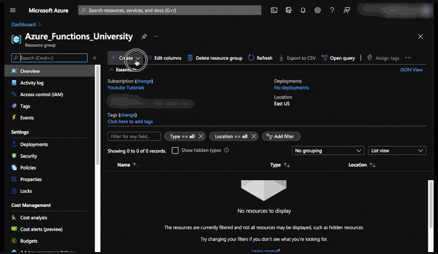

# HTTP Trigger (PowerShell via the Azure portal)

## Goal 🎯

The goal of this lesson is to create your first function, using the Azure portal, which can be triggered by doing an HTTP GET or POST to the function endpoint.

This lessons consists of the following exercises:

|Nr|Exercise
|-|-
|0|[Prerequisites](#0-prerequisites)
|1|[Creating a Function App](#1-creating-a-function-app)
|2|[Take a tour of the interface](#2-take-a-tour-of-the-interface)
|3|[Creating your first Function](#3-creating-your-first-function)
|4|[Changing the template for GET requests](#4-changing-the-template-for-get-requests)
|5|[Changing the template for POST requests](#5-changing-the-template-for-post-requests)
|6|[Changing the name of the Request parameter](#6-changing-the-name-of-the-request-parameter)
|7|[Change the route for a custom greeting](#7-change-the-route-for-a-custom-greeting)
|8|[Homework](#8-homework)
|9|[More info](#9-more-info)

> 📝 **Tip** - If you're stuck at any point you can have a look at the [source code](../../../src/PowerShell/AzureFunctions.Http) in this repository.

---

## 0. Prerequisites

| Prerequisite | Exercise
| - | -
| Azure Subscription | 1-7

See [PowerShell prerequisites](../prerequisites/README.md) for more details.

## 1. Creating a Function App

In this exercise, you will create a new Azure Functions App using the Azure Portal. We will go over the items you can configure when creating an Azure Functions App.

### Steps

1. Log into the [Azure Portal](https://portal.azure.com).
2. (Optional) Create a resource group for your Azure Functions App.
3. Go to your preferred resource group.
4. In your resource group, click **Create**.
5. **Function App** should be listed in the list of *Popular products*. If you do not see it, in the search bar, search for **Function App**
6. Click **Create**.
7. Make sure the **Subscription** and **Resource Group** are correct.
8. Under *Instance Details*, choose a globally unique **Function App Name**
   > **Note**: The function app name is a globally unique name (i.e.: You cannot choose a name that someone else in Azure is using). It also needs to be follow the naming conventions of website names (a-z, 0-9, -).

   > 📝 **Tip**: Pick up good habits early in your cloud journey and choose a naming convention for your resources. [Example from Microsoft.](https://docs.microsoft.com/en-us/azure/cloud-adoption-framework/ready/azure-best-practices/resource-naming)  

9. For **Publish** leave *Code*
10. Choose *PowerShell Core* for **Runtime stack**
11. For the **Version**, choose the most appropriate, currently *7.0*
12. Choose a **Region** that is appropriate for you in terms of costs and distance form you. For these exercises, the overall cost should be negligible, and therefore you should pick a region closest to you.
13. Under the **Hosting** tab, you can select a **Storage Account** and a **Plan Type**. Leave the **Plan Type** as *Consumption (Serverless)*. You can choose to create a new **Storage account** following your naming convention if you'd like or use the default.
14. Under the **Monitoring** tab, you can choose to **Enable Application Insight**. This can be useful when troubleshooting your functions, but is not necessary for this exercise. It can also be added later if needed.
15. Click **Review + Create**
16. Once the validation has passed, click **Create**
17. It will take a couple of minutes to deploy the resources. Once it's done, you can see them in your resource group.
18. Click **Go to resource** to go to your new Function App.

> ❔ **Question** - What are the default names for the storage account and application insight? Where do they get their values from?

> ❔ **Question** - What operating systems are you able to choose? Why do you think that is?



## 2. Take a tour of the interface

Congratulations! You have now created your Azure Functions App. In this exercise, we won't be going over all the settings so take some time to go over the interface and click on some of the settings in the left pane.

> 🔎 **Take a look** - Look at the **App Files**. Use the drop down to look over each file and see their contents.
 
|File|Description
|-|-
|host.json|Contains [global configuration options](https://docs.microsoft.com/en-us/azure/azure-functions/functions-host-json) for all the functions in a function app.
|profile.ps1| A profile file, like you would have in a local PowerShell prompt. Here you can store all cmdlets that need to be executed when the function [cold starts](https://azure.microsoft.com/en-us/blog/understanding-serverless-cold-start/).
|requirements.psd1| Define modules in the PowerShell gallery that need to be loaded when the function starts.

## 3. Creating your first Function

Now that you created your function and go familiar with the settings, let's create our first function!

### Steps

1. In your Azure Functions App, click on **Functions** on the left-hand side.
2. Click **+ Create**.
3. Under the **Add function** pane, **Select a template** choose *HTTP trigger*.

    > 🔎 **Take a look** - Look at all the other trigger options and their descriptions.

4. Under **Template details**, for **New Function** enter the name *HelloWorldHttpTrigger*

5. Leave the authentication as is. 

6. Click **Add**

7. Once created, look under the **Code + Test** section of the function.

    > ❔ **Question** - Look at the code. What do you think it does?

8. At the top of the editor, click on **Test/Run**

9. Edit the body by putting your name in the *name* field

10. Click **Run**

11. Notice the response and where your name appears.


## 4. Changing the template for GET requests

Let's change the template to find out what parameters can be changed.
Depending on the trigger, arguments can be added/removed and parameter types can be changed.
Start with only allowing GET requests.

### Steps

1. In the left panel, click on **Integration**
2. Click on **HTTP (Request)** under trigger
3. Under **Selected HTTP Methods** uncheck the **POST** option
4. Click **Save** and go back to the **Code + Test** section.

5. To get the name from the query string you can do the following:

    ```PowerShell
    $name = $Request.Query.Name
    ```

    > 🔎 **Observation** - In the generated template the response was always an `[HttpStatusCode]::OK`. This means that when a clients calls the function, an HTTP status 200, is always returned. Let's make the function a bit smarter and return a `[HttpStatusCode]::BadRequest` (HTTP status 400).
6. Add an `if` statement to the function that checks if the name value is `$null`. If the name is `$null` return a `[HttpStatusCode]::BadRequest`, otherwise return a `[HttpStatusCode]::OK`. The complete code should now look like this.

    ```PowerShell
    using namespace System.Net
    
    # Input bindings are passed in via param block.
    param($Request, $TriggerMetadata)
    
    # Write to the Azure Functions log stream.
    Write-Host "PowerShell HTTP trigger function processed a request."
    
    # Interact with query parameters or the body of the request.
    $Name = $Request.Query.Name
    
    if ([string]::IsNullOrEmpty($name)) {
        $Body = "Pass a name in the query string or in the request body for a personalized response."
        $Result = [HttpStatusCode]::BadRequest
    }
    else{
        $Body = "Hello, $Name. This HTTP triggered function executed successfully."
        $Result = [HttpStatusCode]::OK
    }
    
    # Associate values to output bindings by calling 'Push-OutputBinding'.
    Push-OutputBinding -Name Response -Value ([HttpResponseContext]@{
        StatusCode = $Result
        Body = $Body
    })

    ```

    Now the function has proper return values for both correct and incorrect invocations.

7. Run the function, once without name value in the querystring, and once with a name value. To add a name parameter to the querystring do the following in the Test/Run panel:
    - Click _Add parameter_ under the **Query** section.
    - Enter _name_ in the **Name** field and enter your name in the **Value** field.

    > ❔ **Question** - Is the outcome of both runs as expected?

## 5. Changing the template for POST requests

Let's change the function to also allow POST requests and test it by posting a request with JSON content in the body.

### Steps

1. In the left panel, click on **Integration**
2. Click on **HTTP (Request)** under trigger
3. Under **Selected HTTP Methods** check the **POST** option
4. Click **Save** and go back to the **Code + Test** section.
5. We need to add some logic to use the `querystring` for GET requests and use the request body for POST requests. This can be done by checking the Method property of the request (`$Request.Method`) as follows:

    ```PowerShell
    if ($Request.Method -eq "GET") {
        $Name = $Request.Query.Name
    }
    elseif ($Request.Method -eq "POST"){
        $Name = $Request.Body.Name
    }
    ```

    > 📝 **Tip** - You could also use a [Switch](https://docs.microsoft.com/en-us/powershell/module/microsoft.powershell.core/about/about_switch?view=powershell-7.1) to reach the same goal.

6. Replace the line that creates `$Name` with the `if` statement from the previous step.

7. Under **Code/Test** Click on **Get Function URL** and copy the URL of your function. You will need it in the next step.
8. Open a PowerShell console and run the function using a POST request and submit a body with a `Name` property. Through PowerShell, you can do that like this:

    ```PowerShell
    $FunctionURL = "Your Function URL"
    $Body = @{
        Name = "Your name"
    }
    $Parameters = @{
       Method = "POST"
       Body = ($Body | ConvertTo-Json)
       URI = $FunctionURL
       ContentType = "application/json"
       }
    Invoke-RestMethod @Parameters
    ```

    > 🔎 **Observation** - There are many ways to test an Azure functions, below are some examples:
    >  - PowerShell `Invoke-WebRequest` or `Invoke-RestMethod` Cmdlets
    >  - You can use the Azure Functions Portal, see [exercise 3](#3-creating-your-first-function)
    >  - You can also use a REST client (such as [Postman](https://www.postman.com/))
    >📝 **Tip** - This script uses [Parameter splatting](https://docs.microsoft.com/en-us/powershell/module/microsoft.powershell.core/about/about_splatting?view=powershell-7.1) to make the code more readable.

    > ❔ **Question** - Is the outcome of the POST as expected?

    > ❔ **Question** - What is the response when you use an empty `name` property?

## 6. Changing the name of the Request parameter

Instead of using the `Request` as the name of the parameters in your script, you can change this for something that is more descriptive for your script. This is also very useful if you have more than one input binding. It will not have any impact on the user input.

### Steps

1. In the left panel, click on **Integration**
2. Click on **HTTP (Request)** under trigger
3. Under **Request Parameter Name** enter `Person`
4. Click **Save** and go back to the **Code + Test** section.

    > 🔎 **Observe** - The trigger now says **HTTP (Person)** the text in the parenthesis will change based on the request parameter name.

5. Now edit your code and change every instance of `$Request` to `$Person`
6. Run the Function App.
7. Trigger the new endpoint by making a request.

    > ❔ **Question** - Is the outcome as expected?

## 7. Change the route for a custom greeting

Instead returning *"Hello {name}"* all the time, it would be nice if we can supply our own greeting. So we could return *"Hi {name}"* or  *"Good evening {name}"*. We can do this by changing the route of the function so it contains the greeting. The function will only triggered for GET requests.

### Steps

1. Copy the code in `HelloWorldHttpTrigger` and create a new HTTP trigger function called `CustomGreetingHttpTrigger`. Once the function is created, replace the code in there and click **Save**.
2. In the left panel, click on **Integration**
3. Click on **HTTP (Request)** under trigger
4. Under **Request parameter name** enter _Person_
5. Under **Route Template** enter `{greeting:alpha?}`
6. Under **Selected HTTP Methods** uncheck the **POST** option
7. Click **Save** and go back to the **Code + Test** section.

    > 🔎 **Observation** - The `Route` uses a route argument named `greeting` and it has an `alpha` constraint. This means that `greeting` may only contain characters from the alphabet (a-z). The question mark indicates the `greeting` parameter is optional. More info on route parameter constraints in the [official docs](https://docs.microsoft.com/en-us/aspnet/core/fundamentals/routing?view=aspnetcore-3.1#route-constraint-reference).

8. Remove the `if` statement that checked if the Method was `Post` or `Get` and replace it with the following:

   ```PowerShell
   $Name = $Person.Query.Name
   ```

9. Add an `if` statement to check if the greeting input was used. If not, the default greeting is used.

    ```PowerShell
    $Greeting = $Person.Params.greeting
    if (-not $Greeting) {
       $Greeting = "Hello"
    }
    ```

10. Now change the body that is returned to the user to use the `$Greeting` variable:

    ```PowerShell
    $Body = "$Greeting $Name. This HTTP triggered function executed successfully."

    ```

11. Test the Function App by changing the `greeting` query parameter value and adding a `name` value.
    > 🔎 **Observation** - The `greeting` query parameter is already present, albeit with a value of `alpha?`

12. Trigger the new endpoint by making a GET request to the following endpoint.

    ```PowerShell
    $FunctionURL = "Your function URL"
    $Greeting = "Hi"
    $Name = "Your Name"
    $URI = $FunctionURL.replace('{greeting:alpha?}?',"$Greeting`?name=$Name&")
    Invoke-RestMethod $URI
    ```

    > 🔎 **Observation** -  Did you see the format of the function URL as copied form the portal? Did you notice the `code` parameter? What do you think it is for? The `replace` method allows us to put our route and parameter in front of the `code` parameter. `name` doesn't need to be before the `code` but we might as well do both in one go.

    > ❔ **Question** - Is the outcome as expected?

## 8. Homework

Ready to get hands-on? Checkout the [homework assignment for this lesson](http-homework-powershell.md).

## 9. More info

- For more info about the HTTP Trigger have a look at the official [Azure Functions HTTP Trigger](https://docs.microsoft.com/en-us/azure/azure-functions/functions-bindings-http-webhook-trigger?tabs=powershell) documentation.

---
[🔼 Lessons Index](../../README.md)
