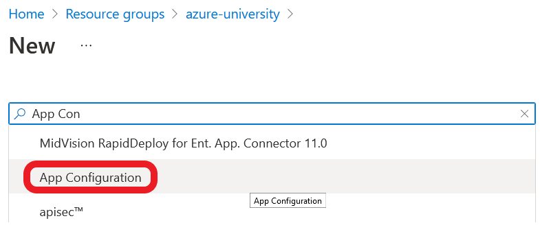
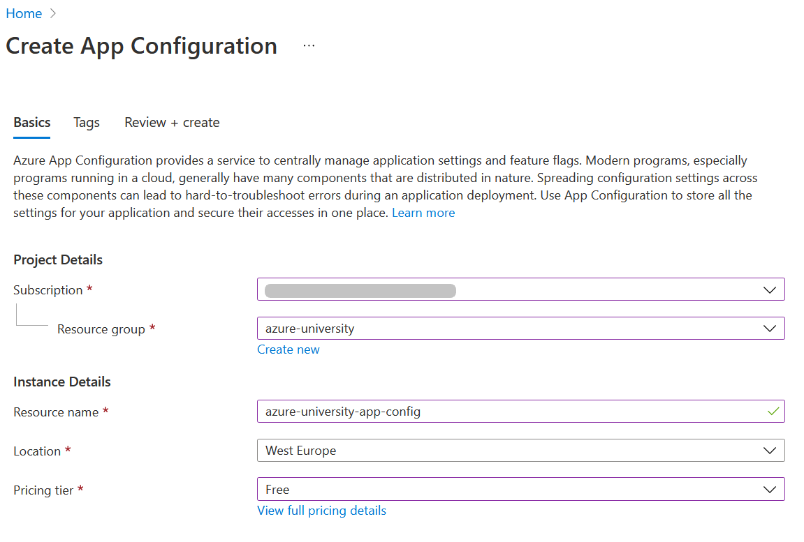
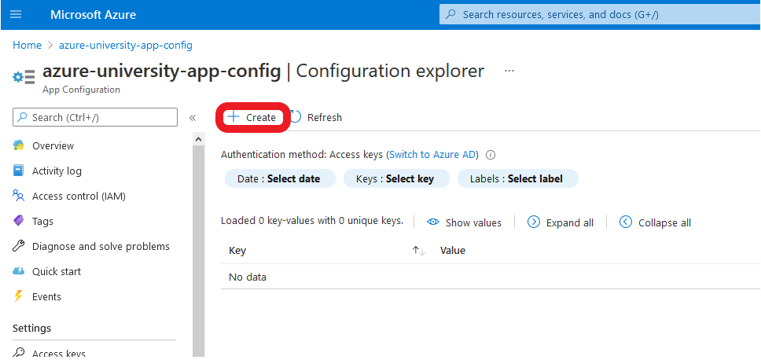
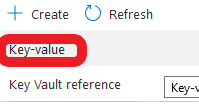
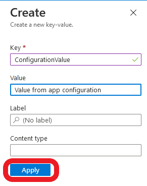

# Configuration & Settings

Watch the recording of this lesson [on YouTube]().

## Goal 🎯

The goal of this lesson is to learn where you can store application settings and use them in your Azure Functions.

This lessons consists of the following exercises:

|Nr|Exercise
|-|-
|0|[Prerequisites](#0-prerequisites)
|1|[Why do we use configuration?](#1-why-do-we-use-configuration)
|2|[Built-in settings](#2-built-in-settings)
|3|[Adding custom application settings](#3-adding-custom-application-settings)
|4|[Using App Configuration Service](#4-using-app-configuration-service)
|5|[Using Azure KeyVault for Secrets](#5-using-azure-keyvault-for-secrets)
|6|[Homework](#6-homework)
|7|[More info](#7-more-info)

---

## 0. Prerequisites

| Prerequisite | Exercise
| - | -

## 1. Why do we use configuration? (Stace)

Configuration. One or more values, read into your application at run time, which can change the way that it runs, or change the data sources it uses at runtime.

When we run our applications locally, we run them against a known environment. We know the location of all resources we need, and if the code is staying on our machines then we also know all of our secrets.

In the early years of software development configuration was not as important to smaller applications. Production and development environments looked similar, or there is only a production environment. You deployed your code and it just worked.

That didn't work for larger applications though, and in this day and age it doesn't really work at all.

As applications became larger, as they became more complex and distributed, and as they were deployed to more diverse environments, you - the developer - lost the knowledge of where and how the application was going to run.

You could make a change to your application and recompile it for each environment that you deploy into - but that is both a lot of extra (manual) work, and introduces risks as what is deployed to test and production environments are all different applications. This is not a realistic approach.

The solution to this is to introduce configuration settings to your application. Something that can be changed externally to your code to allow the same code to work in multiple different places, and to allow a change in behavior per environment. That is, use environment specific settings to set certain values in your code at runtime instead of compile time.

Some examples of the type of data we want to separate from our code are:

* Connection strings
* The execution mode of the application (dev, test, production etc)
* API URLs
* Service account details

Another reason for configuration settings is security. Our code is not just on our local machines. It lives in source control systems such as: Azure DevOps, GitHub etc.

Putting sensitive information into these source control systems, even in private repositories, is a security risk as it allows anyone with access to the repository to know sensitive information about all of your environments. If your repository is public the risk is even greater!

Instead sensitive information (secrets) should be accessed via configuration variables, allowing for each environment to use it's own secrets, and keeping those secrets private to the environments where they need to be kept.

> 📝 **Tip** - When writing your application start using configuration settings from the start, that way everything that should be configurable is configurable and sensitive information isn't missed when moving hard coded values before committing to source control

> 🔎 **Observation** - A primary use case for environment variables is to limit the need to modify and re-release an application due to changes in configuration data

## 2. Built-in settings (Marc)

https://docs.microsoft.com/en-us/azure/azure-functions/functions-app-settings
https://docs.microsoft.com/en-us/azure/azure-functions/functions-how-to-use-azure-function-app-settings?tabs=portal#settings

### Steps

1.
2.
3.

> 📝 **Tip** - < TIP >

> 🔎 **Observation** - < OBSERVATION >

> ❔ **Question** - < QUESTION >

## 3. Adding custom application settings

### Steps

1. In VSCode, create a new HTTP Trigger Function App with the following settings:
   1. Location: *AzureFunctions.Configuration*
   2. Language: *C#*
   3. Template: *HttpTrigger*
   4. Function name: *ReadingEnvironmentVariables*
   5. Namespace: *AzureFunctionsUniversity.Demo.Configuration*  
   6. AccessRights: *Function*
2. Change the `FunctionName` attribute to reflect the name of the class
```c#
[FunctionName(nameof(ReadingEnvironmentVariables))]
```
3. Remove the code inside the `Run` function and replace with the following snippet
```c#
log.LogInformation("ReadingEnvironmentVariables Triggered via HTTP");
var config = Environment.GetEnvironmentVariable("ConfigurationValue");
return new OkObjectResult($"ConfigurationValue: {config}");
```
4. The finished function should look something like
```c#
using System;
using System.IO;
using System.Threading.Tasks;
using Microsoft.AspNetCore.Mvc;
using Microsoft.Azure.WebJobs;
using Microsoft.Azure.WebJobs.Extensions.Http;
using Microsoft.AspNetCore.Http;
using Microsoft.Extensions.Logging;
using Newtonsoft.Json;

namespace AzureFunctionsUniversity.Demo.Configuration
{
    public static class ReadingEnvironmentVariables
    {
        [FunctionName(nameof(ReadingEnvironmentVariables))]
        public static async Task<IActionResult> Run(
            [HttpTrigger(AuthorizationLevel.Function, "get", Route = null)] HttpRequest req,
            ILogger log)
        {
            log.LogInformation("ReadingEnvironmentVariables Triggered via HTTP");
            var config = Environment.GetEnvironmentVariable("ConfigurationValue");
            return new OkObjectResult($"ConfigurationValue: {config}");
        }
    }
}
```
7. Add the following setting to the `Values` section of the `local.settings.json` file
```json
"ConfigurationValue": "This is set in the Local.Settings"
```
7. Run the Function App and navigate to the URL. The output of the function should be: `ConfigurationValue: This is set in the Local.Settings`

### 3.2. Publish settings using VS Code (Marc)

### 3.3. Publish settings using Azure CLI / Functions CLI (Marc)

Include using GitHub secret in GH action in the Deployment lesson.

### Steps

1.
2.
3.

> 📝 **Tip** - < TIP >

> 🔎 **Observation** - < OBSERVATION >

> ❔ **Question** - < QUESTION >

## 4. Using App Configuration Service (Stace)

But there is now a new problem, we have all of our environment variables set up inside our function application itself.

This comes with many drawbacks:

* Management of configuration gets complex
* Management of configuration is spread over multiple locations for multiple apps
* We need a way of sharing this configuration with all developers (without sharing sensitive information in our repo!)

What we need is a centrally managed store of configuration that we can use. Thankfully there is one: **Azure App Configuration**

The Azure App Configuration Service is a fully managed store that allows for fast retrieval of data from *any* Azure application. Perfect for use with Azure Functions.

More than that, the data is encrypted, both at rest and in transit, and has native integration with many popular frameworks.

Now, rather than keeping all environment variables inside of the function themselves, we only need one. Something to point to the App Configuration service itself. This connection string is also all we need to share between our developers as well. We can now make sure that all developers are using the same configuration when running the application locally.

### Steps - Creating an App Configuration in the Azure Portal

1. Inside the Azure Portal, in a Resource Group Click the 'Add' button<br />

2. In the search box type 'App Configuration'<br />

3. Click the 'Create' button<br />

4. Fill in the details for the App Config service. Pick the free tier for this tutorial.<br />
<br />
5. Click the 'Review + create' button, followed by 'Create' button<br />

6. When the resource has been created click 'Go to resource'<br />


### Steps - Adding a Configuration Value

1. In the App Configuration Window click the 'Configuration Explorer'<br />

2. Click 'Create'<br />

3. In the menu that drops down click 'Key-Value'<br />

4. Fill in the values as in the example and click 'Apply'<br />


### Steps - Getting the Shared Access Key

1. In the side menu, under the section 'Settings', click 'Access Keys'<br />

2. Click the copy button for the 'Connection string' connected to the 'Primary key'<br />


### Steps - Setting up our function to use the App Configuration

Now that we have our App Configuration set up with a configuration value, lets use it on our application!

We have some changes that we need to make to our code in order to make this work

#### Steps - Setup dependency injection

In order to use the App Configuration in our code we first need to enable dependency injection for the function, and set up out dependency injection container for the App Configuration

1. Add the following NuGet packages

* Microsoft.Extensions.Configuration.AzureAppConfiguration
* Microsoft.Azure.Functions.Extensions

2. Add a new class `FunctionStartup.cs` to the route of the project with the following `using` statements
```c#
using System;
using Microsoft.Azure.Functions.Extensions.DependencyInjection;
using Microsoft.Extensions.Configuration;
```
3. Add the Assembly attribute to register the start-up method for the function app, and allow us set-up the dependency injection
```c#
[assembly: FunctionsStartup(typeof(AzureFunctionsUniversity.Demo.Configuration.Startup))]
```

3. Add namespace and class

```c#
namespace AzureFunctionsUniversity.Demo.Configuration
{
	class Startup : FunctionsStartup
	{

	}
}
```

4. Inside the class add the `ConfigureAppConfiguration` function<br />This connects our application to our App Configuration using an environment variable to hold the connectin string we just copied.
```c#
		public override void ConfigureAppConfiguration(IFunctionsConfigurationBuilder builder)
		{
			builder.ConfigurationBuilder.AddAzureAppConfiguration(options =>
			{
				options.Connect(Environment.GetEnvironmentVariable("AppConfigurationConnectionString"));
			});

		}
```

5. Add the `Configure` function to add the Azure App Configuration to the dependency injection container for use in our function
```c#
		public override void Configure(IFunctionsHostBuilder builder)
		{
			builder.Services.AddAzureAppConfiguration();
		}
```

6. Finally, we need to set the local setting for the connection string. Add the following setting to the `local.settings.json` file in the `values` section
```json
"AppConfigurationConnectionString": "Endpoint=https://azure-university-app-config.azconfig.io;..."
```

#### Steps - Create the a second function to use the App Configuration

1. Add a new http triggered function to the application called `ReadingAppConfigurationVariables`
2. Add `using` statements for the configuration
```c#
using Microsoft.Extensions.Configuration;
```
3. Remove the static keyword from the Azure Function class/method<br />As we are using dependency injection we need a constructor for the class
4. Create a constructor for the class, pass in an IConfiguration and set a private field to hold the value
```c#
public IConfiguration _configuration { get; }

public ReadingAppConfigurationVariables(IConfiguration configuration)
{
    _configuration = configuration;
}
```
5. Replace the function method with the code below to return the value from the Azure Configuration
```c#
[FunctionName(nameof(ReadingAppConfigurationVariables))]
public async Task<IActionResult> Run(
    [HttpTrigger(AuthorizationLevel.Anonymous, "get", Route = null)] HttpRequest req,
    ILogger log)
{
    log.LogInformation("ReadingEnvironmentVariables Triggered via HTTP");

    var config = _configuration["ConfigurationValue"];

    return new OkObjectResult($"ConfigurationValue: {config}");
}
```
6. You class should look something like this now
```c#
using System.Threading.Tasks;
using Microsoft.AspNetCore.Http;
using Microsoft.AspNetCore.Mvc;
using Microsoft.Azure.WebJobs;
using Microsoft.Azure.WebJobs.Extensions.Http;
using Microsoft.Extensions.Configuration;
using Microsoft.Extensions.Logging;

namespace AzureFunctions.Configuration
{
	public class ReadingAppConfigurationVariables
	{
		public IConfiguration _configuration { get; }

		public ReadingAppConfigurationVariables(IConfiguration configuration)
		{
			_configuration = configuration;
		}

		[FunctionName(nameof(ReadingAppConfigurationVariables))]
		public async Task<IActionResult> Run(
			[HttpTrigger(AuthorizationLevel.Anonymous, "get", Route = null)] HttpRequest req,
			ILogger log)
		{
			log.LogInformation("ReadingEnvironmentVariables Triggered via HTTP");

			var config = _configuration["ConfigurationValue"];

			return new OkObjectResult($"ConfigurationValue: {config}");
		}
	}
}
```
7. Run the function, you will now get the value from the appconfig service

> 📝 **Tip** - Have multiple settings, or multiple apps needing the same setting? Use an App Configuration Service

> 🔎 **Observation** - In order to help facilitate rotation of keys there is a Primary and Secondary key. To rotate the Primary key you can connect to via the secondary, regenerate the primary, and then switch back. This way you never lose connection whilst performing the rotation

> ❔ **Question** - How do you ensure that you settings are always in sync when multiple need to change

https://docs.microsoft.com/en-us/azure/azure-app-configuration/quickstart-azure-functions-csharp

## 5. Using Azure KeyVault for Secrets (Marc)

https://docs.microsoft.com/en-us/azure/app-service/app-service-key-vault-references?toc=/azure/azure-functions/toc.json

### Steps

1.
2.
3.

> 📝 **Tip** - < TIP >

> 🔎 **Observation** - < OBSERVATION >

> ❔ **Question** - < QUESTION >

## 6. Homework (Marc)

Make a template repo with hard coded values that need to be rewritten to make use of app settings, App Config Service and Azure KeyVault.

## 7. More info

https://docs.microsoft.com/en-us/azure/azure-functions/functions-app-settings

---
[◀ Previous lesson](<previous>.md) | [🔼 Index](_index.md) | [Next lesson ▶](<next>.md)
