# Cosmos DB Trigger & Bindings (.NET Core)

Watch the recording of this lesson [on YouTube 🎥](https://youtu.be/h_vX3LrQ4l4).

## Goal 🎯

Learn about how to trigger a function when adding a document to Cosmos DB, how to use input and output bindings, the usage of Azure Key Vault and the dependency injection pattern in Azure Functions when using Cosmos DB.

This lessons consists of the following exercises:

|Nr|Exercise
|-|-
|0|[Prerequisites](#0-prerequisites)
|1|[Setup the Azure Cosmos DB Emulator](#1-setup-the-azure-cosmos-db-emulator)
|2|[Using the Cosmos DB output binding with Custom Output Bindings](#2-using-the-cosmos-db-output-binding)
|3|[Using the Cosmos DB input binding](#3-using-the-cosmos-db-input-binding)
|4|[Creating a Cosmos DB Trigger function](#4-creating-a-cosmos-db-trigger-function)
|5|[Deploying to Azure](#5-deploying-to-azure)
|6|[Using Azure Key Vault for storing the connection string](#6-using-azure-key-vault-for-storing-the-connection-string)
|7|[Using Dependency Injection pattern for Cosmos DB connection](#7-using-dependency-injection-pattern-for-cosmos-db-connection)
|8|[Homework](#8-homework)
|9|[More Info](#9-more-info)
|10|[Feedback](#10-feedback)

> 📝 **Tip** - If you're stuck at any point you can have a look at the [source code](../../../src/dotnet6/cosmos/) in this repository

> 📝 **Tip** - If you have questions or suggestions about this lesson, feel free to [create a Lesson Q&A discussion](https://github.com/marcduiker/azure-functions-university/discussions/categories/lesson-q-a) here on GitHub.

---

## 0. Prerequisites

| Prerequisite | Exercise
| - | -
| An Azure Subscription. | 2-3
| The [Azure Cosmos DB Emulator](https://docs.microsoft.com/azure/cosmos-db/local-emulator?tabs=cli%2Cssl-netstd21). | 2-7
| The [Azurite Emulator.](https://aka.ms/azurecom-tool-dl-azurite) | 2-7
| The [Azure Functions extension](https://marketplace.visualstudio.com/items?itemName=ms-azuretools.vscode-azurefunctions) for VSCode. | 2-7

---

## 1. Setup the Azure Cosmos DB Emulator

Please refer to the [official guide](https://docs.microsoft.com/azure/cosmos-db/local-emulator?tabs=cli%2Cssl-netstd21) corresponding to your platform for the installation steps.

## 2. Using the Cosmos DB output binding

Let's imagine the following scenario: you need to read json data messages from an HTTP call, use that data to get the correct Cosmos DB item, make a simple transformation to that item and then save it into Cosmos DB.

For the implementation, we'll be creating a HttpTrigger function with Cosmos DB input binding and use a custom multiple output binding to save the data to Cosmos DB and return an HTTP response.

### 2.1 Create your Azure Functions Project with VS Code

We need a project with a Http triggered function. For the step by step guide please refer to the [Http lesson](../http/README.md#71-creating-a-default-queue-triggered-function). Name the HttpTrigger function `TransformPlayerAndStoreInCosmos`.

### 2.2 Create your PlayerOutputType

In .NET out-of-process Functions, in order to have multiple outputs, we must create a custom output type.

- Run the following package to add Cosmos DB Extension to your project: 
    - `dotnet add package Microsoft.Azure.Functions.Worker.Extensions.CosmosDB --version 3.0.9`
- Create a new file, name it `PlayerOutputType.cs`


Add the following code:

```csharp
    using Microsoft.Azure.Functions.Worker;
    using Microsoft.Azure.Functions.Worker.Http;

    namespace AzureFunctionsUniversity.Cosmos.Models;

    public class PlayerOutputType
    {
        [CosmosDBOutput(databaseName: "Players", collectionName: "Players", ConnectionStringSetting = "CosmosDBConnection")]
        public Player? UpdatedPlayer { get; set; }
        public HttpResponseData? HttpResponse { get; set; }
    }

```

### 2.3 Edit the Function code in VS Code

In the `HttpTrigger` function, change the return type to the newly created `PlayerOutputType`. We are also going to customize the route for the `HttpTrigger`, change the type to `put` and create `string nickName` so we can use the nickName value passed to the Function via the body of the call.

```csharp
    public PlayerOutputType Run([HttpTrigger(AuthorizationLevel.Anonymous, "put", Route = "players/{id}")] 
    HttpRequestData req, string nickName
```

### 2.4 Create the Cosmos DB database locally

Depending on your local environment, please take a look at the [official guide](https://docs.microsoft.com/azure/cosmos-db/local-emulator?tabs=cli%2Cssl-netstd21) with the steps for your setup. The Cosmos DB Emulator is not available for OS X or linux at the moment of writing this lesson, If that is your case, you will have to create a Windows Virtual Machine hosted in Parallels or Virtual Box, since . Then establish the connection between the host and the guest machines and finally set up the certificate to use the HTTPS connection in OS X. If you run into any issues with this setup you can take a look at this [github issue](https://github.com/Azure/Azure-Functions/issues/1797) for troubleshooting or you can opt for creating an actual Cosmos DB in Azure instead of using the emulator.

Open your Cosmos DB Emulator and select the `New Database` button at the toolbar. We will name it `Players`. The next step is adding a new container. Keep in mind that the actual data of a Cosmos DB is stored in containers. Let's add a new one named `Players`. Here is where the data from the queue will be saved.

Take a look at the below image for reference.

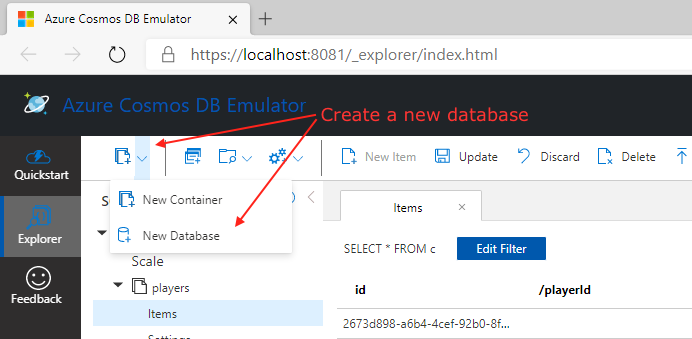 

When you add the new container you have to define the container key. This is very important since this will be used to scale your Cosmos DB. The container key should be picked based on the distribution of the data. From the Microsoft docs:

>"If you choose a partition key that evenly distributes throughput consumption across logical partitions, you will ensure that throughput consumption across physical partitions is balanced."

For this exercise, our Partition Key will be `region`, and also we will add a unique key using the `playerId` field.

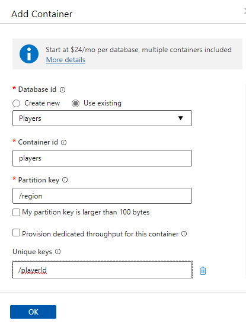

> 🔎 **Observation** - If you are interested in learning more about how the partition key impacts the performance of your application check out [this](https://docs.microsoft.com/azure/cosmos-db/partitioning-overview) page from the official docs.

### 2.5 Add the connection string to your Azure Function

Now that we have the Cosmos DB created locally, let's set up the Azure Function to use the local connection string.

Get the connection string from the local emulator:

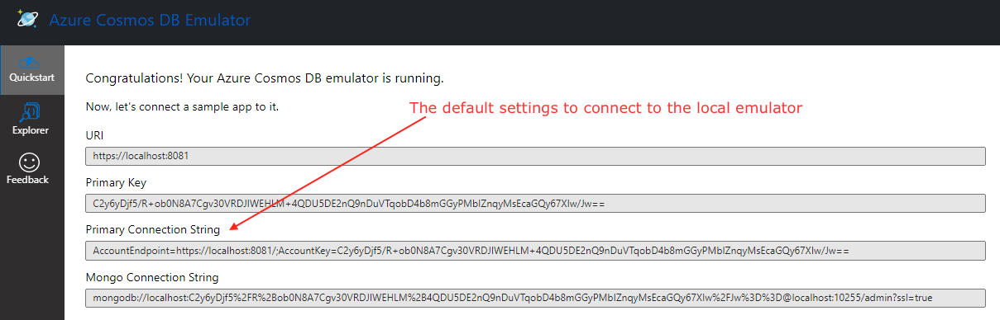 

Since we are running the local emulator in a hosted virtual machine we have to change the IP of localhost to the IP of the virtual machine. After getting the IP from the VM, remove localhost and use the actual IP address. Finally add it to the local.settings.json file.

```json
{
  "IsEncrypted": false,
  "Values": {
    "AzureWebJobsStorage": "UseDevelopmentStorage=false",
    "FUNCTIONS_WORKER_RUNTIME": "dotnet-isolated",
    "CosmosDBConnection": "AccountEndpoint=https://192.168.7.108:8081/;AccountKey=C2y6yDjf5/R+ob0N8A7Cgv30VRDJIWEHLM+4QDU5DE2nQ9nDuVTqobD4b8mGGyPMbIZnqyMsEcaGQy67XIw/Jw==;"
  }
}
```

> 🔎 **Observation** -  Notice the usage of `UseDevelopmentStorage` to false. This flag is used in combination with the Azure Local Storage emulator, but it is not needed in this exercise. Make sure to set it to `false`.

### 2.6 Add a CosmosDB output binding to your Run method

Add the following binding definition:

```csharp
[CosmosDBInput(databaseName: "Players",
                           collectionName: "Players",
                           ConnectionStringSetting = "CosmosDBConnection",
                           Id ="{id}",
                           PartitionKey ="{partitionKey}")] Player player)

```

After adding the output binding the signature of the Run method should look like the following:

```csharp
 public PlayerOutputType Run(
    [HttpTrigger(AuthorizationLevel.Anonymous, "put", Route = "players/{id}")] HttpRequestData req, string nickName,
    [CosmosDBInput(databaseName: "Players",
                           collectionName: "Players",
                           ConnectionStringSetting = "CosmosDBConnection",
                           Id ="{id}",
                           PartitionKey ="{partitionKey}")] Player player)
```

Save your changes.

### 2.7 Add a Player.cs model to the Azure Function application

For this exercise, we need to map the item from the HTTP call to an Entity that can be deserialized to a C# object, and make the required transformations, and then deserialize this object to save it in CosmosDB.

Add a new folder called Models, and add a new C# class inside of it. Call it `Player`.

Add the following content to this class.

```csharp

using System.Text.Json.Serialization;
namespace AzureFunctionsUniversity.Cosmos.Models;

public class Player
{
    [JsonPropertyName("id")]
    public string Id { get; set; }

    [JsonPropertyName("nickName")]
    public string NickName { get; set; }

    [JsonPropertyName("playerId")]
    public int PlayerId { get; set; }

    [JsonPropertyName("region")]
    public string Region { get; set; }
}
```

Save your changes.

### 2.8 Modify the content of the Run method

At the Run method, get the message from the queue, do a simple transformation and then send the resulting data to Cosmos DB.

The final code is shown below:

```csharp
[Function("TransformPlayerAndStoreInCosmos")]
    public PlayerOutputType Run([HttpTrigger(AuthorizationLevel.Anonymous, "put", Route = "players/{id}")] HttpRequestData req, string nickName,
    [CosmosDBInput(databaseName: "Players",
                           collectionName: "Players",
                           ConnectionStringSetting = "CosmosDBConnection",
                           Id ="{id}",
                           PartitionKey ="{partitionKey}")] Player player)
    {
        var response = req.CreateResponse(HttpStatusCode.OK);
        response.Headers.Add("Content-Type", "application/json; charset=utf-8");
        if (player == null)
        {
            return new PlayerOutputType()
            {
                UpdatedPlayer = null,
                HttpResponse = req.CreateResponse(HttpStatusCode.NotFound)
            };
        }

        player.NickName = nickName;


        return new PlayerOutputType()
        {
            UpdatedPlayer = player,
            HttpResponse = response
        };
    }
```

 Run your function locally.

Once your function is running, send a put request to the Function via the URL you're given from the console. Make sure you are provinding the Id of the player you want to update in the URL and the new nickName in the body.

The URL should look like: `http://localhost:7071/api/players/{id}`

```json
{
   "nickName": "Samuel",
}
```

Go to your Cosmos DB local emulator and verify that the item was updated to the `Players` container. You should see the list of items very similar to the below image:

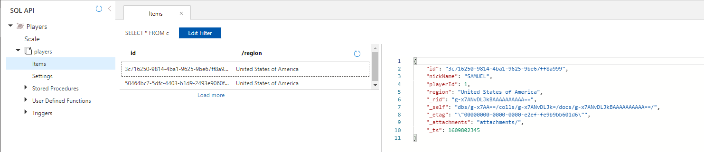 

## 3. Using the Cosmos DB input binding

For this exercise, it will be used the same Cosmos DB and the items that have already been added in the previous section of this lesson. If you have any issue following along this part of the lesson go to the [source code](../../../src/dotnet6/cosmos/) to review the finished code.

### 3.1 Create a new function using the one created in the previous section

Copy the existing Azure Function `TransformPlayerAndStoreInCosmos` in your Azure Function project to a new file called `QueryPlayerWithHttpTrigger.cs`

### 3.2 Add an input Cosmos DB binding to the Run method

An input binding has several fields:

- databaseName
- collectionName
- partitionKey
- connectionStringSetting

All these fields are required when using bindings. For this example we will use an Http trigger to request an item from the Cosmos DB based on its Id.

Use the following code in your new `QueryPlayerWithHttpTrigger` function.

```csharp
using System.Collections.Generic;
using System.Net;
using System.Text.Json;
using AzureFunctionsUniversity.Cosmos.Models;
using Microsoft.Azure.Functions.Worker;
using Microsoft.Azure.Functions.Worker.Http;
using Microsoft.Extensions.Logging;

namespace AzureFunctionsUniversity.Cosmos
{
    public class QueryPlayersWithHttpTrigger
    {
        private readonly ILogger _logger;

        public QueryPlayersWithHttpTrigger(ILoggerFactory loggerFactory)
        {
            _logger = loggerFactory.CreateLogger<QueryPlayersWithHttpTrigger>();
        }

        [Function("QueryPlayersWithHttpTrigger")]
        public HttpResponseData Run(
            [HttpTrigger(AuthorizationLevel.Anonymous, "get", Route = "players/{id}")] HttpRequestData req,
        [CosmosDBInput(databaseName: "Players",
                           collectionName: "Players",
                           ConnectionStringSetting = "CosmosDBConnection",
                           Id ="{id}",
                           PartitionKey ="{partitionKey}")] Player player)
        {
            var response = req.CreateResponse(HttpStatusCode.OK);
            response.Headers.Add("Content-Type", "application/json; charset=utf-8");
            if (player == null)
            {
                return req.CreateResponse(HttpStatusCode.NotFound); ;
            }
            string jsonString = JsonSerializer.Serialize(player);
            response.WriteString(jsonString);
            return response;
        }
    }
}

```

> 🔎 **Observation** - At the moment of writing this lesson there is support only for the SQL API with the Cosmos DB bindings.

> 🔎 **Observation** - Notice that there are three route parameters used in the HttpTrigger. These are re-used in the CosmosDB input binding.

### 3.3 Test the Cosmos DB binding locally

For using your function locally, hit `F5` in your VS Code. Make sure to have your Cosmos DB Emulator running and some items added to the `players` collection that can be queried.

Here's an example of a new item.

```json
{
  "nickName": "Simon",
  "playerId": 2,
  "region": "Spain"
}
```


Run and test your Azure Function locally using the values as part of the URL path.
Here's an example of an URL with the three values in the route:

`http://localhost:7071/api/players/United States of America/473501fc-9cbe-47ad-8de0-eb659fcfa514`

The following image shows the result:

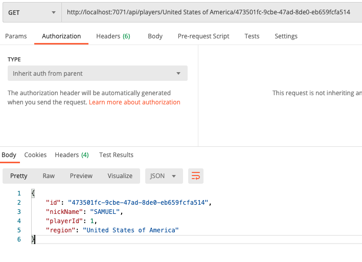

## 4. Creating a Cosmos DB Trigger function

Besides bindings, there is another way to connect an Azure Function to a Cosmos DB collection by using Triggers. In this exercise, we will use the same Azure Functions project that we have so far. If you haven't done the previous sections, you can clone the example from the repository and follow along this lesson. Besides the code, please double check that you have all the requirements at the section 0. 

### 4.1 Create a new Azure Function with a Cosmos DB trigger

The scenario is the following: we need to monitor the changes to our `players` container so we can add new items in another container, which will be used for another application. For achieving this we will use a Cosmos DB trigger and an output binding for Cosmos DB.

At VS Code, using your Azure Function project, add a new function using the Azure Functions extension. Select the Cosmos DB trigger for the template, keep the same namespace that has been used before, select the same `CosmosDBConnection` setting for the connection string, enter `Players` for the database name and finally, `players` for the collection name.

Your code should look very similar to the following:

```csharp
public static class StoreTeamPlayerInCosmos
{
    [FunctionName(nameof(StoreTeamPlayerInCosmos))]
    public static void Run([CosmosDBTrigger(
        databaseName: "Players",
        collectionName: "players",
        ConnectionStringSetting = "CosmosDBConnection",
        LeaseCollectionName = "leases",
        CreateLeaseCollectionIfNotExists = true)]IReadOnlyList<Document> input,
        ILogger log)
    {
        if (input != null && input.Count > 0)
        {
            log.LogInformation("Documents modified " + input.Count);
            log.LogInformation("First document Id " + input[0].Id);
        }
    }
}
```

> 🔎 **Observation** - A Cosmos DB Trigger relies on the change feed streams attached to the container. When any changes are made to a container, the change feed stream is sent to the trigger for the Azure Function invocation. Also, there is a new element in this function: a Leases collection. The concept of leases is introduced by the Changes Feed and the Cosmos DB trigger. The leases collection is used to keep track of what changed documents have been passed to external process(es), in this case the Azure Function. Without this collection there would be no way to know the checkpoint of the processed changed documents.  When only one function exists for a Cosmos DB collection there is not a problem to use one lease collection as only one checkpoint needs to be stored. When there are more functions watching the changes in a container, it needs to be a way to store different checkpoints for each different function.

Make sure to add the `CreateLeaseCollectionIfNotExists = true` parameter. This one is not added in the template, you have to add it manually.

Now, add the custom output binding for sending the new items to the `teamplayers` collection.

Create a file called `TeamPlayerOutputType.cs`

Add the following code:

```csharp
    using AzureFunctionsUniversity.Cosmos.Models;
    using Microsoft.Azure.Functions.Worker;
    using Microsoft.Azure.Functions.Worker.Http;

    namespace AzureFunctionsUniversity.Cosmos.Models;

    public class TeamPlayerOutputType
    {
        [CosmosDBOutput(databaseName: "Players", collectionName: "TeamPlayers", ConnectionStringSetting = "CosmosDBConnection")]
        public TeamPlayer? UpdatedTeamPlayer { get; set; }
        public HttpResponseData? HttpResponse { get; set; }
    }
```

Make sure to add locally the new collection `teamplayers` to your Cosmos DB `Players` as shown in the following image:

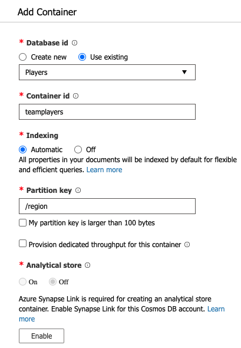

Same, needs to be added to the Azure platform Cosmos DB instance.

We also want to process every new item in the `players` container and then add or change the corresponding one at the `teamplayers` container. Let's do the changes to the function for achieving this.

```csharp
using System;
using System.Collections.Generic;
using AzureFunctionsUniversity.Cosmos.Models;
using Microsoft.Azure.Functions.Worker;
using Microsoft.Extensions.Logging;
using Newtonsoft.Json;

namespace AzureFunctionsUniversity.Trigger
{
    public class StoreTeamPlayerInCosmos
    {
        private readonly ILogger _logger;

        public StoreTeamPlayerInCosmos(ILoggerFactory loggerFactory)
        {
            _logger = loggerFactory.CreateLogger<StoreTeamPlayerInCosmos>();
        }

        [Function("StoreTeamPlayerInCosmos")]
        public TeamPlayerOutputType Run([CosmosDBTrigger(
            databaseName: "Players",
            collectionName: "Players",
            ConnectionStringSetting = "CosmosDBConnection", CreateLeaseCollectionIfNotExists = true)]  
            IReadOnlyList<MyDocument> input)
        {
            if (input != null && input.Count > 0)
            {
                _logger.LogInformation("Documents modified: " + input.Count);
                _logger.LogInformation("First document Id: " + input[0].Id);

                foreach (var item in input)
                {
                    Player player = JsonConvert.DeserializeObject<Player>(item.ToString());
                    TeamPlayer teamPlayer = new TeamPlayer()
                    {
                        Id = player.Id,
                        PlayerName = player.NickName,
                        Region = player.Region,
                        TeamId = 1
                    };
                    return new TeamPlayerOutputType()
                    {
                        UpdatedTeamPlayer = teamPlayer

                    };
                }
            }
            return new TeamPlayerOutputType()
            {
                UpdatedTeamPlayer = null

            };
        }
    }

    public class MyDocument
    {
        public string Id { get; set; }

        public string Text { get; set; }

        public int Number { get; set; }

        public bool Boolean { get; set; }
    }
}

```

Notice that we are using a new object type, `TeamPlayer`. You can copy the contents of this class from the repository files [here](../../../src/dotnet6/cosmos/Models/TeamPlayer.cs)

In the code we are processing all the items in the input parameter. Each document either inserted or changed in the `players` container will be sent in this list. We will send these items to the output binding into the type we have for the `teamplayers` container. In case you need more changes to every document in the input you can add the code here.

Now let's try out the functions in our app locally and see if everything works as expected.

For testing out this function do the following flow:

- Add a new item `Players` container. 
- Watch how the `StoreTeamPlayerInCosmos` function gets executed.

At the end of the execution you should see a new item in the `players` container and a new one at the `teamplayers` respectively.

## 5. Deploying to Azure

For deploying the Azure Function there are several options. All the methods are explained in the [Deployment lesson](../deployment/README.md).

In this exercise, we'll do the deployment using VS Code.

### 5.1 Deploy the Azure resources

Click on the Azure Extension. It should already display the subscription that you have for your Azure Account. Select the Azure Function and click on the Deploy Button indicated in the following image:

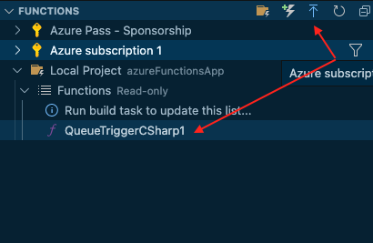 

Indicate the unique global name, the stack, and the region for the new function.

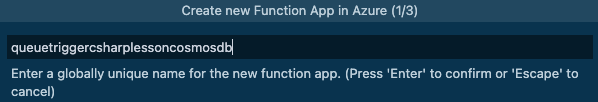

Check the output of the deployment task to review if there is any error.

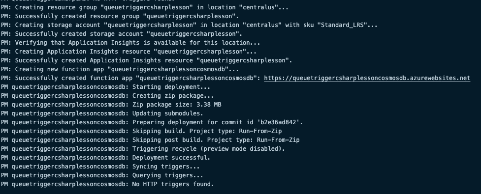

> 🔎 **Observation** - Notice that there is a Function App, and a Storage Account with the same name as the function.

Besides deploying a new Function App, you have to create in your Azure Subscription, a new Azure Cosmos DB and a Players container.

Follow the first three sections of [this](https://docs.microsoft.com/azure/cosmos-db/create-cosmosdb-resources-portal#create-an-azure-cosmos-db-account) tutorial from the Microsoft Docs to create your first Cosmos DB.


### 5.2 Add the connection strings to your Function App

There are two connection strings that should be added to the settings of the Azure Function:

- `CosmosDBConnection`

The names of the connection must be the same as the code deployed.

In the Azure Portal, go to `Home`, then `Azure Cosmos DB`, select your `Cosmos DB` with the `Players` container. Then at the left panel, under the `Settings` section, click on `Keys`, copy the `Primary Connection String`.
Go back to the `Application Settings` of the Azure Function and select the `New application setting` button, and add the CosmosDBConnection setting. 


> 🔎 **Observation** - Notice that even the setting is a connection string it was added as Application Settings. The only Connection Strings that have to be in the Connection String section are Entity Framework connection strings.

At this point, the Azure Function with the output binding is fully set up. Try it out and make sure everything works as expected.

## 6. Using Azure Key Vault for storing the connection string

So far we have used two connection strings: one for the queue connection and a second one for the Cosmos DB instance. Both connection string are critical settings that need to be managed and even shared between functions. In order to keep these settings secure we will use the Azure Key Vault service for storing them and share them. A Key Vault allows to manage secrets, certificates and keys from Azure resources using Azure Active Directory for authentication to access any of the resources stored on it. Also it can be used to monitor who and when this resources are being accessed.

For creating a new Key Vault there are 3 options: Azure CLI, Azure Portal and PowerShell. For this exercise we'll use the Azure Portal for simplicity. 

### 6.1 Create the new Azure Key Vault

Follow the first 3 sections at this [Quick start guide](https://docs.microsoft.com/azure/key-vault/general/quick-create-portal).
Use the name `FunctionUniversity-Vault` for the name of the Key vault.

### 6.2 Add the secrets to the Key Vault

Add two secrets: `CosmosDBConnection` to the vault. You will use the connection string value from both services: Cosmos DB and the Queue Storage connection and stored them in the Key Vault respectively.

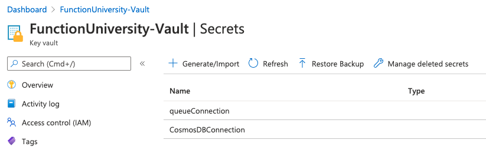

### 6.3 Add a Managed Identity

We need the Azure Functions Application to be able to read both secrets in the Key Vault, to do so let's add a system-assigned managed identity to our application, which will be used to access the protected secrets. A system-assigned identity is ideal for this case since the identity will be tied to the Functions Application and will have the same life cycle.
Follow the instructions at [this](https://docs.microsoft.com/azure/app-service/overview-managed-identity?tabs=dotnet#add-a-system-assigned-identity) Microsoft Docs official guide to enable the System Assigned identity. At the Azure Portal, select you Azure Function App, then settings, and Identity at the left panel, as showing in the below image:

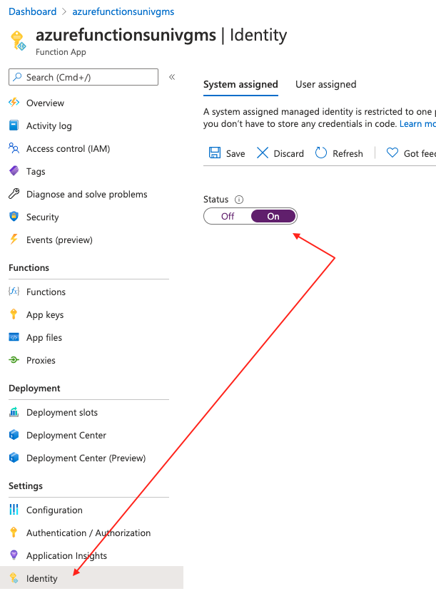

### 6.4 Configure the Access Policy on the Key Vault

Add the new access policy by going to the left panel then Access policies in your Azure Key Vault resource. Find the Service Principal for your Azure Function app using the name of the Azure Function App as shown in the image:

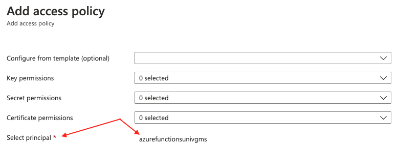

On the permissions field select the `Get` and `List` permissions for the secrets field. At this moment there is no need to add more than the secret permissions.

Click `Save` on the Access Policies at the Azure Portal.

### 6.5 Referencing the Azure key vault secrets at the Azure Functions App settings

The next step is to add the reference to the secrets of the Azure Key Vault service in the Function App. First get the identifiers from your Azure Key Vault and copy `CosmosDBConnection` value for later use. The identifier looks something like this:

`https://{name}.vault.azure.net/secrets/{secret}/{id}`

Go to your Function App, then configuration and update the value of both connection strings, with their own reference to the Key Vault. Example:

The app setting name is: `CosmosDBConnection` and the value will be something like @Microsoft.KeyVault(SecretUri={copied identifier for the secret of the `CosmosDBConnection`})

The format is documented at [this page](https://docs.microsoft.com/azure/app-service/app-service-key-vault-references#reference-syntax) of the official Microsoft Docs.

After both settings are added your App Settings should look like this:

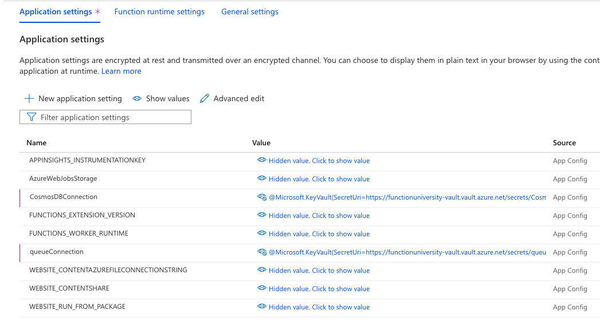

Now we can execute the Queue Trigger Azure Function by adding a new item to the queue in the Azure Storage Explorer. There is no need to change anything in the deployed code.

More about Managed Identities in the [official docs](https://docs.microsoft.com/azure/app-service/overview-managed-identity?tabs=dotnet#add-a-system-assigned-identity)

## 7. Using Dependency Injection pattern for Cosmos DB connection

One of the good practices when using Connections to resources is to look for sharing connections instead of creating them every time a new Function is executed. When many functions are running concurrently, a new connection is created for every running function. If you want to manage the connections so you can share them across functions, or if you want to use bindings to more than one container in the same function, and many other scenarios, there are a couple of options: Use a static client or use dependency injection in your function method to manage your own Cosmos DB client.

So far we have used Bindings and Triggers for Cosmos DB, for this exercise the demo will be using an HttpTrigger, and we will be adding new items on demand on the `players` container. We will send a POST with the data for the new item instead of using the Queue Trigger. This is just to show a different approach and how to use the StartUp class as you would use it in ASP.Net Core applications. You want to use this approach instead of using bindings.

In Out of process Azure Functions Dependency injection is simplified, compared to .NET class libraries. Rather than having to create a startup class to register services, you just have to call ConfigureServices on the host builder and use the extension methods on IServiceCollection to inject specific services. [Read more about here](https://docs.microsoft.com/azure/azure-functions/dotnet-isolated-process-guide#dependency-injection)

Before you can use dependency injection, you must install the following NuGet packages to your Azure Functions App:

- Microsoft.Extensions.Hosting;
- Microsoft.Extensions.DependencyInjection;

And the following for using the Cosmos Client:

- Microsoft.Azure.Cosmos

### 7.3 Create `PlayersRepository.cs`

Create a new file `PlayersRepository.cs` this is where our methods are going to live that will use DI.

```csharp
    using AzureFunctionsUniversity.Cosmos.Models;
    using Microsoft.Azure.Cosmos;
    using Microsoft.Extensions.Configuration;

    public class PlayersRepository
    {

        private readonly Container _playersCollection;


        public PlayersRepository(CosmosClient client, IConfiguration configuration)
        {
            var database = client.GetDatabase(configuration["CosmosDBConnection"]);
            _playersCollection = database.GetContainer("Players");
        
        }

        public async Task AddPlayerAsync(Player player)
        {
            player.Id = Guid.NewGuid().ToString("N");
            await _playersCollection.UpsertItemAsync(player, new PartitionKey(player.Id));
        }

    }
```

### 7.4 Edit `Program.cs`

In VS Code, edit the `Program.cs` file

```csharp
using Microsoft.Extensions.Hosting;
using Microsoft.Extensions.DependencyInjection;
using Microsoft.Azure.Cosmos;

class Program
{
    static async Task Main(string[] args)
    {

        var host = new HostBuilder()
                        .ConfigureFunctionsWorkerDefaults()
                        .ConfigureServices(services =>
                        {
                            services.AddSingleton(sp =>
                            {

                                return new CosmosClient(Environment.GetEnvironmentVariable("CosmosDBConnection"), new CosmosClientOptions
                                {
                                    SerializerOptions = new CosmosSerializationOptions
                                    {
                                        PropertyNamingPolicy = CosmosPropertyNamingPolicy.CamelCase
                                    }
                                });
                            }

                            ); services.AddSingleton<PlayersRepository>();
                        })
                        .Build();

        await host.RunAsync();

    }
}

```

### 7.5 Add a new Azure Function manually with Http trigger

In VS Code, add a new file and name it `StorePlayerWithDI.cs`. Add the following code on it:

```csharp

using System.Net;
using System.Text.Json;
using AzureFunctionsUniversity.Cosmos.Models;
using Microsoft.Azure.Functions.Worker;
using Microsoft.Azure.Functions.Worker.Http;
using Microsoft.Extensions.Logging;

namespace AzureFunctionsUniversity.Output
{
    public class StorePlayerWithDI
    {
        private readonly ILogger _logger;
        private readonly PlayersRepository _repository;

        public StorePlayerWithDI(ILoggerFactory loggerFactory, PlayersRepository repository)
        {
            _logger = loggerFactory.CreateLogger<StorePlayerWithDI>();
            _repository = repository;

        }

        [Function("StorePlayerWithDI")]
        public async Task<HttpResponseData> RunAsync([HttpTrigger(AuthorizationLevel.Anonymous, "post")]
        HttpRequestData req, string nickName, string region)
        {
            var response = req.CreateResponse(HttpStatusCode.Created);
            response.Headers.Add("Content-Type", "application/json; charset=utf-8");
            var newPlayer = new Player()
            {
                NickName = nickName,
                Region = region,
            };

            await _repository.AddPlayerAsync(newPlayer);
            string jsonString = JsonSerializer.Serialize(newPlayer);
            response.WriteString(jsonString);

            return response;
        }
    }
}


```
 
With the mentioned changes, the connection to the Cosmos DB instance is shared in all the function executions of this instance. 

### 7.6 Test the function

In VS Code, hit `F5` or click on `Run` at the main menu.

Using Postman or any other API client, trigger the `StorePlayerWithDI` function with a payload in json of a `player` item. Use a `post` action and check that the result is successful. 

The following image shows a successful response.

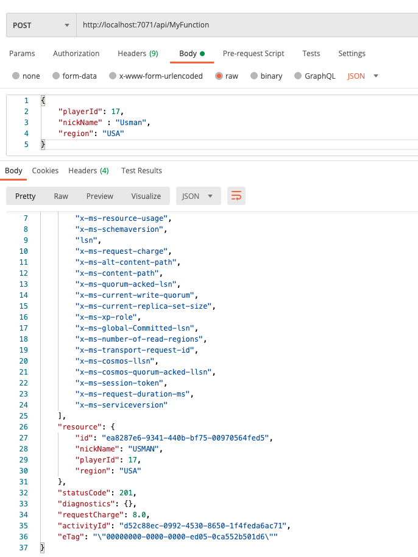

> 🔎 **Observation** - If you have done the other functions that are part of this lesson, you should also see that the Cosmos DB trigger function gets executed and a new item is added at the teamplayers container. If you want to deploy this function to your Azure Subscription, just follow the steps at the Deploying section.

If you want to take a look at the code of this lesson, here is the [source code](../../../src/dotnetcore31/AzureFunctions.Cosmos) of the full lesson.

The official documentation about dependency injection in Azure Functions is at this [link](https://docs.microsoft.com/azure/azure-functions/functions-dotnet-dependency-injection), if you want to read more about how to use it in many more scenarios with Azure Functions.

## 8. Homework

Deploy all the functions to your Azure Subscription and test them in the Azure Cloud.

## 9. More info

For more info about Cosmos DB and bindings for Azure Functions have a look at the official [Azure Cosmos DB Bindings](https://docs.microsoft.com/azure/azure-functions/functions-bindings-cosmosdb-v2) documentation.

## 10. Feedback

We love to hear from you! Was this lesson useful to you? Is anything missing? Let us know in a [Feedback discussion post](https://github.com/marcduiker/azure-functions-university/discussions/new?category=feedback&title=.NET%20Core%20CosmosDB%20Lesson) here on GitHub.

---
[🔼 Lessons Index](../../README.md)
