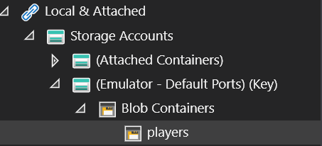
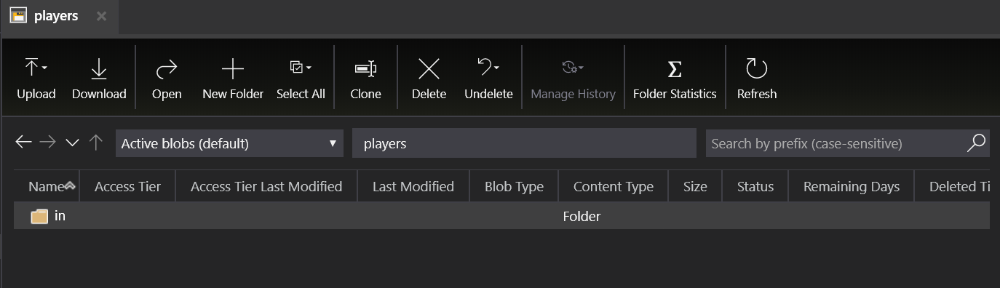
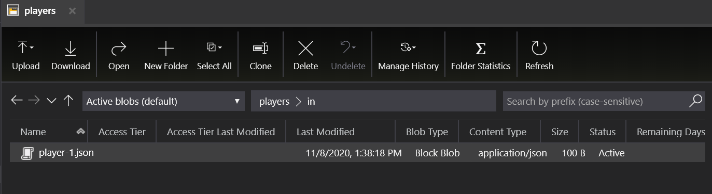
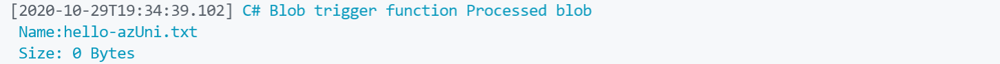

# Blob Bindings

Watch the recording of this lesson [on YouTube 🎥](https://youtu.be/z5AQdk-43ZI).

## **Goal**

The goal of this lesson is to use Blob storage input and output bindings which lets you easily read & write blob data in your functions. In addition you'll create a Blob triggered function that reacts to changes in blob storage data.

This lessons consists of the following exercises:

|Nr|Exercise
|-|-
|1|[Using the Microsoft Azure Storage Explorer and Storage Emulator](#1-using-the-microsoft-azure-storage-explorer-and-storage-emulator)
|2|[Using `string` Blob output bindings](#2-using-string-Blob-output-bindings)
|3|[Using `CloudBlobContainer` Blob output bindings](#3-using-cloudblobcontainer-blob-output-bindings)
|4|[Using `dynamic` Blob output bindings](#4-using-dynamic-blob-output-bindings)
|5|[Using `Stream` Blob input bindings](#5-using-stream-Blob-input-bindings)
|6|[Using `CloudBlobContainer` Blob input bindings](#6-using-cloudblobcontainer-blob-input-bindings)
|7|[Using `dynamic` Blob input bindings](#7-using-dynamic-blob-input-bindings)
|8|[Creating a Blob triggered function](#8-creating-a-blob-triggered-function)
|9|[Homework](#9-homework)
|10|[More info](#10-more-info)

> 📝 **Tip** - If you're stuck at any point you can have a look at the [source code](../../../src/dotnetcore31/AzureFunctions.Blob) in this repository.

---

## 1. Using the Microsoft Azure Storage Explorer and Storage Emulator

We're going to be using local storage instead of creating a storage account in Azure, this is great for local development.  

### Steps

1. Install [Azure Storage Emulator](https://docs.microsoft.com/azure/storage/common/storage-use-emulator) if you are on windows, if you are using Mac OS or Linux, use [Azurite](https://github.com/Azure/Azurite).
2. Install [Azure Storage Explorer](https://azure.microsoft.com/features/storage-explorer/).
3. Start the Azure Storage Emulator.
4. Open Azure Storage Explorer, expand Local & Attached > Storage Accounts > (Emulator - Default Ports) (Keys) > Right click on Blob containers and create a new `players` container.
5. 
   
6. In the `players` container create a folder called `in`.
   
7. Drag [player-1.json](../../../src/dotnetcore31/AzureFunctions.Blob/player-1.json) there. You can create more player json files and add them here if you'd like, we've provided one example.
     
8. You're now all set to work with local storage.

> 📝 **Tip** - Read about [Azure Storage Emulator](https://docs.microsoft.com/azure/storage/common/storage-use-emulator) and [Azure Storage Explorer](https://azure.microsoft.com/features/storage-explorer/).

## 2. Using `string` Blob output bindings

In this exercise, we'll be creating a HTTP Function App with the default HTTPTrigger and extend it with a Blob output binding in order to write a `Player` json object to a "players/out" path in Blob Storage.

### Steps

1. In VSCode Create a new HTTP Trigger Function App with the following settings:
   1. Location: *AzureFunctions.Blob*
   2. Language: *C#*
   3. Template: *HttpTrigger*
   4. Function name: *StorePlayerWithStringBlobOutput*
   5. Namespace: *AzureFunctionsUniversity.Demo*  
   6. AccessRights: *Function*
2. Once the Function App is generated, add a reference to the `Microsoft.Azure.WebJobs.Extensions.Storage` NuGet package to the project. This allows us to use bindings for Blobs, Tables and Queues.

   > 📝 **Tip** - One way to easily do this is to use the _NuGet Package Manager_ VSCode extension:
   > 1. Run `NuGet Package Manager: Add new Package` in the Command Palette (CTRL+SHIFT+P).
   > 2. Type: `Microsoft.Azure.WebJobs.Extensions.Storage`
   > 3. Select the most recent (non-preview) version of the package.

3. We want to store an object with (game)player data. Create a new file in the project called `Player.cs` and add the contents from this [Player.cs](../../../src/dotnetcore31/AzureFunctions.Blob/Models/Player.cs) file.
4. Now open the `StorePlayerWithStringBlobOutput.cs` function file and add the following output binding directly underneath the `HttpTrigger` method argument:

   ```csharp
   [Blob(
      "players/out/string-{rand-guid}.json", 
      FileAccess.Write)] out string playerBlob
   ```

    > 🔎 **Observation** - The first part parameter of the `Blob` attribute is the full path where the blob will be stored. The **{rand-guid}** section in path is a so-called **binding expression**. This specific expression creates a random guid. There are more expressions available as is described [in the documentation](https://docs.microsoft.com/azure/azure-functions/functions-bindings-expressions-patterns). The second parameter indicates we are writing to Blob Storage. Finally we specify that there is an output argument of type `string` named `playerBlob`.

    > 🔎 **Observation** - Notice that we're not specifying the Connection property for the `Blob` binding. This means the storage connection of the Function App itself is used for the Blob storage. It now uses the `"AzureWebJobsStorage"` setting in the `local.settings.json` file. The value of this setting should be: `"UseDevelopmentStorage=true"` when emulated storage is used. When an Azure Storage Account is used this value should contain the connection string to that Storage Account.

5. Go back to the function class. We'll be doing a POST to the function so the `"get"` can be removed from the `HttpTrigger` attribute.
6. Change the function input type and name from `HttpRequest req` to `Player player` so we have direct access to the `Player` object in the request.
7. Remove the existing content of the function method, since we'll be writing a new implementation.
8. To return a meaningful response the the client, based on a valid `Player` object, add the following lines of code in the method:

   ```csharp
   playerBlob = default;
   IActionResult result;

   if (player == null)
   {
      result = new BadRequestObjectResult("No player data in request.");
   }
   else
   {
      result = new AcceptedResult();
   }

   return result;
   ```

9. Since we're using `string` as the output type the `Player` object needs to be serialized. This can be done as follows inside the `else` statement in the method:

   ```csharp
   playerBlob = JsonConvert.SerializeObject(player, Formatting.Indented);
   ```

10. Ensure that the function looks as follows:

   ```csharp
   public static class StorePlayerWithStringBlobOutput
    {
        [FunctionName(nameof(StorePlayerWithStringBlobOutput))]
        public static IActionResult Run(
            [HttpTrigger(
                AuthorizationLevel.Function,
                nameof(HttpMethods.Post),
                Route = null)] Player player,
            [Blob(
                "players/out/string-{rand-guid}.json",
                FileAccess.Write)] out string playerBlob)
        {
            playerBlob = default;
            IActionResult result;

            if (player == null)
            {
                result = new BadRequestObjectResult("No player data in request.");
            }
            else
            {
                playerBlob = JsonConvert.SerializeObject(player, Formatting.Indented);
                result = new AcceptedResult();
            }

            return result;
        }
    }
   ```

11. Build & run the `AzureFunctions.Blob` Function App.
12. Make a POST call to the `StorePlayerWithStringBlobOutput` endpoint and provide a valid json body with a `Player` object:

      ```http
      POST http://localhost:7071/api/StorePlayerWithStringBlobOutput
      Content-Type: application/json

      {
         "id": "{{$guid}}",
         "nickName" : "Ada",
         "email" : "ada@lovelace.org",
         "region" : "United Kingdom"
      }
      ```

       > 📝 **Tip** - The `{{$guid}}` part in the body creates a new random guid when the request is made. This functionality is part of the VSCode REST Client extension.

13. > ❔ **Question** - Is there a blob created blob storage? What is the exact path of the blob?

14. > ❔ **Question** - What do you think would happen if you run the function again with the exact same input?

## 3. Using `CloudBlobContainer` Blob output bindings

In this exercise, we'll be adding an HttpTrigger function and use the Blob output binding with the `CloudBlobContainer` type in order to write a `Player` json object to a "players/out" path in Blob Storage.

### Steps

1. Create a copy of the `StorePlayerWithStringBlobOutput.cs` file and rename the file, the class and the function to `StorePlayerWithContainerBlobOutput`.
2. Change the `Blob` attribute as follows:

   ```csharp
   [Blob(
      "players",
      FileAccess.Write)] CloudBlobContainer cloudBlobContainer
   ```

    > 🔎 **Observation** - The `CloudBlobContainer` refers to a blob container and not directly to a specific blob. Therefore we only have to specify the `"players"` container in the `Blob` attribute.
3. Update the code inside the `else` statement. Remove the line with `playerBlob = JsonConvert.SerializeObject...` and replace it with:

   ```csharp
   var blob = cloudBlobContainer.GetBlockBlobReference($"out/cloudblob-{player.NickName}.json");
   var playerBlob = JsonConvert.SerializeObject(player);
   await blob.UploadTextAsync(playerBlob);
   ```

   > 🔎 **Observation** - Notice that the argument for getting a reference to a blockblob includes the `out/` path. This part is a virtual folder, it is not a real container such as the `"player"` container. The filename of the blob is a concatenation of "cloudblob-", the nickname of the player object, and the json extension.
4. Build & run the `AzureFunctions.Blob` Function App.
5. Make a POST call to the `StorePlayerWithContainerBlobOutput` endpoint and provide a valid json body with a `Player` object:

   ```http
   POST http://localhost:7071/api/StorePlayerWithContainerBlobOutput
   Content-Type: application/json

   {
      "id": "{{$guid}}",
      "nickName" : "Margaret",
      "email" : "margaret@hamilton.org",
      "region" : "United States of America"
   }
   ```

6. > ❔ **Question** - Is the blob created in the `players/in` location?
7. > ❔ **Question** - What happens when you run the function with the exact same input?
8. > ❔ **Question** - Use one of the other `Player` properties as the partial filename. Does that work?

## 4. Using `dynamic` Blob output bindings

In this exercise, we'll be adding an HttpTrigger function and use a dynamic Blob output binding in order to write a `Player` json object to a "players/out" path in Blob Storage.

> 📝 **Tip** - Dynamic bindings are useful when output or input bindings can only be determined at runtime. In this case we'll use the dynamic binding to create a blob path that contains a property of a `Player` object that is provided in the HTTP request.

### Steps

1. Create a copy of the `StorePlayerWithStringBlobOutput.cs` file and rename the file, the class and the function to `StorePlayerWithStringBlobOutputDynamic`.
2. Remove the existing `Blob` attribute from the method and replace it with:

   ```csharp
   IBinder binder
   ```

   > 🔎 **Observation** - The IBinder is the interface of a dynamic binding. It only has one method `BindAsync<T>()` which we'll use in the next step.
3. Update the `else` statement to it looks like this:

   ```csharp
   var blobAttribute = new BlobAttribute($"players/out/dynamic-{player.Id}.json");
   using (var output = await binder.BindAsync<TextWriter>(blobAttribute))
   {
      await output.WriteAsync(JsonConvert.SerializeObject(player));
   }
   result = new AcceptedResult();
   ```

    > 🔎 **Observation** - First, a new instance of a `BlobAttribute` type is created which contains the path to the blob. A property of the `Player` object is used as part of the filename. Then, the `BindAsync` method is called on the `IBinder` interface. Since we'll be writing json to a file, we can use the `TextWriter` as the generic type. The `BindAsync` method will return a `Task<TextWriter>`. When the method is awaited we can acces methods on the `TextWriter` object to write the serialized `Player` object to the blob.
4. Build & run the `AzureFunctions.Blob` Function App.
5. Make a POST call to the `StorePlayerWithStringBlobOutputDynamic` endpoint and provide a valid json body with a `Player` object:

   ```http
   POST http://localhost:7071/api/StorePlayerWithStringBlobOutputDynamic
   Content-Type: application/json

   {
      "id": "{{$guid}}",
      "nickName" : "Grace",
       "email" : "grace@hopper.org",
      "region" : "United States of America"
   }
   ```

6. > ❔ **Question** - Is the blob created in the `players/in` location?
7. > ❔ **Question** - Could you think of other scenarios where dynamic bindings are useful?

## 5. Using `Stream` Blob input bindings

Let's see how we can use the `Stream` type to work with Blobs. We will create an HTTP Trigger function that expects a player ID in the URL, and with that ID it will return the content from the Blob that matches it. 

### Steps

1. Create a new HTTP triggered function, we will name it GetPlayerWithStreamInput.cs
2. We're going to make some changes to the method definition:
   1. Change the `HTTPTrigger` `Route` value, set it to

      ```csharp
      Route = "GetPlayerWithStreamInput/{id}"
      ```

   2. Add a parameter to the method

       ```csharp
      string id
       ```

   3. Add the Blob Input Binding

      ```csharp
      [Blob(
         "players/in/player-{id}.json",
         FileAccess.Read)] Stream playerStream
      ```

   4. Your method definition should should look like this now:

      ```csharp
      [FunctionName(nameof(GetPlayerWithStreamInput))]
      public static async Task<IActionResult> Run(
         [HttpTrigger(
            AuthorizationLevel.Function,
            nameof(HttpMethods.Get),
            Route = "GetPlayerWithStreamInput/{id}")] HttpRequest request,
         string id,
         [Blob(
            "players/in/player-{id}.json",
            FileAccess.Read)] Stream playerStream)
      ```

3. Let's make some edits to the body of the method.
   1. Remove all the code in the body.
   2. Create an object to store our IActionResult:

      ```csharp
      IActionResult result;
      ```

   3. Let's make sure the id is not empty or null, if it is, return a BadRequestObjectResult with a custom message:

      ```csharp
      if (string.IsNullOrEmpty(id))
      {
         result = new BadRequestObjectResult("No player id route.");
      }
      ```

   4. If we do have a value for id, use StreamReader to get the contents of playerStream and return it:

         ```csharp
         else
         {
            using var reader = new StreamReader(playerStream);
            var content = await reader.ReadToEndAsync();
            result = new ContentResult 
            { 
               Content = content,
               ContentType = MediaTypeNames.Application.Json,
               StatusCode = 200
            };
         }
         return result;
         ```

   > 🔎 **Observation** -  `StreamReader` reads characters from a byte stream in a particular encoding. In this demo we are creating a new `StreamReader` from the playerStream. The `ReadToEndAsync()` method reads all characters from the playerStream (which is the content of the blob). We then create a result with the content of the blob, json as the `ContentType` and `StatusCode 200` to indicate success.  

4. Run the Function App, make a request to the endpoint, and provide an ID in the URL. As long as there is a blob with the name matching the ID you provided, you will see the contents of the blob output.
     1. URL:

         ```http
         GET http://localhost:7071/api/GetPlayerWithStreamInput/1
         ```

     2. Output: (this is the contents of [player-1.json](../../../src/dotnetcore31/AzureFunctions.Blob/player-1.json) make sure it's in your local storage blob container, we covered this in the first step of this lesson.)

         ```json
         {
            "id":"1",
            "nickName":"gwyneth",
            "email":"gwyneth@game.com",
            "region": "usa"
         }
         ```

## 6. Using `CloudBlobContainer` Blob input bindings

Let's see how we can use the `CloudBlobContainer` type to work with Blobs. We will create an HTTP Trigger function that will return the names of every blob in our `players` container.

### Steps

1. Create a new HTTP Trigger Function App, we will name it `GetBlobNamesWithContainerBlobInput.cs`.
2. We're going to make some changes to the method definition:
   1. Change the HTTPTrigger to only allow GET calls:

      ```csharp
      nameof(HttpMethods.Get)
      ```

   2. Add the Blob Input Binding:

      ```csharp
      [Blob(
         "players",
         FileAccess.Read)] CloudBlobContainer cloudBlobContainer)
      ```

   3. Your method definition should should look like this now:

      ```csharp
      public static IActionResult Run(
         [HttpTrigger(
            AuthorizationLevel.Function,
            nameof(HttpMethods.Get), 
            Route = null)] HttpRequest request,
         [Blob(
            "players",
            FileAccess.Read)] CloudBlobContainer cloudBlobContainer)
      ```

3. Let's make some edits to the body of the method.
   1. Remove all the code in the body.
   2. Create an object to store our the list of blobs in our container:

      ```csharp
      var blobList = cloudBlobContainer.ListBlobs(prefix: "in/")OfType<CloudBlockBlob>();
      ```

   3. Create an object to store the names of each blob from the blobList:

      ```csharp
      var blobNames = blobList.Select(blob => new { BlobName = blob.Name });
      ```

   4. Return an OkObjectResult with the blobNames found:

         ```csharp
         return new OkObjectResult(blobNames);
         ```

   > 🔎 **Observation** - Azure storage service offers three types of blobs. Block blobs are optimized for uploading large amounts of data efficiently (e.g pictures, documents). Page blobs are optimized for random read and writes (e.g VHD). Append blobs are optimized for append operations (e.g logs). Read more [here](https://docs.microsoft.com/rest/api/storageservices/understanding-block-blobs--append-blobs--and-page-blobs)

4. Run the Function App and make a request to the endpoint.
   1. URL:

      ```http
      GET http://localhost:7071/api/GetBlobNamesWithContainerBlobInput
      ```

   2. Output: (In my case, I have 2 play json files)

      ```json
      [
         {"blobName":"in/player-1.json"},
         {"blobName":"in/player-2.json"}
      ]
      ```

## 7. Using `dynamic` Blob input bindings

Often you won't know the path of the blob until runtime, for those cases we can perform the binding imperatively in our code (instead of declaratively via the method definition). Meaning the binding will execute at runtime instead of compile time. For this we can use `IBinder`. Let's take a look.

Okay so to summarize, use dynamic when you are getting the path at runtime. String and byte[] load the entire blob into memory, not ideal for large files, but Stream and CloudBlockBlob with the blob binding don’t load it entirely into memory, so ideal for processing large files.

### Steps

1. Create a new HTTP Trigger Function App, we will name it `GetPlayerWithStringInputDynamic.cs`.
2. We're going to make some changes to the method definition:
   1. Change the HTTPTrigger to only allow GET calls:

      ```csharp
      nameof(HttpMethods.Get)
      ```

   2. Add an IBinder parameter to the method definition:

      ```csharp
      IBinder binder
      ```

   3. Your method definition should should look like this now:

      ```csharp
      public static async Task<IActionResult> Run(
            [HttpTrigger(AuthorizationLevel.Function, "get", Route = null)] HttpRequest request,
            IBinder binder
      ```

3. Let's make some edits to the body of the method.
   1. Remove all the code in the body.
   2. Create a string object to store `id` and `result`:

      ```csharp
      string id = request.Query["id"];
      IActionResult result;
      ```

   3. Let's do some validation to make sure we have a value for `id`. If we do have a value for `id` we create a `BlobAttribute` with the value in the path. Then we will use `BindAsync<TextReader> to read the contents of the blob and finally assign the content to the result and return the result.

         ```csharp
         if (string.IsNullOrEmpty(id))
         {
            result = new BadRequestObjectResult("No player data in request.");
         }
         else
         {
            string content;
            var blobAttribute = new BlobAttribute($"players/in/player-{id}.json");
            using (var input = await binder.BindAsync<TextReader>(blobAttribute))
            {
               content = await input.ReadToEndAsync();
            }
            result = new ContentResult
            {
               Content = content,
               ContentType = MediaTypeNames.Application.Json,
               StatusCode = 200
            };
         }

         return result;
         ```

      > 🔎 **Observation** - We are using `TextReader` for this simple example, but other options include `Stream` and `CloudBlockBlob` which we've used in other examples.

      > 🔎 **Observation** - By wrapping the Binder instance in a `using` we are indicating that the instance must be properly disposed. This just means that once the code inside of the `using` is executed, it will call the Dispose method of `IBinder` and clean up the object. [Here](https://www.codeproject.com/Articles/6564/Understanding-the-using-statement-in-C) is a great explanation.

4. Run the Function App, make a request to the endpoint, and provide an ID in the URL. As long as there is a blob with the name matching the ID you provided, you will see the contents of the blob output.
     1. URL:

         ```http
         GET http://localhost:7071/api/GetPlayerWithStringInputDynamic/1
         ```

     2. Output: (this is the contents of [player-1.json](../../../src/dotnetcore31/AzureFunctions.Blob/player-1.json) make sure it's in your local storage blob container, we covered this in the first step of this lesson.)

         ```json
         {
            "id":"1",
            "nickName":"gwyneth",
            "email":"gwyneth@game.com",
            "region": "usa"
         }
         ```

## 8. Creating a Blob triggered Function App

First, you'll be creating a Function App with the BlobTrigger and review the generated code.

### Steps

1. Create the Function App by running `AzureFunctions: Create New Project` in the VSCode Command Palette (CTRL+SHIFT+P).

   > 📝 **Tip** - Create a folder with a descriptive name since that will be used as the name for the project.

2. Select the language you'll be using to code the function, in this lesson we'll be using `C#`.
3. Select `BlobTrigger` as the template.
4. Give the function a name (e.g. `HelloWorldBlobTrigger`).
5. Enter a namespace for the function (e.g. `AzureFunctionsUniversity.Demo`).
6. Select `Create a new local app setting`.

   > 🔎 **Observation** - The local app settings file (local.settings.json) is used to store environment variables and other useful configurations.

7. Select the Azure subscription you will be using.
8. Since we are using the BlobTrigger, we need to provide a storage account, select one or create a new storage account.
   1. If you select a new one, provide a name. The name you provide must be unique to all Azure.
9. Select a resource group or create a new one.
   1. If you create a new one, you must select a region. Use the one closest to you.
10. Enter the path that the trigger will monitor, you can leave the default value `samples-workitems` if you'd like or change it. Make sure to keep this in mind as we will be referencing it later on.
11. When asked about storage required for debugging choose _Use local emulator_.

   

Now the Function App with a BlobTrigger function will be created.

## 8.1 Examining the Function App

Great, we've got our Function Project and Blob Trigger created, let's examine what has been generated for us.

```csharp
public static void Run(
   [BlobTrigger(
      "samples-workitems/{name}", 
      Connection = "azfunctionsuniversitygps_STORAGE")]
      Stream myBlob, 
      string name, 
      ILogger log)
   {
      log.LogInformation($"C# Blob trigger function 
      Processed blob\n Name:{name} \n Size: {myBlob.Length} Bytes");
   }
```

This is the function with BlobTrigger created for us. A few things in here were generated and set for us thanks to the wizard. Let's look at the binding.

```csharp
[BlobTrigger(
   "samples-workitems/{name}",
   Connection = "azfunctionsuniversitygps_STORAGE")] Stream myBlob
```

We can see this BlobTrigger has a few parts:

- **"samples-workitems/{name}"**: This is the path we set that the function will monitor.
- **Connection = "azfunctionsuniversitygps_STORAGE"**: This is the value in our local.settings.json file where our connection string to our storage account is stored.
- **Stream myBlob**: This is the object where the blob that triggered the function will be stored and can be used in code.

As for the body of the function:

```csharp
log.LogInformation($"C# Blob trigger function Processed blob\n Name:{name} \n Size: {myBlob.Length} Bytes");
```

the name and size of the blob that triggered the function will print to console.

## 8.2 Run the function

Okay now it actually is time to fun the function, go ahead and run it, and then add a file to the blob container that the function is monitoring. You should see output similar to this. The name and size of the tile you uploaded will appear in your Visual Studio terminal output.



> 🔎 **Observation** - Great! That's how the BlobTrigger works, can you start to see how useful this trigger could be in your work?

## 9. Homework

[Here](blob-homework-resume-api-dotnet.md) is the assignment for this lesson.

## 10. More info

For more info about the Blob Trigger and bindings have a look at the official [Azure Functions Blob Bindings](https://docs.microsoft.com/azure/azure-functions/functions-bindings-storage-blob) documentation.

---
[🔼 Lesson Index](../../README.md)
