# Configuration & Settings (.NET Core)

Watch the recording of this lesson [on YouTube](https://youtu.be/p8FVnMSYMpA).

## Goal 🎯

The goal of this lesson is to learn where you can store application settings and use them in your Azure Functions.

This lessons consists of the following exercises:

|Nr|Exercise
|-|-
|0|[Prerequisites](#0-prerequisites)
|1|[Why do we use configuration?](#1-why-do-we-use-configuration)
|2|[Function App application settings](#2-function-app-application-settings)
|3|[Using custom application settings](#3-using-custom-application-settings)
|4|[Manage app settings using Azure CLI](#4-manage-app-settings-using-azure-cli)
|5|[Using App Configuration Service](#5-using-app-configuration-service)
|6|[Homework](#6-homework)
|7|[More info](#7-more-info)

---

## 0. Prerequisites

| Prerequisite | Exercise
| - | -
| Azure CLI | 3, 4
| Azure Functions Core Tools | 3
| VS Code | 3, 5
| A Function App in Azure | 3, 4

See [.NET prerequisites](../prerequisites/README.md) for more details.

## 1. Why do we use configuration?

Configuration. One or more values, read into your application at run time, which can change the way that it runs, or change the data sources it uses at runtime.

When we run our applications locally, we run them against a known environment. We know the location of all resources we need, and if the code is staying on our machines then we also know all of our secrets.

In the early years of software development configuration was not as important to smaller applications. Production and development environments looked similar, or there is only a production environment. You deployed your code and it just worked.

That didn't work for larger applications though, and in this day and age it doesn't really work at all.

As applications became larger, as they became more complex and distributed, and as they were deployed to more diverse environments, you - the developer - lost the knowledge of where and how the application was going to run.

You could make a change to your application and recompile it for each environment that you deploy into - but that is both a lot of extra (manual) work, and introduces risks as what is deployed to test and production environments are all different applications. This is not a realistic approach.

The solution to this is to introduce configuration settings to your application. Something that can be changed externally to your code to allow the same code to work in multiple different places, and to allow a change in behavior per environment. That is, use environment specific settings to set certain values in your code at runtime instead of compile time.

Some examples of the type of data we want to separate from our code are:

* Connection strings
* The execution mode of the application (dev, test, production etc)
* API URLs
* Service account details

Another reason for configuration settings is security. Our code is not just on our local machines. It lives in source control systems such as: Azure DevOps, GitHub etc.

Putting sensitive information into these source control systems, even in private repositories, is a security risk as it allows anyone with access to the repository to know sensitive information about all of your environments. If your repository is public the risk is even greater!

Instead sensitive information (secrets) should be accessed via configuration variables, allowing for each environment to use it's own secrets, and keeping those secrets private to the environments where they need to be kept.

> 📝 **Tip** - When writing your application start using configuration settings from the start, that way everything that should be configurable is configurable and sensitive information isn't missed when moving hard coded values before committing to source control

> 🔎 **Observation** - A primary use case for environment variables is to limit the need to modify and re-release an application due to changes in configuration data

## 2. Function App application settings

When you look at a Function App in the portal there are several types of settings available under the *Settings* > *Configuration* blade:

* Application settings
* Function runtime settings
* General settings

### 2.1 Application settings

The *Application settings* are exposed as environment variables and available at runtime. Some of these settings are required by Azure Functions such as *FUNCTIONS_WORKER_RUNTIME*. There is a [long list of predefined settings](https://docs.microsoft.com/azure/azure-functions/functions-app-settings) you can use to change the behavior of the Function App. Most of the predefined settings can be recognized because they're written in ALL CAPS. There are exception though, such as *AzureWebJobsStorage*. Besides the predefined settings the *Application settings* section is a great place to put your own application specific settings.
The *Connection strings* section below the *Application settings* is only meant for Entity Framework related connection strings. These will be covered in another lesson.

### 2.2 Function runtime settings

The *Function runtime settings* section is quite small. Here the Azure Function *Runtime version* can be selected. `~3` means: use the latest available version for Azure Functions Runtime v3. This value can be overridden to a specific runtime version by supplying a value (e.g. `3.0.15065`) for the *FUNCTIONS_EXTENSION_VERSION* setting. The *Daily Usage Quota* can be set to limit the costs for the Function App. The Function App will stop once the quota is exceeded.

### 2.3 General settings

The *General settings*  section contains settings about the platform, debugging, and client certificates. These settings are only available for functions based on Windows machines. Since Function Apps share the same resources are App Services, more information on the *General settings* can be found in the [*Configure general settings* section in the App Service docs](https://docs.microsoft.com/azure/app-service/configure-common#configure-general-settings).

> 📝 **Tip** - When any of these settings are updated (and saved), the Function App will be restarted. So be mindful when updating these settings to avoid a disruption of the Function App.

## 3. Using custom application settings

Now that we know where to find the application settings in the portal, how can those values be used in our application?

And how can we still debug the application locally without having access to those values in the Azure cloud?

In the following three exercises (3.1-3.3) we will:

* Create a function application
* Retrieve a custom application setting
* Set it locally for debugging purposes
* Publish the setting to Azure

### 3.1 Retrieve App Settings

#### Steps

1. In VSCode, create a new HTTP Trigger Function App with the following settings:
   1. Location: *AzureFunctions.Configuration*
   2. Language: *C#*
   3. Template: *HttpTrigger*
   4. Function name: *ReadingEnvironmentVariables*
   5. Namespace: *AzureFunctionsUniversity.Demo.Configuration*  
   6. AccessRights: *Function*
2. Change the `FunctionName` attribute to reflect the name of the class:

   ```c#
   [FunctionName(nameof(ReadingEnvironmentVariables))]
   ```

3. Remove the code inside the `Run` function and replace with the following snippet:

   ```c#
   var config = Environment.GetEnvironmentVariable("ConfigurationValue");
   return new OkObjectResult($"ConfigurationValue: {config}");
   ```

4. The finished function should look something like:

   ```c#
   using System;
   using System.IO;
   using System.Threading.Tasks;
   using Microsoft.AspNetCore.Mvc;
   using Microsoft.Azure.WebJobs;
   using Microsoft.Azure.WebJobs.Extensions.Http;
   using Microsoft.AspNetCore.Http;
   using Microsoft.Extensions.Logging;
   using Newtonsoft.Json;

   namespace AzureFunctionsUniversity.Demo.Configuration
   {
       public static class ReadingEnvironmentVariables
       {
           [FunctionName(nameof(ReadingEnvironmentVariables))]
           public static async Task<IActionResult> Run(
               [HttpTrigger(AuthorizationLevel.Function, "get", Route = null)] HttpRequest req,
               ILogger log)
           {
               var config = Environment.GetEnvironmentVariable ("ConfigurationValue");
               return new OkObjectResult($"ConfigurationValue:    {config}");
           }
       }
   }
   ```

5. Add the following setting to the `Values` section of the `local.settings.json` file:

   ```json
   "ConfigurationValue": "This is set in the Local.Settings"
   ```

6. Run the Function App locally and navigate to the URL of the `ReadingEnvironmentVariables` function. The output of the function should be: `ConfigurationValue: This is set in the Local.Settings`

### 3.2. Publish settings using VS Code

When you create a Function App resource in the cloud it will have some of the required application settings such as the *FUNCTIONS_WORKER_RUNTIME* and *AzureWebJobsStorage*. It won't have the custom application settings yet, from the `local.settings.json` file.

These settings need to be published (or created) in a separate step. This can be done in VSCode, with the Azure CLI, or as part of the function deployment using Github Actions.

For the following steps we assume the Function App resource is already created in Azure. See the [Deployment Lesson](../deployment/README.md) for more information.

#### Steps

1. In VSCode, use the Azure Functions extension to navigate to your deployed Function App.
2. Open the Function App node to show its child nodes.
3. One of the child nodes is named *Application Settings*. Open that one.
4. You'll see the required application settings.
5. When you right click on the *Application Settings* node, you'll see these actions:

   * *Add New Setting*
   * *Download Remote Settings*
   * *Upload Local Settings*

6. Choose *Upload Local Settings*.
7. Browse to the `local.settings.json` file for this Function App and select this file.

### 3.3. Publish settings using Functions CLI

Another way to publish the local app settings to a Function App in Azure is to use the [Azure Function Core Tools](https://docs.microsoft.com/azure/azure-functions/functions-run-local?tabs=windows%2Ccsharp%2Cbash#v2). This is the tool that the Azure Functions extension in VSCode uses as well. Let's first use the Functions CLI to manage our local settings and then publish them to the Function App in Azure.

#### Steps

1. Open a command prompt in the folder where your Function App is. It should be the folder that contains your `local.settings.json` file.
2. To see what we can do with local app settings, type:

   ```cmd
   func settings
   ```

3. Let's list the settings in the `local.settings.json` file by typing:

   ```cmd
   func settings list
   ```

   > ❔ **Question** - What is the output for your Function App?

4. To add a new setting to your `local.settings.json` type:

   ```cmd
   func settings add <NewSettingName> "<NewValue>"
   ```

   Replace `<NewSettingName>` and `<NewValue>` with the actual setting name and the actual you want to add.

5. Use `func settings list` to see if that worked.
6. Now lets push the settings from `local.settings.json` to the existing Function App in Azure. Ensure that you are logged in using the Azure CLI:

   ```cmd
   az login
   ```

   > 🔎 **Observation** - A browser window will open where you can login to Azure.

7. Now run the command to publish the settings:

   ```cmd
   func azure functionapp publish <FuncAppName> --publish-settings-only
   ```

   Where `<FuncAppName>` is the name of the Azure Function App.

   > 🔎 **Observation** - Settings that are new, or existing settings with unchanged values are always published.

   > 🔎 **Observation** - In case settings are different between `local.settings.json` and the app settings in Azure you'll receive a warning such as the following:
   `App setting AzureWebJobsStorage is different between azure and local.settings.json. Would you like to overwrite value in azure? [yes/no/show]`

8. To check the available app settings in the Azure Function App type:

   ```cmd
   func azure functionapp fetch-app-settings <FuncAppName>
   ```

   Where `<FuncAppName>` is the name of the Azure Function App.

   > ❔ **Question** - What is the output of this command?

## 4. Manage app settings using Azure CLI

Next to using the Azure Functions Core Tools, the Azure CLI can also be used to manage app settings of a Function App in Azure. It does not publish local settings to Azure. It manages the settings in the Function App directly.

### Steps

1. Open a command prompt in the folder where your Function App is. It should be the folder that contains your `local.settings.json` file.
2. Ensure that you are logged in using the Azure CLI:

   ```cmd
   az login
   ```

   > 🔎 **Observation** - A browser window will open where you can login to Azure.

3. To see what you can do with app settings for our Azure Function App type:

   ```cmd
   az functionapp config appsettings -h
   ```

4. To retrieve the current app settings from the Function App type:

   ```cmd
   az functionapp config appsettings list --name <FuncAppName> --resource-group <ResourceGroupName>
   ```

   Where `<FuncAppName>` is the name of the Function App and `<ResourceGroupName>` is the name of the resource group.

5. To add a new setting to the Function App type:

   ```cmd
   az functionapp config appsettings set --name <FuncAppName> --resource-group <ResourceGroupName> --setting "NewSetting=NewValue"
   ```

   Where `<FuncAppName>` is the name of the Function App and `<ResourceGroupName>` is the name of the resource group.

   > ❔ **Question** - What is the output of this command?

   > 📝 **Tip** - Since the Azure CLI can be run in deployment pipelines such as a GitHub workflow, the `az functionapp config appsettings set` command can be used to set app settings as part of the automated deployment. See the [`application.yaml` workflow file in the functionapp-deployment](https://github.com/marcduiker/functionapp-deployment/blob/main/.github/workflows/application.yml) repo for an actual example.

## 5. Using App Configuration Service

But there is now a new problem, we have all of our environment variables set up inside our function application itself.

This comes with many drawbacks:

* Management of configuration gets complex
* Management of configuration is spread over multiple locations for multiple apps
* We need a way of sharing this configuration with all developers (without sharing sensitive information in our repo!)

What we need is a centrally managed store of configuration that we can use. Thankfully there is one: **Azure App Configuration**

The Azure App Configuration Service is a fully managed store that allows for fast retrieval of data from *any* Azure application. Perfect for use with Azure Functions.

More than that, the data is encrypted, both at rest and in transit, and has native integration with many popular frameworks.

Now, rather than keeping all environment variables inside of the function themselves, we only need one. Something to point to the App Configuration service itself. This connection string is also all we need to share between our developers as well. We can now make sure that all developers are using the same configuration when running the application locally.

### 5.1 Creating an App Configuration in the Azure Portal

#### Steps

1. Inside the Azure Portal, in a Resource Group Click the 'Add' button:

   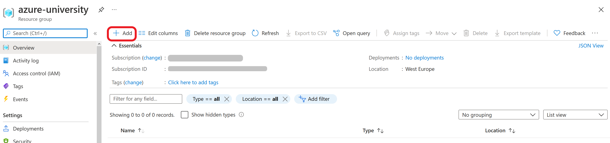

2. In the search box type 'App Configuration'

   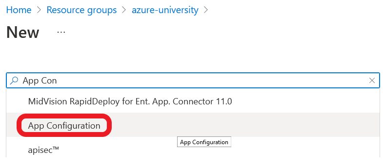

3. Click the 'Create' button

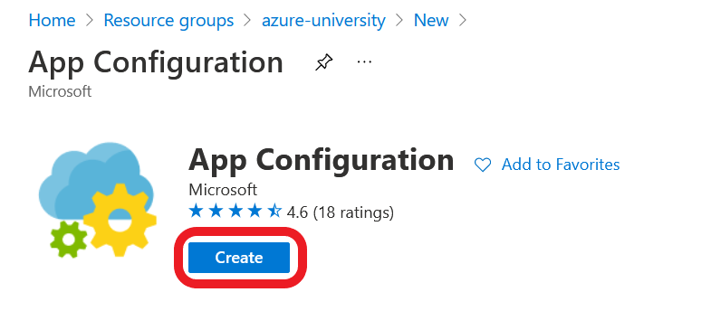

4. Fill in the details for the App Config service. Pick the free tier for this tutorial.

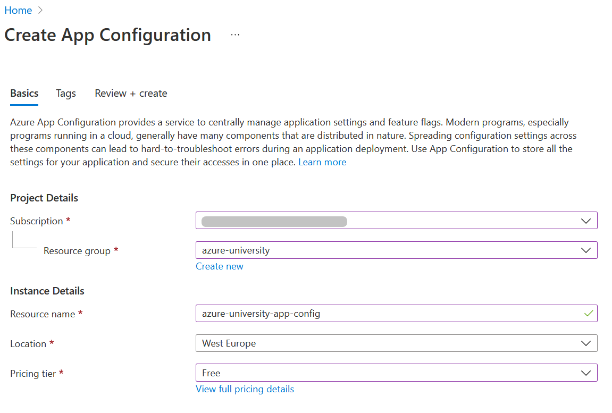

5. Click the 'Review + create' button, followed by 'Create' button


6. When the resource has been created click 'Go to resource'

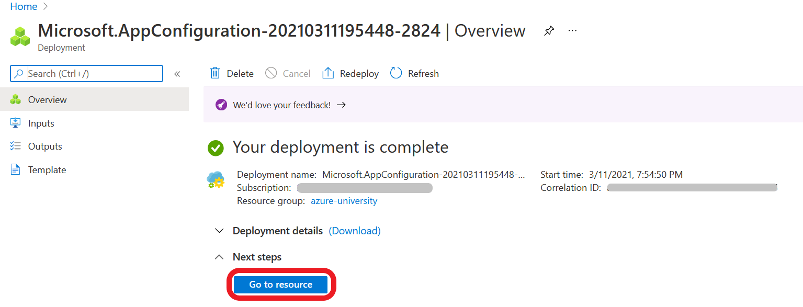

### 5.2 Adding a Configuration Value

#### Steps

1. In the App Configuration Window click the 'Configuration Explorer'.

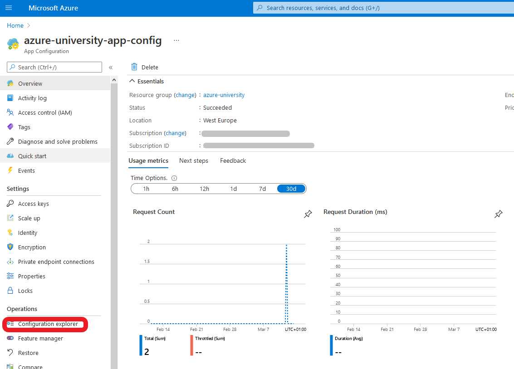

2. Click 'Create'.

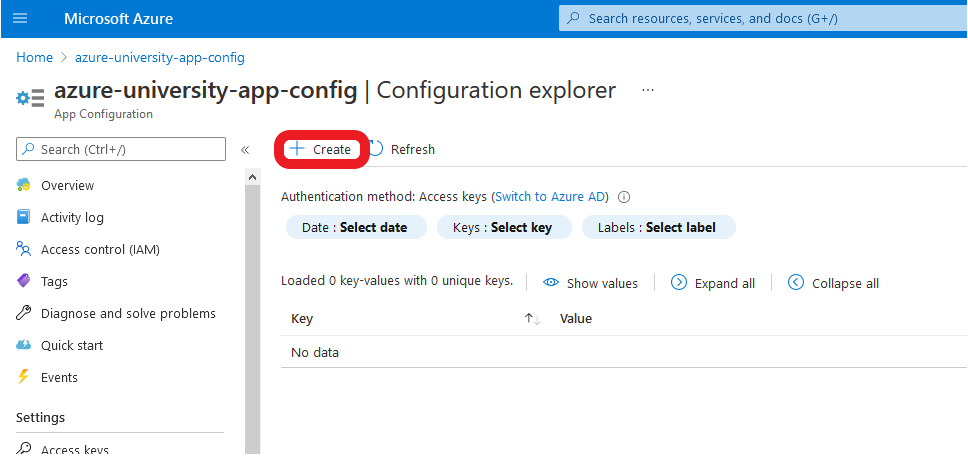

3. In the menu that drops down click 'Key-Value'.

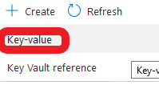

4. Fill in the values as in the example and click 'Apply'.

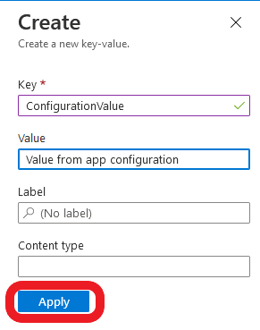

### 5.3 Getting the Shared Access Key

#### Steps

1. In the side menu, under the section 'Settings', click 'Access Keys'

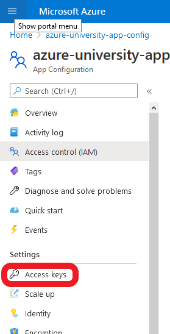

2. Click the copy button for the 'Connection string' connected to the 'Primary key'

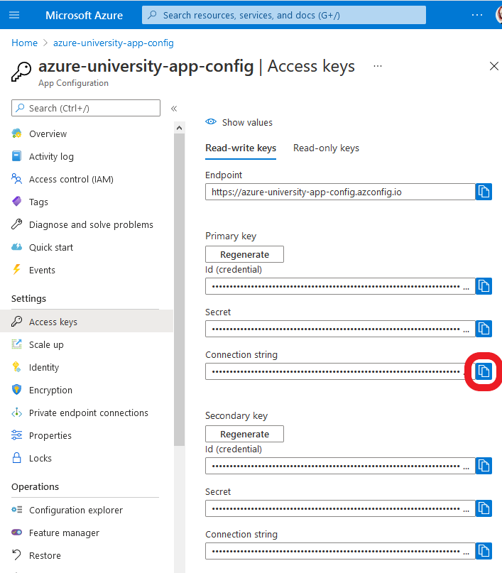

Now that we have our App Configuration set up with a configuration value, lets use it on our application!

### 5.4 Setting up our function to use the App Configuration

We have some changes that we need to make to our code in order to use the App Configuration service. Let's start with setting up dependency injection.

#### Steps

In order to use the App Configuration in our code we first need to enable dependency injection for the function, and set up out dependency injection container for the App Configuration

1. Add the following NuGet packages

   * `Microsoft.Extensions.Configuration.AzureAppConfiguration`
   * `Microsoft.Azure.Functions.Extensions`

2. Add a new class `FunctionStartup.cs` to the route of the project with the following `using` statements:

   ```c#
   using System;
   using Microsoft.Azure.Functions.Extensions.DependencyInjection;
   using Microsoft.Extensions.Configuration;
   ```

3. Add the Assembly attribute to register the start-up method for the function app, and allow us set-up the dependency injection:

   ```c#
   [assembly: FunctionsStartup(typeof(AzureFunctionsUniversity.Demo.Configuration.Startup))]
   ```

4. Add namespace and class:

   ```c#
   namespace AzureFunctionsUniversity.Demo.Configuration
   {
      class Startup : FunctionsStartup
      {

      }
   }
   ```

5. Inside the class add the `ConfigureAppConfiguration` function. This connects the application to the App Configuration using an environment variable to hold the connection string we just copied.

   ```c#
      public override void ConfigureAppConfiguration(IFunctionsConfigurationBuilder builder)
      {
         builder.ConfigurationBuilder.AddAzureAppConfiguration(options =>
         {
            options.Connect(Environment.GetEnvironmentVariable("AppConfigurationConnectionString"));
         });
      }
   ```

6. Add the `Configure` function to add the Azure App Configuration to the dependency injection container for use in our function:

   ```c#
      public override void Configure(IFunctionsHostBuilder builder)
      {
         builder.Services.AddAzureAppConfiguration();
      }
   ```

7. Finally, the local setting for the connection string need to be set. Add the following setting to the `local.settings.json` file in the `values` section:

   ```json
   "AppConfigurationConnectionString": "Endpoint=https://azure-university-app-config.azconfig.io;..."
   ```

### 5.5 Create the a second function to use the App Configuration

#### Steps

1. Add a new http triggered function to the application called `ReadingAppConfigurationVariables`.
2. Add `using` statements for the configuration:

   ```c#
   using Microsoft.Extensions.Configuration;
   ```

3. Remove the `static` keyword from the Azure Function class/method. As we are using dependency injection we need a constructor for the class.
4. Create a constructor for the class, pass in an `IConfiguration` and set a private field to hold the value:

   ```c#
   public IConfiguration _configuration { get; }

   public ReadingAppConfigurationVariables(IConfiguration   configuration)
   {
       _configuration = configuration;
   }
   ```

5. Replace the function method with the code below to return the value from the Azure Configuration:

   ```c#
   [FunctionName(nameof(ReadingAppConfigurationVariables))]
   public async Task<IActionResult> Run(
       [HttpTrigger(AuthorizationLevel.Anonymous, "get", Route = null)] HttpRequest req,
       ILogger log)
   {
       var config = _configuration["ConfigurationValue"];
       return new OkObjectResult($"ConfigurationValue: {config}");
   }
   ```

6. The class should look something like this now:

   ```c#
   using System.Threading.Tasks;
   using Microsoft.AspNetCore.Http;
   using Microsoft.AspNetCore.Mvc;
   using Microsoft.Azure.WebJobs;
   using Microsoft.Azure.WebJobs.Extensions.Http;
   using Microsoft.Extensions.Configuration;
   using Microsoft.Extensions.Logging;

   namespace AzureFunctions.Configuration
   {
      public class ReadingAppConfigurationVariables
      {
         public IConfiguration _configuration { get; }

         public ReadingAppConfigurationVariables(IConfiguration configuration)
         {
            _configuration = configuration;
         }

         [FunctionName(nameof(ReadingAppConfigurationVariables))]
         public async Task<IActionResult> Run(
            [HttpTrigger(AuthorizationLevel.Anonymous, "get", Route = null)] HttpRequest req,
            ILogger log)
         {
            var config = _configuration["ConfigurationValue"];
            return new OkObjectResult($"ConfigurationValue: {config} ");
         }
      }
   }
   ```

7. Run the function, you will now get the value from the appconfig service.

> 📝 **Tip** - Have multiple settings, or multiple apps needing the same setting? Use an App Configuration Service

> 🔎 **Observation** - In order to help facilitate rotation of keys there is a Primary and Secondary key. To rotate the Primary key you can connect to via the secondary, regenerate the primary, and then switch back. This way you never lose connection whilst performing the rotation

> ❔ **Question** - How do you ensure that you settings are always in sync when multiple need to change

## 6. Homework

[Here](configuration-homework-dotnet.md) is the assignment for this lesson.

## 7. More info

* [Azure Functions app settings reference](https://docs.microsoft.com/azure/azure-functions/functions-app-settings)
* [App Configuration Service](https://docs.microsoft.com/azure/azure-app-configuration/)
* [Enable Dynamic Configuration](https://docs.microsoft.com/azure/azure-app-configuration/enable-dynamic-configuration-azure-functions-csharp)

---
[🔼 Lessons Index](../../README.md)
