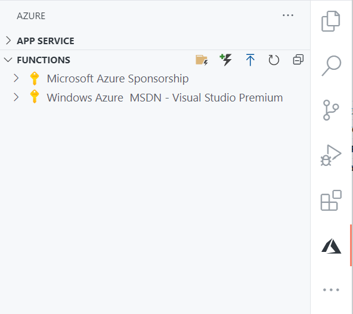
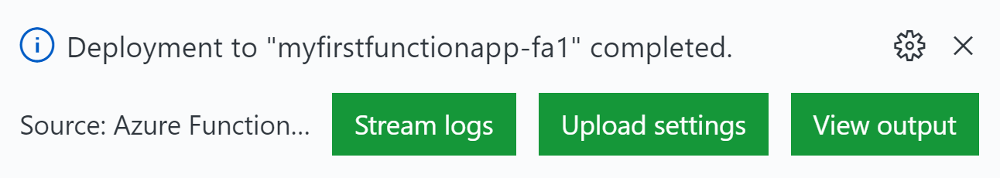

# Deployment to Azure (.NET Core)

Watch the recording of this lesson [on YouTube 🎥](https://youtu.be/-B8dE4GTWsk).

## Goal 🎯

The goal of this lesson is to learn about how to deploy your .NET Core Function App to Azure.

Before you can deploy your functions, the required Azure resources need to be created first. This can be done in many different ways. It can be done straight from an IDE such as VSCode or full Visual Studio, via command line tooling, or via a CI/CD pipeline. We'll cover various deployment options in this lesson.

This lesson consists of the following exercises:

|Nr|Exercise
|-|-
|0|[Prerequisites](#0-prerequisites)
|1|[Understanding the Azure Resources](#1-understanding-the-azure-resources)
|2|[Deployment using VSCode](#2-deployment-using-vscode)
|3|[Creating Azure Resources using Azure CLI](#3-creating-azure-resources-using-azure-cli)
|4|[Deployment using Azure Functions CLI](#4-deployment-using-azure-functions-cli)
|5|[Deployment using GitHub Actions](#5-deployment-using-github-actions)
|6|[Homework](#6-homework)
|7|[More info](#7-more-info)

---

## 0. Prerequisites

| Prerequisite | Exercise
| - | -
| An Azure Subscription. | 2-5
| A local folder with a Function App. | 2, 4, 5
| The [Azure Functions extension](https://marketplace.visualstudio.com/items?itemName=ms-azuretools.vscode-azurefunctions) for VSCode. | 2
| A GitHub repo with a Function App project |5

> 📝 __Tip__ - If you don't have a Function App project yourself, you can create a new GitHub repo based on [this template repo](https://github.com/marcduiker/functionapp-deployment). This contains a Function App project with an HttpTrigger, and some yml files we'll use in exercise 5.

---

## 1. Understanding the Azure Resources

The goal of this exercise is understand the resources that are required for an Azure Function App.

In the diagram below the resources are shown:

```text
+------------------------------+
|                              |
|  +------------------------+  |
|  |                        |  |
|  |  +------------------+  |  |
|  |  |                  |  |  |
|  |  |   Function App   |  |  |
|  |  |                  |  |  |
|  |  +------------------+  |  |
|  |                        |  |
|  |    App Service Plan    |  |
|  |                        |  |
|  +------------------------+  |
|                              |
|  +------------------------+  |
|  |                        |  |
|  |    Storage Account     |  |
|  |                        |  |
|  +------------------------+  |
|                              |
|        Resource Group        |
|                              |
+------------------------------+
```

From the outside to the inside these resources are:

- **Resource Group**: A logical grouping of related Azure resources.
- **Storage Account**: An Azure Storage Account where the Function App files are stored. When Azure Functions is scaling out, the files are copied from this storage account to the virtual machine instances which host your Function App.
- **App Service Plan**: An App Service Plan resource defines a set of compute resources used for App Services or Function Apps. For App Services or Azure Functions Premium plan, you get the option to select the size of the VM instances and how much they can scale. For the Azure Function consumption plan, you don't have these options.
- **Function App**: The Function App resource which runs the Azure Functions Runtime and executes your code. The Function App resource also has application settings (since the `local.settings.json` are only used on your local development environment).

---

## 2. Deployment using VSCode

The goal of this exercise is to create Azure resources and deploy the Function App using VSCode.

### Steps

1. Open the Function App project in VSCode.
2. Open the Azure / Azure Functions side bar (`CTRL+SHIFT+A`).

    

3. Click the `Deploy to Function App` button (looks like an upload icon).
4. If you have multiple subscriptions, select the subscription you want to use for the new Function App resource.
5. Select `Create new Function App in Azure...`
6. Enter a globally unique name for the Function App. We chose `myfirstfunctionapp-fa1`.
7. Select the `.NET Core 3.1` runtime stack.
8. Select a location (region) where the resources will be created.

    > 🔎 __Observation__ - Now you should see a notification in VSCode that the Azure resources are being created. Wait until this is finished.

9. Once the resources are created the Function App project will be packaged and deployed automatically.

    > 🔎 __Observation__ - Again you should see a notification in VSCode that the Function App project is being packaged and deployed. Wait until this is finished. You should receive the following notification:

    

10. Expand the Subscription node in the Azure Functions side bar. There should be a node for the Function App you just deployed.

    > 🔎 __Observation__ - Click around on all the child nodes of the Function App in the side bar to familiarize yourself.

11. Use the [Azure Portal](https://portal.azure.com/) and navigate to the deployed Azure Function.

    > ❔ __Question__ - What is name of the resource group your Function App has been deployed to? Can you identify all the resources in that resource group?

---

## 3. Creating Azure Resources using Azure CLI

The goal of this exercise is to create Azure resources using the Azure CLI.

You can either use the Azure CLI from the terminal in VSCode or use a separate terminal such as [Windows Terminal](https://www.microsoft.com/p/windows-terminal/9n0dx20hk701?activetab=pivot:overviewtab) or the built in command prompt of your OS.

### Steps

1. Type `az` in the terminal.
    > 🔎 __Observation__ - When you see output such as this, the Azure CLI is available. If not please check the [prerequisites](../prerequisites/README.md) and install the Azure CLI.

    ```text
         /\
        /  \    _____   _ _  ___ _
       / /\ \  |_  / | | | \'__/ _\
      / ____ \  / /| |_| | | |  __/
     /_/    \_\/___|\__,_|_|  \___|


    Welcome to the cool new Azure CLI!

    Use `az --version` to display the current version.
    ```

2. Before you can create or manage Azure resources, you need to authenticate yourself. Type `az login` and follow the instructions.
    > 🔎 __Observation__ - A browser window will open where you can login using your Azure account. Once logged in you can close this browser window.

    > 🔎 __Observation__ - Once logged in, you should see a json output with your subscription info, it could be that you have several subscriptions so you see an array of objects.

3. If you have multiple subscriptions choose the one you'll use to create the Azure resources. Copy the `id` of the subscription from the `az login` output and use in the following command:

    ```ps
    az account set -s {SUBSCRIPTION ID}
    ```

    > 📝 __Tip__ - If you need help with the Azure CLI or just want to explore the functionality append `-h` at the end of the command, such as `az account set -h`.

4. Now we can start with creating the first resource, the Resource Group. Since we'll be executing several commands it's useful to use variables for the values which we'll be using often. We're using PowerShell syntax in these examples, so variables start with `$` and multiline commands are separated with a backtick ( ` ).

    ```ps
    $location="{LOCATION_NAME}"
    # e.g. $location="westeurope"

    $rgname="{RESOURCE_GROUP_NAME}"
    # e.g. $rgname="myfirstfunction-rg"

    az group create `
        --name $rgname `
        --location $location ` 
        --tags type=temp
    ```

    > 🔎 __Observation__ - Here we're using variables for the region we're creating the resource in, and for the Resource Group name.

    > 📝 __Tip__ - Always try to use a location which is close to you (and your users) to minimize latency. You can view all the possible locations by typing:

    ```ps
    az account list-locations --query [].name
    ```

    > 🔎 __Observation__ - The `--tags type=temp` part is optional, however it's a good practice to label your resources so you can manage them better. In this case the Resource Group is labelled as `temp` which indicates it is temporary and can be deleted without problems.

    > ❔ __Question__ - Inspect the json output of the command.Is the resource completed successfully?

5. Now let's create a Storage Account in this Resource Group:

    ```ps
    $stname="{STORAGE_NAME}"
    # e.g. $stname="myfirstfunctionst"

    az storage account create `
        --name $stname `
        --resource-group $rgname `
        --location $location `
        --sku Standard_LRS `
        --kind StorageV2 `
        --access-tier Hot
    ```

    > 📝 __Tip__ - Storage Account names need to be unique within Azure and have quite some [restrictions on the length and the characters](https://docs.microsoft.com/azure/storage/common/storage-account-overview#naming-storage-accounts) that can be used. You can check the Storage Account name before you create the account via: `az storage account check-name --name "myfirstfunctionst"`.

    > ❔ __Question__ - Investigate the other arguments of this command, such as, `sku`, `kind` and `access-tier`. What do they mean?

    > ❔ __Question__ - What does the output look like? Is the Storage Account created successfully?

6. Now we can create the Function App & App Service Plan resources. This can be done using one command:

    ```ps
    az functionapp create `
        --name "{FUNCTION_APP_NAME}" `
        --resource-group $rgname `
        --consumption-plan-location $location `
        --storage-account $stname `
        --runtime dotnet `
        --os-type Windows `
        --functions-version 3
    ```

    > 🔎 __Observation__ - Notice that we're creating a .NET based Function App based on Windows using the Azure Function Runtime v3.

    > ❔ __Question__ - What does the output look like? Is the Function App resource created successfully?

     > 🔎 __Observation__ - At this point we have the required Azure resources but we still need to deploy our function code to the Function App in the cloud.

7. To verify that the Function App and App Service Plan are available you can run this command to list all the Function Apps:

    ```ps
    az functionapp list --out table
    ```

    > 📝 __Tip__ - Note that we're using the `table` output formatting to make the output more readable.

---

## 4. Deployment using Azure Functions CLI

The goal of this exercise is to deploy the Function App project to the cloud using the Azure Functions CLI. We'll deploy the Function App that is created in the [HTTP Lesson](../http/README.md) but you can choose any Function App you wish to deploy.

The Azure Functions CLI is part of the Azure Functions Core Tools which you probably already have installed if you've completed one of the other lessons. As with the previous exercise you can either use the Azure CLI from the terminal in VSCode or use a separate terminal/command prompt.

### Steps

1. Type `func` in the terminal.

    > 🔎 __Observation__ - When you see output as shown below, the Azure Functions CLI is available. If not please check the [prerequisites](../prerequisites/README.md) and install the Azure Functions Core Tools.

    ```text
                  %%%%%%
                 %%%%%%
            @   %%%%%%    @
          @@   %%%%%%      @@
       @@@    %%%%%%%%%%%    @@@
     @@      %%%%%%%%%%        @@
       @@         %%%%       @@
         @@      %%%       @@
           @@    %%      @@
                %%
                %

    Azure Functions Core Tools (3.0.2931 Commit hash: d552c6741a37422684f0efab41d541ebad2b2bd2)
    Function Runtime Version: 3.0.14492.0
    Usage: func [context] [context] <action> [-/--options]
    ...
    ```

2. To publish your local Function App to the Azure make sure you're in the folder that contains the project file of the Function App.
3. Type the following command, and make sure you use the exact same Function App name as you did in the previous exercise (Exercise 3, Step 6) when the resource was created:

    ```text
    func azure functionapp publish "{FUNCTION_APP_NAME}" --publish-local-settings -i
    ```

    > 🔎 __Observation__ - Look closely at the output so you can see what this command is doing. It should be similar to the following output.

    ```text
    Microsoft (R) Build Engine version 16.8.0+126527ff1 for .NET
    Copyright (C) Microsoft Corporation. All rights reserved.

    Determining projects to restore...
    All projects are up-to-date for restore.
    MyFirstAzureFunction -> {LOCAL PATH TO THE FUNCTION DLL}

    Build succeeded.        
        0 Warning(s)        
        0 Error(s)

    Time Elapsed 00:00:11.33


    Getting site publishing info...
    Creating archive for current directory...
    Uploading 2,3 MB [################################################################################]
    Upload completed successfully.
    Deployment completed successfully.
    ```

4. After the deployment step there will be a question if you want to replace the value for the `AzureWebJobsStorage` setting with the value from `local.settings.json`. The `AzureWebJobsStorage` setting contains the connection string to the Azure Storage Account the Function App is using. If you have completed Exercise 3 Step 6 than this is set correctly, therefore don't overwrite it with the (empty) local value. Type `no` and press enter.

    ```text
    App setting AzureWebJobsStorage is different between azure and local.settings.json
    Would you like to overwrite value in azure? [yes/no/show]
    no
    Setting FUNCTIONS_WORKER_RUNTIME = ****
    Syncing triggers...
    Functions in {FUNCTION_APP_NAME}:
        HelloWorldHttpTrigger - [httpTrigger]
            Invoke url: {URL TO HTTP FUNCTION}
    ```

    > ❔ __Question__ - Try to invoke the deployed function app. Does it work as expected?

---

## 5. Deployment using GitHub Actions

The goal of this exercise is to create Azure resources and deploy the Function App using GitHub Actions.

To complete this exercise you need a GitHub repository that contains a Function App project. We'll be using [this FunctionApp-Deployment repo](https://github.com/marcduiker/functionapp-deployment), which you can use as [a template repo](https://github.com/marcduiker/functionapp-deployment/generate), if you don't have your own Function App to deploy.

In addition you also need to add deployment credentials to your GitHub repository. Follow these steps to add those.

### Steps

1. Before we create the deployment workflow we need to create deployment credentials and add these to the GitHub repo as secrets.

    1. Using the Azure CLI run this command, and supply the values for SUBSCRIPTION-ID and RESOURCE-GROUP (Exercise 3, Steps 3 and 4).

        ```ps
        az ad sp create-for-rbac `
            --name "GitHubactionsServicePrincipal" `
            --role contributor `
            --scopes /subscriptions/{SUBSCRIPTION-ID} `
            --sdk-auth
        ```

        > 🔎 __Observation__ - Note that the scope of this service principal is very large. The service principal now has contribution rights within the entire subscription. If you don't want this, you can further narrow down the scope such as `/subscriptions/{SUBSCRIPTION-ID}/resourceGroups/{RESOURCE-GROUP}` to limit the rights to a single resource group. In our case however, we'll use the Azure CLI inside GitHub Actions to create several Azure resources including the resource group itself.

        > 📝 __Tip__ - An alternative way to create deployment credentials is to use a [Publishing Profile](https://github.com/Azure/functions-action#using-publish-profile-as-deployment-credential-recommended). Note that you'll need an existing Function App resource in Azure to do this. These credentials will allow you only to deploy the Function App project. You won't be able to create the Azure resources with these credentials.

    2. The result should be a json output that looks similar to this:

        ```json
        {
            "clientId": "{GUID}",
            "clientSecret": "{GUID}",
            "subscriptionId": "{GUID}",
            "tenantId": "{GUID}",
            ...
        }
        ```

        Copy the entire json output, you'll need it soon!

    3. Go to your GitHub repository and go to `Settings` > `Secrets` and choose `New repository secret`.
    4. Provide `AZURE_RBAC_CREDENTIALS` as the secret name.
    5. Paste the json object with the credentials in the value field.

        > 🔎 __Observation__ - Now your GitHub repo has the credentials to create Azure resources and make deployments. The credentials will be used in the next steps of this exercise.
2. GitHub Actions are based on yaml files that are placed in the `/.github/workflows/` folder.
3. If you've used the `functionapp-deployment` repository as a template repo, have a detailed look at the `infrastructure.yml` and `application.yml` files.
    > ❔ __Question__ - Can you figure out the structure of these files and what each step is doing?
    1. Go to the repo on GitHub. Go to Actions, click on the `infrastructure` workflow and click `Run workflow`.
        > ❔ __Question__ - Is the workflow running? Does it finish successfully?
    2. Now click on the `application` workflow and click `Run workflow`.
        > ❔ __Question__ - Is the workflow running? Does it finish successfully?

4. If you're not using the `functionapp-deployment` repository, complete these steps first:
    1. Create a `/.github/workflows/` folder in your GitHub repository.
    2. Add a new file named `infrastructure.yml` to the workflow folder.
    3. Copy the entire raw content from this [workflow file](https://github.com/marcduiker/functionapp-deployment/blob/main/.github/workflows/infrastructure.yml) to your `infrastructure.yml` file.
        > ❔ __Question__ - Have a detailed look at the content of the yaml file. Can you figure out the structure and what each step is doing?

    4. Commit and push the `infrastructure.yml` file.

        > ❔ __Question__ - Go to your repository on GitHub and go to the Actions tab. Is the workflow running? Does it finish successfully?

    5. Add a new file named `application.yml` to the workflows folder.
    6. Copy the entire raw content from this [workflow file](https://github.com/marcduiker/functionapp-deployment/blob/main/.github/workflows/application.yml)  to your `application.yml` file.
        > ❔ __Question__ - Have a detailed look at the content of the yaml file. Can you figure out the structure and what each step is doing?

    7. Commit and push the `application.yml` file.

        > ❔ __Question__ - Go to your repository on GitHub and go to the Actions tab. Is the workflow running? Does it finish successfully?

---

## 6. Homework

If you have completed a previous homework assignment, try to deploy that project using one of the methods described above.

---

## 7. More info

- [Manage Function Apps with the Azure CLI](https://docs.microsoft.com/cli/azure/functionapp?view=azure-cli-latest).
- The [functions-action](https://github.com/Azure/functions-action) GitHub repository.
- [Azure Functions & GitHub Actions](https://docs.microsoft.com/azure/azure-functions/functions-how-to-github-actions?tabs=dotnet).
- [Full GitHub Actions documentation](https://docs.github.com/en/actions).

---
[🔼 Index](../../README.md) |
