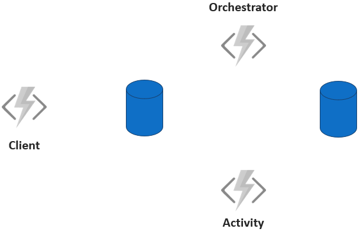
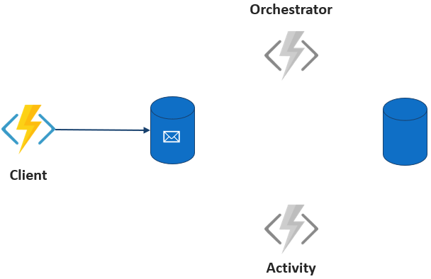

# Azure Durable Functions - Introduction & Chaining (.NET Core)

<!-- Watch the recording of this lesson [on YouTube 🎥](https://youtu.be/gE130BITP9g). -->

## Goal 🎯

The goal of this lesson is to give you an introduction into Azure Durable Functions including a first Durable Function that chains two functions calls. In addition we will take a look into some features of Durable Functions that help you write resilient workflows.

This lessons consists of the following exercises:

|Nr|Exercise
|-|-
|0| [Prerequisites](#0-prerequisites)
|1| [Introduction to Azure Durable Functions](#1-introduction-to-azure-durable-functions)
|2| [Creating a Function App project for a Durable Function](#2-creating-a-function-app-project-for-a-durable-function)
|3| [Implementing a "Real-World" Scenario](#3-implementing-a-real-world-scenario)
|4| [Retries - Dealing with Temporal Errors](#4-retries---dealing-with-temporal-errors)

> 📝 **Tip** - If you're stuck at any point you can have a look at the [source code](../../../../src/dotnetcore31/AzureFunctions.Durable.Chaining) in this repository.
> 📝 **Tip** - If you have questions or suggestions about this lesson, feel free to [create a Lesson Q&A discussion](https://github.com/marcduiker/azure-functions-university/discussions/categories/lesson-q-a) here on GitHub.

---

## 0 Prerequisites

| Prerequisite | Exercise
| - | -
| A local folder with a Function App. | 2-5
| The [Azure Functions extension](https://marketplace.visualstudio.com/items?itemName=ms-azuretools.vscode-azurefunctions) for VSCode. | 2, 3
| The [Azurite extension for VSCode](https://marketplace.visualstudio.com/items?itemName=Azurite.azurite) | 2-3
| The [Azure Functions Core Tools](https://github.com/Azure/azure-functions-core-tools#installing) | 2-5
| The [Azure Storage Explorer](https://azure.microsoft.com/features/storage-explorer/) | 2-5

## 1. Introduction to Azure Durable Functions

Within this section we want to take a look at the motivation for the usage of Azure Durable Functions and take a look at the underlying mechanics.

### 1.1 Functions and Chaining

In general, Functions are a great way to develop functionality in a serverless manner. However, this development should follow some guidelines to avoid drawbacks or even errors when using them. The three main points to consider are:

* Functions must be stateless
* Functions should not call other functions
* Functions should only do one thing well

While the first guideline is due to the nature of functions, the other two guidelines could easily be ignored but would contradict the paradigms of serverless and loosely coupled systems. In real life scenarios we often have to model processes that resemble a workflow, so we want to implement a sequence of single steps. How can we do that sticking to the guidelines? One common solution for that is depicted below:


Every function in the picture represents a single step of a workflow. In order to glue the functions together we use storage functionality, such as queues or databases. So Function 1 is executed and stores its results in a table. Function 2 is triggered by an entry in the table via the corresponding bindings and gets executed representing the second step in the workflow. This sequence is then repeated for Function 3. The good news is, that this pattern adheres to the guidelines. But this pattern comes with several downsides namely:

* The single functions are only coupled via the event that they react to. From the outside it is not clear how the functions relate to each other although they represent a sequence of steps in a workflow.
* The storage functionality between function executions are a necessary evil. One motivation for developing serverless is to care about servers less. Here we must care about the technical infrastructure in order to have our functions loosely coupled.
* If you want to pass a context between the functions you must store it (and deal with the potential errors around it).
* Handling errors and analyzing bugs in such a setup is very complicated.

Can we do better? Or is there even a solution provided by Azure Functions to handle such scenarios? There is good news - there are Azure Durable Functions.

### 1.2 Solution via Durable Functions

Azure Durable Functions is an extension to the Azure Functions Framework that allows you to write workflows as part of your Azure Functions code. Although queues and table storage are still used, the Durable Functions extension abstracts those away, so that you can focus on the business requirement at hand. The function state is managed by making use of the [Event Sourcing](https://martinfowler.com/eaaDev/EventSourcing.html) pattern. In addition the extension helps you with common functionalities in workflows, such as retries and race conditions, as we will see later. Let us first take a look at how Durable Functions work and introduce some terminology.

### 1.3 Mechanics of Durable Functions

Durable Functions uses three types of functions:

* Orchestrator Functions: the central part of the Durable framework that orchestrates the actions that should take place by triggering Activity Functions.
* Activity Functions: the basic workers that execute the single tasks scheduled via the Orchestrator Function.
* Client Function: the gateway to the Orchestrator Function. The Client Function triggers the Orchestrator Function and serves as the single point of entry for requests from the caller like getting the status of the processing, terminating the processing etc.

Let us assume the following simple execution sequence with two tasks triggered by an HTTP request:

```csharp
var x = await context.CallActivityAsync<object>("F1", null);
var y = await context.CallActivityAsync<object>("F2", x);
```

The second task depends on the result of the first task.

The schematic setup with Azure Durable Functions looks like this:



The Client Function is triggered by an HTTP request and consequently triggers the Orchestrator Function. Internally this means that a message is enqueued to a control queue in a task hub. We do not have to care about that as we will see later.



After that the Client Function completes and the Orchestrator Function takes over and schedules the Activity Function. Internally, Durable Functions fetches the task from the control queue in the task hub to start the Orchestrator and enqueues a task to the work-item queue to schedule the Activity Function.


The execution of the Orchestrator Function stops once an Activity Function is scheduled. It will resume, and replay the entire orchestration once the Activity Function is complete.


When the Orchestrator Function is replayed it will check if there are tasks (Activity Functions) left to execute. In our scenario the second Activity Functions is scheduled. This cycle continues until all Activity Function calls in the Orchestrator have been executed.

After this theoretical overview it is time to make our hands dirty and write some code!

## 2. Creating a Function App project for a Durable Function

Our scenario comprises a Durable Function App with one Activity Function. The app will be triggered via an HTTP call. The Activity Function receives a city name as input and returns a string in the form of "Hello _City Name_" as an output. The Activity Function is called three times in sequence with three different city names. The app should return the three strings as an array.

### 2.1 The Function

The first function that we create is the Client Function of our Durable Function app that represents the gateway towards the Orchestrator Function.

#### Steps

1. Create a directory for our function app and navigate into the directory.

   ```powershell
   mkdir DurableFunctionApp
   cd DurableFunctionApp
   ```

2. Start Visual Studio Code.

   ```powershell
   code .
   ```

3. Create a new Function App project via the Azure Functions Extension.
   1. In command palette, select `Azure Functions: New Project...`
   2. Select the current folder
   3. Choose `C#` as language.
   4. Select `.NET Core 3.1` as .NET runtime
      1. If you can't see it, select `Change Azure Functions version` to `Azure Functions v3`
      2. `.NET Core 3.1` option is now listed
   5. Skip the template selection by clicking on `Skip for now`

4. Add a Durable function to the Function App
   1. In command palette, select `Azure Functions: Create Function...`
   2. Select the `DurableFunctionsOrchestration` template
   3. Use `DurableChainingOrchestration` as name
   4. Use `Durable.Chaining.Orchestration` as namespace

The selected template, creates three function in the single file `DurableChainingOrchestration`:

* `DurableChainingOrchestration`: this is the orchestrator function, which defines the flow
* `DurableChainingOrchestration_Hello`: this is an Activity function, called three times with three different inputs from the orchestrator
* `DurableChainingOrchestration_HttpStart`: the client function that invokes the orchestrator, triggered by an anonymous HTTP call

### 2.2 The First Execution

Execute the Durable Function and experience its mechanics.

#### Steps

1. Start Azurite
   1. From the command palette, execute `Azurite: Start`
2. Ensure that the value of the AzureWebJobsStorage in your `local.settings.json` to `UseDevelopmentStorage=true`. This instructs the Azure Functions local runtime to use your local Azure Storage Emulator (Azurite in this case).
3. Put a breakpoint at the first row of each function
4. Start all the functions via `F5`

   
5. Trigger the Client Function via the tool of your choice e.g. Postman.
   > ❔ **Question** - What route do you have to use?
   > 🔎 **Observation** - The result of the orchestration is not directly returned to the caller. Instead the Client Function is returning the ID of the orchestrator instance and several HTTP endpoints to interact with this instance.

   

6. Call the `runtime/webhooks/durableTask/instances` endpoint to receive the results of the orchestration.

   
   > 🔎 **Observation** - The status endpoint returns not only the result but also some metadata with respect to the overall execution.

7. Check the resulting entries in your Azure Storage Emulator
   > ❔ **Question** - How many tables have been created by the Azure Functions runtime? What do they contain?

## 3. Implementing a "Real-World" Scenario

In this section we develop some more realistic setup for our Durable Function. Assume the following situation:
Assume that we have the name of a GitHub repository. Now we want to find out who is the owner of this repo. In addition we want to find our some more things about the owner like the real name, the bio etc. To achieve this we must execute two calls in a sequence to the GitHub API:

1. Get the information about the repository itself containing the user ID.
2. Based on the user ID we fetch the additional information of the user.

The good thing about the GitHub API is that we do not need to care about authentication and API keys. This means that there are some restrictions with respect to the allowed number of calls per minute, but that is fine for our scenario.

### 3.1 Basic Setup of "Real-World" Scenario

In this section we add the skeleton for the implementation.

#### Steps

1. Create a new function in a folder named `GitHub` via the Azure Functions Extension in VSCode:
   1. Select `Durable Functions orchestrator` as a template.
   2. Name the function `GitHubInfoOrchestrator`.
   3. Delete the orchestration function body
   4. Use `Durable.Chaining.GitHub` as namespace
   5. Delete the `SayHello` template's function and add two new functions:
      1. `GetRepositoryDetailsByName`
      2. `GetUserDetailsByName`
   6. Install the following NuGet package for a smooth interaction with the GitHub REST API
      1. `Octokit`

### 3.2 Implementation of the Orchestrator Function

In this section we implement the Orchestrator Function that defines the call sequence of the Activity Functions and assures the transfer of the result of the first Activity Function to the second one.

#### Steps

1. Update the Orchestrator Function `GitHubInfoOrchestrator` to call the two Activity Functions. The first Activity Function is `GetRepositoryDetailsByName`. The returned information of that activity, the user ID, must be transferred to the context of the Durable Function. The second Activity Function is `GetUserDetailsById`. The returned information of the second Activity Function is returned as response by the Orchestrator Function. The Orchestrator Function code should look like this:

   ```csharp
   [FunctionName("GitHubInfoOrchestrator")]
   public static async Task<UserDetails> RunOrchestrator(
      [OrchestrationTrigger] IDurableOrchestrationContext context)
   {
      var input = context.GetInput<string>();

      var userName = await context.CallActivityAsync<string>("GitHubInfoOrchestrator_GetRepositoryDetailsByName", input);
      
      var userDetails = await context.CallActivityAsync<string>("GitHubInfoOrchestrator_GetUserDetailsByName", userName);

      return userInfo;
   }
   ```

### 3.3 Implementation of the Activity Function `GetRepositoryDetailsByName`

In this section we implement the Activity Function `GetRepositoryDetailsByName`. We fetch the data of the GitHub repository by name making use of the `/search/repositories` endpoint.

#### Steps

1. Create an instance of the Octokit class and build the query for the search based on the repository name. Note that the `string` used as parameter of `ProductHeaderValue` constructor is just used as user agent and can be any value.

   ```csharp
   var githubClient = new GitHubClient(new ProductHeaderValue("azure-functions-university"));
   ```

2. Call the GitHub API with the query.

   ```csharp
   var request = new SearchRepositoriesRequest(name);
   var searchResult = await githubClient.Search.SearchRepo(request);
   ```

3. As the search via the API is not an exact match and more than one repo might be returned we must find the search result where the name matches exactly. We implement this via LINQ on the returned array and return the ID of the owner

   ```csharp
   var repository = searchResult.Items.Single(x => x.Name == name);

   return repository.Owner.Login;
   ```

The resulting Activity Function looks like this:

```csharp
[FunctionName("GitHubInfoOrchestrator_GetRepositoryDetailsByName")]
public static async Task<int> GetRepositoryDetails([ActivityTrigger] string name, ILogger log)
{
   var githubClient = new GitHubClient(new ProductHeaderValue("azure-functions-university"));

   var request = new SearchRepositoriesRequest(name);

   var searchResult = await githubClient.Search.SearchRepo(request);
   var repository = searchResult.Items.Single(x => x.Name == name);

   return repository.Owner.Login;
}
```

### 3.4 Implementation of the Activity Function `GetUserDetailsByName`

In this section we implement the Activity Function `GetUserDetailsByName` that fetches the details about the user from GitHub.

#### Steps

1. Create an instance of the Octokit class and build the path for the request based on the user ID.

   ```csharp
   var githubClient = new GitHubClient(new ProductHeaderValue("azure-functions-university"));
    
   var user = await githubClient.User.Get(name);
   ```

2. Transform received data into JSON.

   ```csharp
   var serializedUser = JsonSerializer.Serialize<object>(user);
    
   return serializedUser;
   ```

The resulting Activity Function looks like this:

```csharp
[FunctionName("GitHubInfoOrchestrator_GetUserDetailsByName")]
public static async Task<string> GetUserDetailsByName([ActivityTrigger] string name, ILogger log)
{
   var githubClient = new GitHubClient(new ProductHeaderValue("azure-functions-university"));

   var user = await githubClient.User.Get(name);

   var serializedUser = JsonSerializer.Serialize<object>(user);
   return serializedUser;
}
```

> ❔ **Question** - How many functions will be started by the runtime now?

### 3.5 Test the Implementation

In this section we finally test our implementation.

#### Steps

1. Start the Client Function. The URL is `http://localhost:7071/api/GitHubInfoOrchestrator_HttpStart`. Use the following values as query string:

   ```properties
    
   "name": "azure-functions-university"
    
   ```

   > ❔ **Question** - How can you address the new Orchestrator Function in the function app  

## 4. Retries - Dealing with Temporal Errors

As we are dealing with external systems the question is not if something will go wrong, but when this will be the case and can we recover from this. So in this section we want to harden our setup to deal with temporal outages of the downstream system using retries when calling Activity Functions.
Azure Durable Functions has the built-in capability to execute an [automatic retry](https://docs.microsoft.com/azure/azure-functions/durable/durable-functions-error-handling?tabs=csharp#automatic-retry-on-failure) in case an Activity Function fails. The retry mechanism can be configured using a so-called retry policy. In this section we will update our `GitHubInfoOrchestrator` to call the Activity Functions with retries.

### Steps

1. Commit your changes and create a branch of the project and switch to the branch.

   ```powershell
   git add .
   git commit -m "Basic DF setup"
   git checkout -b retry
   ```