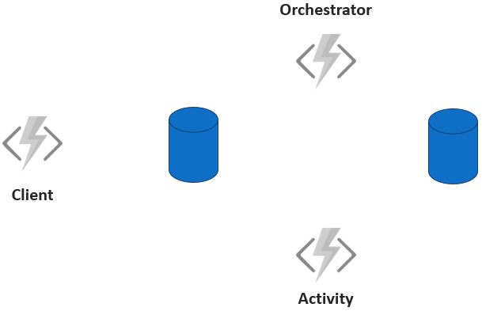
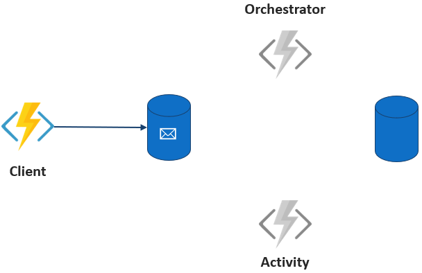
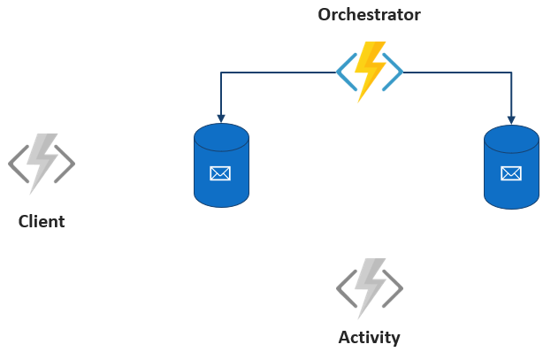
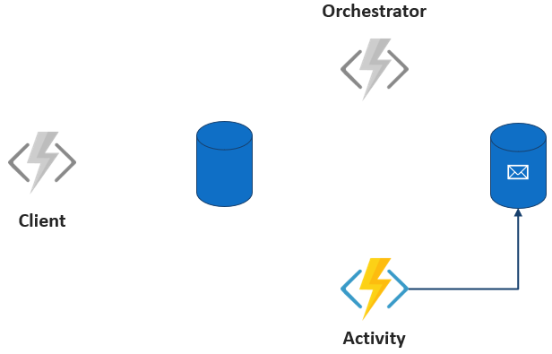
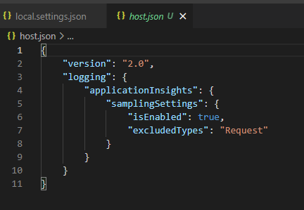

# Azure Durable Functions - Introduction & Chaining (.NET)

Watch the recording of this lesson [on YouTube 🎥](https://youtu.be/gE130BITP9g).

## Goal 🎯

The goal of this lesson is to give you an introduction into Azure Durable Functions including a first Durable Function that chains two functions calls. 
In addition we will take a look into some features of Durable Functions that help you write resilient workflows.

This lessons consists of the following exercises:

|Nr|Exercise
|-|-
|0| [Prerequisites](#0-prerequisites)
|1| [Introduction to Azure Durable Functions](#1-introduction-to-azure-durable-functions)
|2| [Creating a Function App project for a Durable Function](#2-creating-a-function-app-project-for-a-durable-function)
|3| [Implementing a "Real-World" Scenario](#3-implementing-a-\"real-world\"-scenario)
|4| [Retries - Dealing with Temporal Errors](#4-retries---dealing-with-temporal-errors)
|5| [Circuit Breaker - Dealing with Timeouts](#5-circuit-breaker---dealing-with-timeouts)
|6| [Homework](#6-homework)
|7| [More Info](#7-more-info)

📝 **Tip** - If you're stuck at any point you can have a look at the [source code]() in this repository.

---

## 0 Prerequisites

| Prerequisite | Exercise
| - | -
| A local folder with a Function App. | 2-5
| The [Visual Studio Code](https://code.visualstudio.com/download) | 2, 3 
| The [Azure Functions extension](https://marketplace.visualstudio.com/items?itemName=ms-azuretools.vscode-azurefunctions) for VSCode. | 2, 3
| The [C# for Visual Studio Code extension](https://marketplace.visualstudio.com/items?itemName=ms-dotnettools.csharp) | 2, 3
| Azure Storage Account and Azure Subscription | 2-5
| The [Microsoft Azure Storage Emulator](https://docs.microsoft.com/en-us/azure/storage/common/storage-use-emulator) | 2-5
| Install the latest [.NET Core SDK 3.1 or above](https://dotnet.microsoft.com/download) | 2-5 
| The [Azure Storage Explorer](https://azure.microsoft.com/en-us/features/storage-explorer/) | 2-5
| Postman Client | 2-5 


📝 **Tip** - Up to now the Durable Functions are not compatible with Azurite with respect to the emulation of storage. 
So if you are on a non-Windows machine you must use a hybrid approach and connect your Durable Functions to a storage in Azure. This means that you need an Azure subscription.

## 1. Introduction to Azure Durable Functions

Within this section we want to take a look at the motivation for the usage of Azure Durable Functions and take a look at the underlying mechanics.

### 1.1 Functions and Chaining

In general, Functions are a great way to develop functionality in a serverless manner. However, this development should follow some guidelines to avoid drawbacks or even errors when using them. The three main points to consider are:

* Functions must be stateless
* Functions should not call other functions
* Functions should only do one thing well

While the first guideline is due to the nature of functions, the other two guidelines could easily be ignored but would contradict the paradigms of serverless and loosely coupled systems. In real life scenarios we often have to model processes that resemble a workflow, so we want to implement a sequence of single steps. How can we do that sticking to the guidelines? One common solution for that is depicted below:

Every function in the picture represents a single step of a workflow. In order to glue the functions together we use storage functionality, such as queues or databases. So Function 1 is executed and stores its results in a table. Function 2 is triggered by an entry in the table via the corresponding bindings and gets executed representing the second step in the workflow. This sequence is then repeated for Function 3. The good news is, that this pattern adheres to the guidelines. But this pattern comes with several downsides namely:

* The single functions are only coupled via the event that they react to. From the outside it is not clear how the functions relate to each other although they represent a sequence of steps in a workflow.
* The storage functionality between function executions are a necessary evil. One motivation for developing serverless is to care about servers less. Here we must care about the technical infrastructure in order to have our functions loosely coupled.
* If you want to pass a context between the functions you must store it (and deal with the potential errors around it).
* Handling errors and analyzing bugs in such a setup is very complicated.

Can we do better? Or is there even a solution provided by Azure Functions to handle such scenarios? There is good news - there are Azure Durable Functions.

### 1.2 Solution via Durable Functions

Azure Durable Functions is an extension to the Azure Functions Framework that allows you to write workflows as part of your Azure Functions code. </br>
Although queues and table storage are still used, the Durable Functions extension abstracts those away, so that you can focus on the business requirement at hand. 
The function state is managed by making use of the [Event Sourcing](https://martinfowler.com/eaaDev/EventSourcing.html) pattern. In addition the extension helps you with common functionalities in workflows, such as retries and race conditions, as we will see later. Let us first take a look at how Durable Functions work and introduce some terminology.

### 1.3 Mechanics of Durable Functions

Durable Functions uses three types of functions:

* Orchestrator Functions: the central part of the Durable framework that orchestrates the actions that should take place by triggering Activity Functions.
* Activity Functions: the basic workers that execute the single tasks scheduled via the Orchestrator Function.
* Client Function: the gateway to the Orchestrator Function. The Client Function triggers the Orchestrator Function and serves as the single point of entry for requests from the caller like getting the status of the processing, terminating the processing etc.

Let us assume the following simple execution sequence saying Hello to different cities with three tasks triggered by an HTTP request:

```csharp
[FunctionName("E1_HelloSequence")]
public static async Task<List<string>> Run(
    [OrchestrationTrigger] IDurableOrchestrationContext context)
{
    var outputs = new List<string>();

    outputs.Add(await context.CallActivityAsync<string>("E1_SayHello", "Tokyo"));
    outputs.Add(await context.CallActivityAsync<string>("E1_SayHello", "Seattle"));
    outputs.Add(await context.CallActivityAsync<string>("E1_SayHello_DirectInput", "London"));

    // returns ["Hello Tokyo!", "Hello Seattle!", "Hello London!"]
    return outputs;
}
```

The second task depends on the result of the first task.

The schematic setup with Azure Durable Functions looks like this:



The Client Function is triggered by an HTTP request and consequently triggers the Orchestrator Function. Internally this means that a message is enqueued to a control queue in a task hub. We do not have to care about that as we will see later.



After that the Client Function completes and the Orchestrator Function takes over and schedules the Activity Function. Internally, Durable Functions fetches the task from the control queue in the task hub to start the Orchestrator and enqueues a task to the work-item queue to schedule the Activity Function.



The execution of the Orchestrator Function stops once an Activity Function is scheduled. It will resume, and replay the entire orchestration once the Activity Function is complete.



When the Orchestrator Function is replayed it will check if there are tasks (Activity Functions) left to execute. In our scenario the second Activity Functions is scheduled. This cycle continues until all Activity Function calls in the Orchestrator have been executed.

After this theoretical overview it is time to make our hands dirty and write some code!

## 2. Creating a Function App project for a Durable Function

Our scenario comprises a Durable Function App with one Activity Function. The app will be triggered via an HTTP call. The Activity Function receives a city name as input and returns a string in the form of "Hello _City Name_" as an output. The Activity Function is called three times in sequence with three different city names. The app should return the three strings as an array.

### 2.1 The Client Function

The first function that we create is the Client Function of our Durable Function app that represents the gateway towards the Orchestrator Function.

#### Steps

1. Create a local directory for our function app and navigate into the directory.

  ```powershell
   mkdir DurableFunctionApp
   cd DurableFunctionApp
   ```

2. Start Visual Studio Code

 ```powershell
   code .
   ```

3. Create a new empty project via the Azure Functions Extension
   Press F1 (Ctrl or Cmd + Shift + P) to open the command palette, type `az functions create ` to find the option to create project. 
   1. Name the project `DurableFunctionApp`
   2. Choose `C#` as language.
   3. There will two run time versions  `.NET Core 3.1 LTS` and  `.NET 5 Isolated` to choose from.  Choose `.NET Core 3.1 LTS`.
   4. Skip the selection of template by choosing  `Skip for now `
 
4. Create the orchestrator function to the durable app  
   1. In the command palette, type and search for `Azure Function: Create Function `
   2. Select `Durable Functions Orchestration` template 
   3. Type `DurableFunctionsOrchestration` as the name of orchestration function
   4. You will be asked to choose a storage account which is necessary, 
      you may choose to setup a new Azure Storage Account through your Azure Subscription or you temporarily choose `Local Storage Emulator` 


   > 🔎 **Observation** - Take a look into the `local.settings.json` file. You will find details to build and run the Durable Function app like your AzureWebJobStorage and your functions worker runtime which is dotnet.

   ` "AzureWebJobsStorage": "UseDevelopmentStorage=true"`
   `  "FUNCTIONS_WORKER_RUNTIME": "dotnet"`
     
   

    > 🔎 **Observation** - Take a look into the `host.json` file. 

   

   5. The  `Durable Functions Orchestration` template, creates the three main types of of functions :`Orchestrator`, `Client (HTTP Trigger)`, and `Activity`

### 2.2 The Orchestrator Function

The orchestrator function that was created from the template is the function that is responsible for the orchestration of Activity Functions.
In the orchestrator function, workflow of your tasks (activity) are described. 

  > 🔎 **Observation** - Take a look into the `DurableFunctionsOrchestration_Orchestrator` function.

 ```csharp
        [FunctionName("DurableFunctionsOrchestration_Orchestrator")]
        public static async Task<List<string>> RunOrchestrator(
            [OrchestrationTrigger] IDurableOrchestrationContext context)
        {
            var outputs = new List<string>();

            // Replace "hello" with the name of your Durable Activity Function.
            outputs.Add(await context.CallActivityAsync<string>("DurableFunctionsOrchestration_HelloActivity", "Tokyo"));
            outputs.Add(await context.CallActivityAsync<string>("DurableFunctionsOrchestration_HelloActivity", "Seattle"));
            outputs.Add(await context.CallActivityAsync<string>("DurableFunctionsOrchestration_HelloActivity", "London"));

            // returns ["Hello Tokyo!", "Hello Seattle!", "Hello London!"]
            return outputs;
        }
   ```

### 2.3 The Client Function

The client function that was created from the template is the function that is responsible for the triggering and starting the orchestration workflow.
Client function is a trigger-function like for example below, an HTTP-trigger that initiates and starts `DurableFunctionsOrchestration_Orchestrator`.

  > 🔎 **Observation** - Take a look into the `DurableFunctionsOrchestration_HttpStart` function.

 ```csharp
      [FunctionName("DurableFunctionsOrchestration_HttpStart")]
        public static async Task<HttpResponseMessage> HttpStart(
            [HttpTrigger(AuthorizationLevel.Anonymous, "get", "post")] HttpRequestMessage req,
            [DurableClient] IDurableOrchestrationClient starter,
            ILogger log)
        {
            // Function input comes from the request content.
            string instanceId = await starter.StartNewAsync("DurableFunctionsOrchestration_Orchestrator", null);

            log.LogInformation($"Started orchestration with ID = '{instanceId}'.");

            return starter.CreateCheckStatusResponse(req, instanceId);
        }    return starter.CreateCheckStatusResponse(req, instanceId);
        
   ```

### 2.4 The Activity Function

The activity function that was created from the template is the function is the function where you do write your logic for the task that you need to do. 
Activity functions are the basic unit of work in a durable function orchestration. Activity functions are the functions and tasks that are orchestrated in the process. 

  > 🔎 **Observation** - Take a look into the `DurableFunctionsOrchestration_HelloActivity` function which is the task that greetings every city name passed from the orchestrator using the function chaining pattern. 

 ```csharp
      [FunctionName("DurableFunctionsOrchestration_HelloActivity")]
        public static string SayHello([ActivityTrigger] string name, ILogger log)
        {
            log.LogInformation($"Saying hello to {name}.");
            return $"Hello {name}!";
        }

   ```

#### Steps

### 2.5 The First Execution

Execute the Durable Function and experience its mechanics.

#### Steps

#### 2.5.1  


## 3 Implementing a "Real-World" Scenario

#### Steps

## 4 Retries - Dealing with Temporal Errors

### Steps

## 5 Circuit Breaker - Dealing with Timeouts

### Steps

## 6. Homework

[Here]() is the assignment for this lesson.

In addition we also have an additional homework that deals with a more advanced scenario i. e. making use of the SAP Cloud SDK to call a downstream SAP system. You find the instructions [here]().

## 7. More info

* Azure Durable Functions - [Official Documentation](https://docs.microsoft.com/en-us/azure/azure-functions/durable/)
* C# .NET Documentation - https://docs.microsoft.com/en-us/dotnet/csharp/
* Azure Durable Functions - [Automatic retries](https://docs.microsoft.com/en-us/azure/azure-functions/durable/durable-functions-error-handling?tabs=javascript#automatic-retry-on-failure)
* Azure Durable Functions - [Function timeouts](https://docs.microsoft.com/en-us/azure/azure-functions/durable/durable-functions-error-handling?tabs=javascript#function-timeouts)
* More info on the [circuit breaker pattern](https://docs.microsoft.com/en-us/azure/architecture/patterns/circuit-breaker)
* [GitHub REST API](https://docs.github.com/en/free-pro-team@latest/rest)
* Alternative to code-based workflows in Microsoft Azure: [Azure Logic Apps](https://azure.microsoft.com/en-us/services/logic-apps/)

---
[🔼 Lessons Index](../../../README.md)
 
