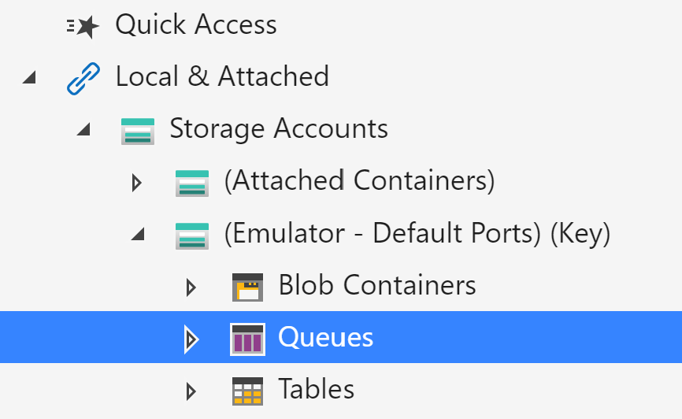
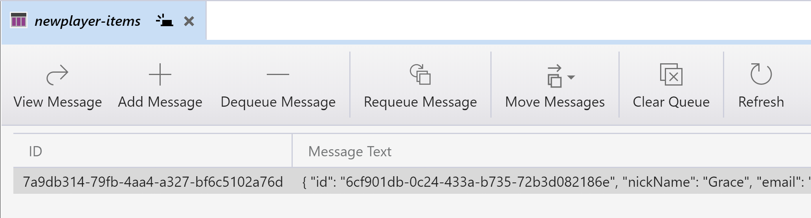
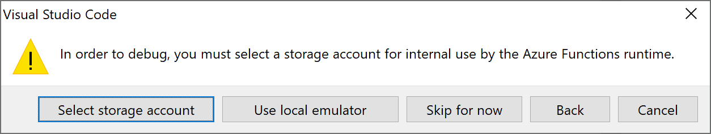

# Queue Trigger & Bindings (.NET Core)

Watch the recording of this lesson [on YouTube 🎥](https://youtu.be/nKJUwW6SGZo).

## Goal 🎯

The goal of this lesson is to learn how to trigger a function by putting a message on a queue, and how you can bind an output message to a queue.

This lessons consists of the following exercises:

|Nr|Exercise
|-|-
|1|[Using the Microsoft Azure Storage Explorer for Queues](#1-using-the-microsoft-azure-storage-explorer-for-queues)
|2|[Using `string` Queue output bindings](#2-using-string-queue-output-bindings)
|3|[Using custom typed Queue output bindings](#3-using-custom-typed-queue-output-bindings)
|4|[Using `CloudQueueMessage` Queue output bindings](#4-using-cloudqueuemessage-queue-output-bindings)
|5|[Using `dynamic` Queue output bindings](#5-using-dynamic-queue-output-bindings)
|6|[Using `IAsyncCollector<T>` Queue output bindings](#6-using-iasynccollectort-queue-output-bindings)
|7.1|[Creating a default Queue triggered function](#71-creating-a-default-queue-triggered-function)
|7.2|[Examine & Run the Queue triggered function](#72-examine--run-the-queue-triggered-function)
|7.3|[Break the Queue triggered function](#73-break-the-queue-triggered-function)
|7.4|[Change the Queue triggered function](#74-change-the-queue-triggered-function)
|8|[Homework](#8-homework)
|9|[More info](#9-more-info)

> 📝 **Tip** - If you're stuck at any point you can have a look at the [source code](../../../src/dotnetcore31/AzureFunctions.Queue) in this repository.

---

## 1. Using the Microsoft Azure Storage Explorer for Queues

In this exercise we'll look into storage emulation and the Azure Storage Explorer to see how you can interact with queues and messages.

### Steps

1. Make sure that the storage emulator is running and open the Azure Storage Explorer.
2. Navigate to `Storage Accounts` -> `(Emulator - Default Ports)(Key)` -> `Queues`
   
3. Right-click on `Queues` and select `Create Queue`
4. Type a name for the queue: `newplayer-items`
5. Select the new queue.
   
   > 🔎 **Observation** - Now you see the contents of the queue. In the top menu you see actions you can perform on the queue or its items.
6. Try adding three messages to the queue, each with different content.
7. Now try dequeue-ing the messages.

   > ❔ **Question** - What do you notice about the order of the messages being dequeued?

## 2. Using `string` Queue output bindings

In this exercise, we'll be creating an HttpTrigger function and use the Queue output binding with a `string` type in order to put player messages on the `newplayer-items` queue.

### Steps

1. In VSCode, create a new HTTP Trigger Function App with the following settings:
   1. Location: *AzureFunctions.Queue*
   2. Language: *C#*
   3. Template: *HttpTrigger*
   4. Function name: *NewPlayerWithStringQueueOutput*
   5. Namespace: *AzureFunctionsUniversity.Demo*  
   6. AccessRights: *Function*
2. Once the Function App is generated, add a reference to the `Microsoft.Azure.WebJobs.Extensions.Storage` NuGet package to the project. This allows us to use bindings for Blobs, Tables and Queues.

   > 📝 **Tip** - One way to easily do this is to use the _NuGet Package Manager_ VSCode extension:
   > 1. Run `NuGet Package Manager: Add new Package` in the Command Palette (CTRL+SHIFT+P).
   > 2. Type: `Microsoft.Azure.WebJobs.Extensions.Storage`
   > 3. Select the most recent (non-preview) version of the package.

3. We'll be working with the same `Player` type again as we did in the Blob lesson. Create a new file to the project, called `Player.cs`, and copy/paste [this content](../../../src/dotnetcore31/AzureFunctions.Queue/Models/Player.cs) into it.

4. Now update the function method HttpTrigger argument so it looks like this:

   ```csharp
   [HttpTrigger(
                AuthorizationLevel.Function,
                nameof(HttpMethods.Post),
                Route = null)] Player player
   ```

   > 🔎 **Observation** - The function will only allow POST requests and since we're using the `Player` type directly, we don't have to extract it from the request content ourselves.

   > 📝 **Tip** - When you use the `HttpMethods` enumeration you need to add a using to the `Microsoft.AspNetCore.Http` namespace.

5. Remove the entire content of the function method and replace it with this single line:

   ```csharp
   return JsonConvert.SerializeObject(player);
   ```

6. Update the return type of the `Run` method to `string`, so the method declaration looks like this:

   ```csharp
   public static string Run(...)
   ```

7. We haven't specified how the player data will be put on the queue. First, lets add a new file, called `QueueConfig.cs` and copy the following into the file:

   ```csharp
   namespace AzureFunctionsUniversity.Demo.Queue
   {
      public static class QueueConfig
      {
         public const string NewPlayerItems = "newplayer-items";
      }
   }
   ```

   > 🔎 **Observation** - We've now captured the name of the output queue in a string constant. We can use this constant whenever we need to refer to the name of the queue.

8. Now let's use the newly created `QueueConfig` to configure what the output of our function is. Add the following underneath the `FunctionName` attribute (so directly above the `Run` method):

   ```csharp
   [return: Queue(QueueConfig.NewPlayerItems)]
   ```

    > 🔎 **Observation** - We've just used a `Queue` attribute to specify this method will return a message to a queue name that is specified in `QueueConfig.NewPlayerItems`.

    > 🔎 **Observation** - Notice that we're not specifying the Connection property for the `Blob` binding. This means the storage connection of the Function App itself is used for the Blob storage. It now uses the `"AzureWebJobsStorage"` setting in the `local.settings.json` file. The value of this setting should be: `"UseDevelopmentStorage=true"` when emulated storage is used. When an Azure Storage Account is used this value should contain the connection string to that Storage Account.

9. Verify that the entire function method looks as follows:

   ``` csharp
   [FunctionName(nameof(NewPlayerWithStringQueueOutput))]
   [return: Queue(QueueConfig.NewPlayerItems)]
   public static string Run(
       [HttpTrigger(
           AuthorizationLevel.Function,
           nameof(HttpMethods.Post),
           Route = null)] Player player)
   {
       return JsonConvert.SerializeObject(player);
   }
   ```

10. Ensure that the storage emulator is started. Then build & run the `AzureFunctions.Queue` Function App.

    > 📝 **Tip** - When you see an error like this: `Microsoft.Azure.Storage.Common: No connection could be made because the target machine actively refused it.` that means that the Storage Emulator has not been started successfully and no connection can be made to it. Check the app settings in the local.settings.json and (re)start the emulated storage.

11. Do a POST request to the function endpoint:

      ```http
      POST http://localhost:7071/api/NewPlayerWithStringQueueOutput
      Content-Type: application/json

      {
         "id": "{{$guid}}",
         "nickName" : "Ada",
         "email" : "ada@lovelace.org",
         "region" : "United Kingdom"
      }
      ```

      > ❔ **Question** - Look at the Azure Functions console output. Is the message processed without errors?

      > ❔ **Question** - Using the Azure Storage Explorer, check if there's a new message in the `newplayer-items` queue. What is the content of the message?

## 3. Using custom typed Queue output bindings

In this exercise, we'll be adding an HttpTrigger function and use the Queue output binding with the `Player` output type in order to put player messages on the `newplayer-items` queue.

### Steps

1. Create a copy of the `NewPlayerWithStringQueueOutput.cs` file and rename the file, the class and the function to `NewPlayerWithTypedQueueOutput.cs`.
2. Remove the `[return: Queue(QueueConfig.NewPlayerItems)]` line since we won't be using the same return Queue attribute.
3. Instead add the following Queue binding underneath the HttpTrigger:

   ```csharp
   [Queue(QueueConfig.NewPlayerItems)] out Player playerOutput
   ```

   > 🔎 **Observation** - Here we're specifying a Queue output binding with the same queue name as before. But now we're using an `out` parameter of type `Player`. Now the return type of the function itself can be of type `IActionResult`, so we have more control of what kind of response we sent back to the caller of our function.

4. Update the return type of the method to `IActionResult`, so the method declaration looks like this:

   ```csharp
   public static IActionResult Run(...)
   ```

5. Replace the contents of the function method with the following:

   ```csharp
   IActionResult result = null;
   playerOutput = null;
   if (string.IsNullOrEmpty(player.Id))
   {
      result = new BadRequestObjectResult("No player data in request.");
   }
   else
   {
      playerOutput = player;
      result = new AcceptedResult();
   }

   return result;
   ```

   > 🔎 **Observation** - Based on the presence of a Player ID we return either a BadRequestObjectResult or an AcceptedResult. When the player object is valid it is assigned to the playerOutput object, and that object will be put on the queue.

6. Verify that the entire function method looks as follows:

   ``` csharp
   [FunctionName(nameof(NewPlayerWithTypedQueueOutput))]
   public static IActionResult Run(
       [HttpTrigger(
           AuthorizationLevel.Function,
           nameof(HttpMethods.Post),
           Route = null)] Player player,
       [Queue(QueueConfig.NewPlayerItems)] out Player playerOutput)
   {
       IActionResult result = null;
       playerOutput = null;
       if (string.IsNullOrEmpty(player.Id))
       {
           result = new BadRequestObjectResult("No player data in request.");
       }
       else
       {
           playerOutput = player;
           result = new AcceptedResult();
       }

       return result;
   }
   ```

7. Build & run the `AzureFunctions.Queue` Function App.
8. Do a POST request, with a complete player object, to the function endpoint:

      ```http
      POST http://localhost:7071/api/NewPlayerWithTypedQueueOutput
      Content-Type: application/json

      {
         "id": "{{$guid}}",
         "nickName" : "Grace",
         "email" : "grace@hopper.org",
         "region" : "United States of America"
      }
      ```

   > ❔ **Question** - > Is there a new message in the `newplayer-items` queue?

9. Do a POST request, without a player ID, to the function endpoint:

   ```http
   POST http://localhost:7071/api/NewPlayerWithTypedQueueOutput
   Content-Type: application/json

   {
      "nickName" : "Grace",
      "email" : "grace@hopper.org",
      "region" : "United States of America"
   }
   ```

   > ❔ **Question** - > Do you receive the correct HTTP response? Is there a new message in the `newplayer-items` queue now?

## 4. Using `CloudQueueMessage` Queue output bindings

In this exercise, we'll be adding an HttpTrigger function and use the Queue output binding with the `CloudQueueMessage` output type in order to put player messages on the `newplayer-items` queue.

### Steps

1. Create a copy of the `NewPlayerWithTypedQueueOutput.cs` file and rename the file, the class and the function to `NewPlayerWithCloudQueueMessageOutput.cs`.
2. We'll be using a new output type, called `CloudQueueMessage`. To use the latest version of this type add a reference to the `Azure.Storage.Queues` NuGet package to the project.

   > 📝 **Tip** - One way to easily do this is to use the _NuGet Package Manager_ VSCode extension:
   > 1. Run `NuGet Package Manager: Add new Package` in the Command Palette (CTRL+SHIFT+P).
   > 2. Type: `Azure.Storage.Queues`
   > 3. Select the most recent (non-preview) version of the package.

3. Change the output type of the Queue binding from:

    ```csharp
    out Player playerOutput
    ````

    to

    ```csharp
    out CloudQueueMessage message
    ```

    > 📝 **Tip** - Ensure that the `CloudQueueMessage` type is from the new `Microsoft.Azure.Storage.Queue` namespace and not the old `Microsoft.WindowsAzure.Storage.Queue` namespace.

4. Now that we have defined a new output parameter named `message` we still need to set it with player data. Replace:

    ```csharp
    playerOutput = null;
    ```

    with:

    ```csharp
    message = null;
    ```

5. A `CloudQueueMessage` is constructed with a `byte` array, or `string` as the message content. Let's use the `string` content option so serialize the `Player` object. Put the following code inside the `else` statement:

    ```csharp
    var serializedPlayer = JsonConvert.SerializeObject(player);
    message = new CloudQueueMessage(serializedPlayer);
    result = new AcceptedResult();
    ```

6. Build & run the `AzureFunctions.Queue` Function App.
7. Make a POST call to the `NewPlayerWithCloudQueueMessageOutput` endpoint and provide a valid json body with a `Player` object:

      ```http
      POST http://localhost:7071/api/NewPlayerWithCloudQueueMessageOutput
      Content-Type: application/json

      {
         "id": "{{$guid}}",
         "nickName" : "Ada",
         "email" : "ada@lovelace.org",
         "region" : "United Kingdom"
      }
      ```

   > ❔ **Question** - Inspect the `newplayer-items` queue. does it contain a new message?  

## 5. Using `dynamic` Queue output bindings

In this exercise, we'll be adding an HttpTrigger function and use dynamic output bindings in order to put valid player messages on the `newplayer-items` queue, and invalid messages on a `newplayer-error-items` queue.

> 📝 **Tip** - Dynamic bindings are useful when output or input bindings can only be determined at runtime. In this case we'll use the dynamic binding to determine the queue name at runtime.

### Steps

1. Create a copy of the `NewPlayerWithTypedQueueOutput.cs` file and rename the file, the class and the function to `NewPlayerWithDynamicQueueOutput.cs`.
2. Replace the line with the `Queue` binding attribute and parameter with:

   ```csharp
   IBinder binder
   ```

3. Remove the contents of the method.
4. Now add the following sections to the method:

   1. First, initialize the result of the HTTP response and the name of the queue:

      ```csharp
         IActionResult result;
         string queueName;
      ```

   2. Second, add an `if/else` statement to determine the name of the queue and the HTTP response:

      ```csharp

         if (string.IsNullOrEmpty(player.Id))
         {
            queueName = QueueConfig.NewPlayerErrorItems;
            result = new BadRequestObjectResult("No player data in request.");
         }
         else
         {
            queueName = QueueConfig.NewPlayerItems;
            result = new AcceptedResult();
         }
      ```

   3. Then, serialize the `Player` object and create an instance of a `CloudQueueMessage`. The cloudQueueMessage will be used in the dynamic queue binding:

      ```csharp
      var serializedPlayer = JsonConvert.SerializeObject(player);
      var cloudQueueMessage = new CloudQueueMessage(serializedPlayer);
      ```

      > 📝 **Tip** - Make sure you use the CloudQueueMessage from the `Microsoft.Azure.Storage.Queue` namespace and **not**  the `Microsoft.WindowsAzure.Storage.Queue` namespace (the latter one is outdated). A dependency to the `Azure.Storage.Queues` NuGet package is required for this.

   4. Finally, create a new `QueueAttribute`, create an instance of a `CloudQueue` using the binder interface and add the cloudQueueMessage to the queue as follows:

      ```csharp
      var queueAttribute = new QueueAttribute(queueName);
      var cloudQueue = await binder.BindAsync<CloudQueue>(queueAttribute);
      await cloudQueue.AddMessageAsync(cloudQueueMessage);

      return result;
      ```

      > ❔ **Question** - Look into the `CloudQueue` type. Which other operations does this type have?

5. Build & run the `AzureFunctions.Queue` Function App.
6. First make a POST call to the `NewPlayerWithDynamicQueueOutput` endpoint and provide a valid json body with a `Player` object:

      ```http
      POST http://localhost:7071/api/NewPlayerWithDynamicQueueOutput
      Content-Type: application/json

      {
         "id": "{{$guid}}",
         "nickName" : "Ada",
         "email" : "ada@lovelace.org",
         "region" : "United Kingdom"
      }
      ```

   > ❔ **Question** - Inspect the `newplayer-items` queue. Does it contain a new message?
7. Now make a POST call to the `NewPlayerWithCloudQueueMessageOutput` endpoint and provide an **invalid** player json body as follows:

      ```http
      POST http://localhost:7071/api/NewPlayerWithDynamicQueueOutput
      Content-Type: application/json

      {
         "nickName" : "Ada",
      }
      ```

   > ❔ **Question** - Inspect the `newplayer-error-items` queue. Does it contain a new message?

## 6. Using `IAsyncCollector<T>` Queue output bindings

In this exercise, we'll be adding an HttpTrigger function and use the Queue output binding with the `IAsyncCollector<Player>` output type in order to put multiple player messages on the `newplayer-items` queue when the HTTP request contains an array of `Player` objects.

### Steps

1. Create a copy of the `NewPlayerWithTypedQueueOutput.cs` file and rename the file, the class and the function to `NewPlayerWithIAsyncCollectorQueueOutput.cs`.
2. Update the type of the Queue attribute and replace:

   ```csharp
   out Player playerOutput
   ```

   with

   ```csharp
   IAsyncCollector<Player> collector
   ```

   > 📝 **Tip** - The `IAsyncCollector<T>` and `ICollector<T>` interfaces are supported by several output bindings such as Queue, ServiceBus, and EventHubs. When this interface is used, items are added to the (in-memory) collector and not directly to the target service behind the output binding. Once the collector is flushed, either using a direct method call or automatically when the function completes, the items in the collector are transferred.

3. Update the `HTTPTrigger` input type from:

   ```csharp
   Player player
   ```

   to

   ```csharp
   Player[] players
   ```

   > 🔎 **Observation** - Notice that we expect an array of Player items in our request.

4. Remove the contents of the function method.
5. Update the function method as follows: Check if there are player objects, iterate over them, add the objects to the collector, and return a `AcceptedResult`. If there are no players to process, return a `BadRequestObjectResult`:

   ```csharp
   IActionResult result = null;
   if (players.Any())
   {
       foreach (var player in players)
       {
           await collector.AddAsync(player);
       }

       result = new AcceptedResult();
   }
   else
   {
       result = new BadRequestObjectResult("No player data in request.");
   }

   return result;
   ```

6. Build & run the `AzureFunctions.Queue` Function App.
7. Do a POST call to the `NewPlayerWithIAsyncCollectorQueueOutput` endpoint and provide a valid json body with multiple `Player` objects:

   ```http
   POST http://localhost:7071/api/NewPlayerWithIAsyncCollectorQueueOutput
   Content-Type: application/json

   [
      {
         "id": "{{$guid}}",
         "nickName" : "Grace",
         "email" : "grace@hopper.org",
         "region" : "United States of America"
      },
      {
         "id": "{{$guid}}",
         "nickName" : "Ada",
         "email" : "ada@lovelace.org",
         "region" : "United Kingdom"
      },
      {
         "id": "{{$guid}}",
         "nickName" : "Margaret",
         "email" : "margaret@hamilton.org",
         "region" : "United States of America"
      }
   ]
   ```

   > ❔ **Question** - Have a look at the `newplayer-items` queue. Does it contain multiple new messages?

## 7.1 Creating a default Queue triggered function

In this exercise we'll create a new QueueTriggered function and trigger it with a message.

### Steps

1. Create a new Function App by running `AzureFunctions: Create New Project` in the VSCode Command Palette (CTRL+SHIFT+P).

   > 📝 **Tip** - Create a folder with a descriptive name since that will be used as the name for the project, e.g. `AzureFunctionsUniversity.Queue`.

2. Select the language you'll be using to code the function, in this lesson we'll be using `C#`.
3. Select `QueueTrigger` as the template.
4. Give the function a name (e.g. `HelloWorldQueueTrigger`).
5. Enter a namespace for the function (e.g. `AzureFunctionsUniversity.Demo`).
6. Select `Create a new local app setting`.

   > 🔎 **Observation** - The local app settings file (local.settings.json) is used to store environment variables and other useful configurations.

7. Select the Azure subscription you will be using.
8. Since we are using the QueueTrigger, we need to provide a storage account, select one or create a new storage account.
   1. If you select a new one, provide a name (we chose `azfuncstor`). The name you provide must be unique to all Azure.
9. Select a resource group or create a new one.
   1. If you create a new one, you must select a region. Use the one closest to you.
10. Enter the name of the storage queue, you can leave the default value `myqueue-items` if you'd like or change it. Make sure to keep this in mind as we will be referencing it later on.
11. When asked about storage required for debugging choose _Use local emulator_.

   

Now the Function App with a Queue Trigger function will be created.

## 7.2 Examine & Run the Queue triggered function

Great, we've got our Function Project and Queue Trigger created, let's examine what has been generated for us.

```csharp
public static class HelloWorldQueueTrigger
{
    [FunctionName("HelloWorldQueueTrigger")]
    public static void Run(
        [QueueTrigger(
            "myqueue-items",
            Connection = "azfuncstor_STORAGE")]string myQueueItem,
            ILogger log)
    {
        log.LogInformation($"C# Queue trigger function processed: {myQueueItem}");
    }
}
```

> 🔎 **Observation** - The `QueueTrigger` indicates this function will be triggered based on queue messages. The first parameter in this attribute is the name of the queue, `myqueue-items`. The `Connection` parameter contains the name of the application setting which contains the connection string. In this case a setting called `azfuncstor_STORAGE` should be present in the `local.settings.json`. If you choose to use local storage emulation instead of the Azure Storage Account you can change the value of the `azfuncstor_STORAGE` setting to `UseDevelopmentStorage=true`;

> 🔎 **Observation** - The queue message itself, named `myQueueItem`, is read as a string and outputted to the log inside the method.

1. Build and run the Function App.

2. The function will only be triggered when a message is put on the `myqueue-items` queue. Use the Azure Storage Explorer to add a message to this queue.

   > ❔ **Question** - Is the function triggered once you've put a message on the queue? How can you determine this?

   > 📝 **Tip** -  You can configure the behavior of the queue binding via the `host.json` file. Configurable settings include the frequency of polling the queue for new messages, timeout duration when processing fails, and how many messages the function will process in parallel. See the [official docs](https://docs.microsoft.com/azure/azure-functions/functions-bindings-storage-queue-output?tabs=csharp#host-json) for the details.

## 7.3. Break the Queue triggered function

Now that the queue trigger is working, let's break it! When a queue triggered function can't process the message successfully, the message will be retried a couple of time (5 times by default). When it still fails after the final retry the message will be placed on a so-called **poison queue**. This is a new queue dedicated for messages that can't be processed. The name of this queue is the same as the regular queue but ends with `-poison`.

### Steps

1. Replace the contents of the queue triggered function with this exception:

   ```csharp
   throw new Exception("Uh oh!");
   ```

   > 🔎 **Observation** - Throwing an exception will force the function to fail processing the message. The function will retry to process the message a couple of times.

2. Build and run the Function App. Put a breakpoint on the `throw new Exception()` line.
3. Using the Azure Storage Explorer, add a message to the `myqueue-items` queue.

   > ❔ **Question** - How many times is the breakpoint hit?

   > ❔ **Question** - Once the function has stopped retrying, is there a `myqueue-items-poison` queue? Does it contain the message you created?

## 7.4. Change the Queue triggered function

Now you understand how queue triggers work, let's do something useful with the message. Let's add a Blob output binding which saves the contents of the message to a Blob container. We'll use a Player json object as the message this time.

### Steps

1. The Azure Functions project template usually references slightly outdated NuGet packages (the release cycle of these NuGet packages is shorter than that of the project template). Let's update these references so we're working with the latest bits. Update the `Microsoft.Azure.WebJobs.Extensions.Storage` and `Microsoft.NET.Sdk.Functions` NuGet packages to the most recent (non-preview) versions.
2. Add a reference to the `Azure.Storage.Blobs` NuGet package to the project. Use the most recent (non-preview) version.
3. Add the following Blob output binding to the method:

   ```csharp
   [Blob("players", FileAccess.Write)] CloudBlobContainer blobContainer,
   ```

   > 📝 **Tip** - The `CloudBlobContainer` type is part of the `Microsoft.Azure.Storage.Blob` namespace.

4. Add the `Player.cs` class, used in earlier exercises, to the project.
5. Replace the existing body of the function method with the following:

   ```csharp
   var player = JsonConvert.DeserializeObject<Player>(message);
   var blob = blobContainer.GetBlockBlobReference($"player-{player.Id}.json");
   await blob.UploadTextAsync(message);
   ```

   > 🔎 **Observation** - First the queue message will be converted to a Player object. Then a new blob reference is created where the blob name is based on the player Id. Finally the message content is uploaded to Blob Storage. Since an asynchronous method (`UploadTextAsync`) is used, the function method signature need to change from `void` to `async Task`. A reference to the `System.Threading.Tasks` namespace is required for this.

6. The entire function method should look like this:

   ```csharp
   [FunctionName("HelloWorldQueueTrigger")]
      public static async Task Run(
      [QueueTrigger(
         "myqueue-items",
         Connection = "azfuncstor_STORAGE")]string message,
      [Blob("players", FileAccess.Write)] CloudBlobContainer blobContainer,
      ILogger log)
   {
      var player = JsonConvert.DeserializeObject<Player>(message);
      var blob = blobContainer.GetBlockBlobReference($"player-{player.Id}.json");
      await blob.UploadTextAsync(message);
   }
   ```

7. Build and run the Function App.
8. Using the Azure Storage Explorer, add a message with the following json content to the `myqueue-items` queue:

   ```csharp
   {
      "id":"2673d898-a6b4-4cef-92b0-8fc46bcf972f",
      "nickName":"Margaret",
      "email":"margaret@hamilton.org",
      "region":"United States of America"
   }
   ```

   > ❔ **Question** - Is the function triggered by the message? Is a new blob available in the "players" Blob container?

## 8. Homework

[Here](queue-homework-resume-api-dotnet.md) is the assignment for this lesson.

## 9. More info

For more info about the Queue Trigger and binding have a look at the official [Azure Functions Queue Storage and Bindings](https://docs.microsoft.com/azure/azure-functions/functions-bindings-storage-queue) documentation.

---
[🔼 Lessons Index](../../README.md)
