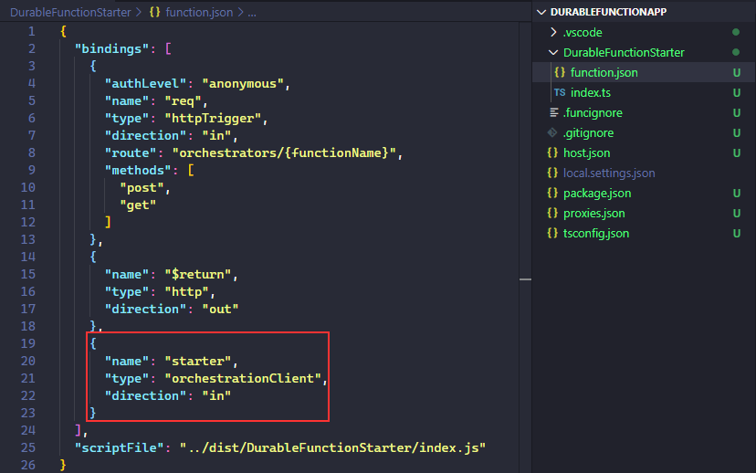
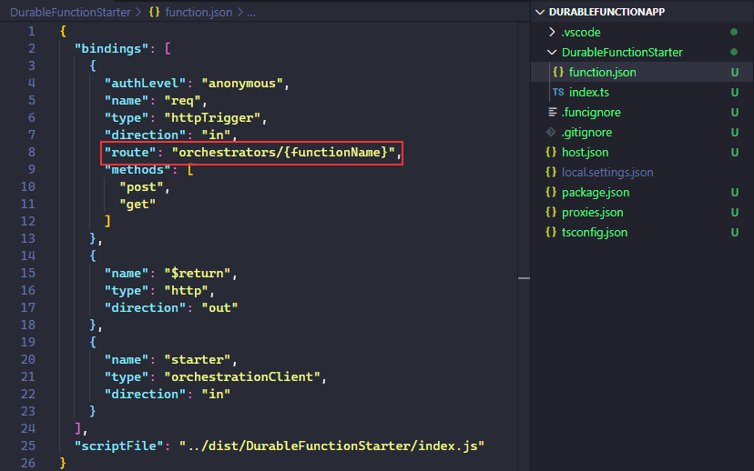

# Azure Durable Functions - Introduction & Chaining

## Goal 🎯

The goal of this lesson is to give you an introduction into Azure Durable Functions including a first durable function that chains two functions calls. In addition we will take a look into some features of Durable Functions that help you when working with durable functions.

This lessons consists of the following exercises:

|Nr|Exercise
|-|-
|0| [Introduction to Azure Durable Functions](#0-introduction-to-azure-durable-functions)
|0.1| [Functions and Chaining](#01-functions-and-chaining)
|0.2| [Solution via Durable Functions](#02-solution-via-durable-functions)
|0.3| [Mechanics of Durable Functions](#03-mechanics-of-durable-functions)
|0.4| [Prerequisites for local development](#04-prerequisites-for-local-development)
|1| [Creating a Function App project for a Durable Function](#1-creating-a-function-app-project-for-a-durable-function)
|1.1| [The Client Function](#11-the-client-function)
|1.2| [The Orchestrator Function](#12-the-orchestrator-function)
|1.3| [The Activity Function](#13-the-activity-function)
|1.4| [The First Execution](#14-the-first-execution)
|2| [Implementing a "Real-World" Scenario](#2-implementing-a-"real-world"-scenario)
|2.1| [Basic Setup of the Scenario](#21-basic-setup-of-the-scenario)
|2.2| [Implementation of the Activity Function `GetPoDetails`](#22-implementation-of-the-activity-function-`GetPoDetails`)
|2.3| [Implementation of the Activity Function `GetPgText`](#23-implementation-of-the-activity-function-`getpgtext`)
|2.4| [Implementation of the Orchestrator Function](#24-implementation-of-the-orchestrator-function)
|2.5| [Test the Implementation](#25-test-the-implementation)
|3| [Retries - Dealing with Temporal Errors](#3-retries---dealing-with-temporal-errors)
|4| [Racing Conditions - Dealing with Timeouts](#4-racing-conditions---dealing-with-timeouts)
|5| [Homework](#5-homework)
|6| [More Info](#6-more-info)

> 📝 **Tip** - If you're stuck at any point you can have a look at the [source code](../../src/durablefunctions/chaining/ts) in this repository.

---

## 0. Introduction to Azure Durable Functions

Within this section we want to take a look at the motivation for the usage of Azure Durable functions and take a look at the basic mechanics.

### 0.1 Functions and Chaining

In general, Functions are a great way to develop functionality in a serverless manner. However, this development should follow some best practices to avoid drawbacks or even errors when using them. The three main points to follow are:

* Functions must be stateless
* Functions should not call other functions
* Functions should only do one thing well

While the first practice is due to the nature of functions, the other two are technically possible but will contradicting the paradigms of serverless. In real life scenarios we often have to model processes that resemble a workflow, so we want to implement a sequence of single steps. How can we do that sticking to the best practices? One common solution for that is depicted below:


Every function in the picture represents a single step of a workflow. In order to glue the functions together we use queues and storages or databases. So Function 1 is executed and stores its results in a table. Function 2 is triggered by an entry in the table via the corresponding bindings and gets executed representing the second step in the workflow. This story continued ten for Function 3. The good news is, that this pattern adheres to the best practices. But this pattern comes with several downsides namely:

* The single functions are just coupled via the event that they react to. From the outside it is not clear how the functions relate to each other although the represent a sequence of steps in a workflow.
* The storage or queues in between single function executions are a necessary evil. One motivation for developing serverless is to care about servers less. Here we must care about technical infrastructure in order to cover the requirement.
* If you want to pass a context between the functions you must store it (and deal with the potential errors around it).
* Handling errors and analyzing bugs in such a setup is very complicated.

Can we do better? Or is there even a solution provided by Azure Functions to handle such scenarios? There is good news - there are Azure Durable Functions.

### 0.2 Solution via Durable Functions

Azure Durable Functions are an extension to the Azure Functions Framework that support you with modeling workflows via Azure Functions. The extension supports you with dealing with all the tedious tasks mentioned above i. e. it does the heavy lifting for you, so that you can focus on the business requirement at hand. The local state is preserved by making use of [Event Sourcing](https://martinfowler.com/eaaDev/EventSourcing.html) and the chaining of functions is done in a programmatic way without you having to deal with state and its persistency. In addition the extension helps you with common tasks in WOrkflows like retries and race conditions as we will see later. Let us first take a look at how Durable Functions work and introduce some terminology.

### 0.3 Mechanics of Durable Functions

Durable Functions consist of three components:

* Orchestrator Functions: the central part of the Durable framework that orchestrates the actions that should take place by triggering Activity Functions.
* Activity Functions: the basic workers that execute the single tasks scheduled via the Orchestrator Function.
* Client Function: the gateway to the Orchestrator Function. The Client Function triggers the Orchestrator Function and serves as the single point of entry for requests from the caller like getting the status of the processing, terminating the processing etc.

Let us assume the following simple execution sequence with two tasks triggered by an HTTP request:

```typescript
let x = await ctx.CallActivityAsync("F1")
let y = await ctx.CallActivityAsync("F2", x)
```

The second task depends on the result of the first task.

The schematic setup with Azure Durable Functions looks like this:


The Client Function is triggered by an HTTP request and consequently triggers the Orchestrator function. Internally this means that a message is enqueued in a task hub. We do not have to care about that as we will se later.


After that the Client Functions scales back down to zero and the Orchestrator Function takes over. It fetches the task from the task hub and schedules the Activity Function.


Again the orchestrator scales down to zero and the Activity Function is executed and returns its results.


After the execution of the first Activity Function the Orchestrator function is invoked again and checks if there are tasks left to do. In our scenario the second Activity Functions is executed. This cycle continuos until all Activity Function calls implemented in the Orchestrator are executed.

After this more theoretical discussion Let us make our hands dirty with some code. But before let us sort our some prerequisites.

### 0.4 Prerequisites for local development

As we could see Azure Durable Functions need some persistency attached. If you want to do a pure local development you must install the [Microsoft Azure Storage Emulator](https://docs.microsoft.com/en-us/azure/storage/common/storage-use-emulator). Up to now the Durable Functions are not compatible with Azurite. So if you are on a non-Windows machine you must use a hybrid approach and connect your Durable Functions to a storage in Azure.

An optional tool ist the [Azure Storage Explorer](https://azure.microsoft.com/en-us/features/storage-explorer/). This one helps you to take a look behind the curtains of the Azure Durable Functions to understand the dynamics and to analyze errors.

Last but not least the example i. e. the Activity Functions shown interact with an external API. This API is free to use and mimics an [SAP system](https://api.sap.com/package/SAPS4HANACloud?section=Artifacts). The only prerequisite is to register in order to get an API key. You can also hard-code the values returned by the Activity Functions or use another API.

## 1. Creating a Function App project for a Durable Function

Ou scenario comprises a Durable Function App with two Activity Functions. The app will be triggered via an HTTP call.
From a business perspective we get an purchase order item number handed over via the HTTP call. Based on the purchase order number we determine ina first step the material group of the purchase order item and in the consequent call we fetch the corresponding description in English.

### 1.1 The Client Function

The first function that we create is the Client Function of our Durable Function app that represents the gateway towards the Orchestrator Function.

#### Steps

1. Create a directory for our function app and navigate into the directory.

   ```powershell
   mkdir DurableFunctionApp
   cd DurableFunctionApp
   ```

2. Start Visual Studio Code.

   ```powershell
   code .
   ```

3. Create a new project via the Azure Functions Extension.
   1. Name the project `DurableFunctionApp`.
   2. Choose `TypeScript` as language.
   3. Select `Durable Functions HTTP Starter` as a template as we want to trigger the execution of the Durable Function via an HTTP call.
   4. Name the function `DurableFunctionStarter`.
   5. Set the authorization level of the function to `Anonymous`.

   > 🔎 **Observation** - Take a look into the `package.json` file. You find already a lot of predefined scripts to build and run the Durable Function.

   

   > 🔎 **Observation** - Take a look into the `function.json` file that was created. Besides the common HTTP bindings we see a special binding called `starter`  of type `orchestrationClient`. This is a special binding that enables the function to kick off an Orchestrator Function.

   

   > 🔎 **Observation** - In addition we find a routing configuration in the `function.json`. This means that the orchestration that is triggered is identified via the name of the Orchestrator Function.

   

   > ❔ **Question** - Why is there an error in the `index.ts` file of the function?

4. Install the `durable-functions` via npm `npm install durable-functions`.

> 📝 **Tip** - Install the the `@types/node` npm package as a dev-dependency because this is needed for the build process.

### 1.2 The Orchestrator Function

Now we create the Orchestrator Function responsible for the orchestration of the single Activity Functions.

#### Steps

1. Create a new function via the Azure Functions Extension in VSCode.
   1. Select `Durable Functions orchestrator` as a template.
   2. Name the function `DurableFunctionsOrchestrator`.

   > 📝 **Tip** - Remove the comments from the index.ts file.

   > 🔎 **Observation** - Take a look into the `function.json` file of the Orchestrator Function. You find the binding type `orchestrationTrigger` which classifies the function as an Orchestrator Function.

   > ❔ **Question** - Can you derive how the Orchestrator Function triggers the Activity Functions? Do you see potential issues in the way the functions are called?

### 1.3 The Activity Function

To complete the Durable Function setup we create an Activity Function.
#### Steps

1. Create a new function via the Azure Functions Extension in VSCode.
   1. Select `Durable Functions activity` as a template.
   2. Name the function `HelloCity`.

   > 📝 **Tip** - Remove the comments from the index.ts file.

   > 🔎 **Observation** - Take a look into the `function.json` file of the Activity Function. You find the binding type `activityTrigger` which classifies the function as an Activity Function.

   > ❔ **Question** - If you trigger the orchestration now, would you run into an error? What adoption do you have to make (hint: function name in orchestrator)?

### 1.4 The First Execution

Execute the Durable Function and experience its mechanics.

#### Steps

1. Start the Azure Storage Emulator.
2. Set the value of the `AzureWebJobsStorage` in your `local.settings.json` to `UseDevelopmentStorage=true`. This advices the function worker to use your local Azure Storage Emulator.
3. Start the function via `npm run start`.
   > 🔎 **Observation** - You can see that the runtime is serving three functions.

   
4. Trigger the orchestration via the tool of your choice e.g. Postman.
   > ❔ **Question** - What route do you have to use?

   > 🔎 **Observation** - The result of the orchestration is not directly returned to the caller. Instead the Client Function is returning the ID and several HTTP endpoints to interact with the orchestration.

   

5. Call the `statusQueryGetUri` endpoint to receive the results of the orchestration.

   
   > 🔎 **Observation** - The status endpoint returns not only the result but also some metadata with respect to the overall execution.

6. Check the resulting entries in your Azure Storage Emulator
   > ❔ **Question** - How many tables have been created by the Azure Functions runtime? What do they contain?

## 2. Implementing a "Real-World" Scenario

In this section we develop some more realistic setup for our durable function. Assume the following situation:
Out function gets triggered via a purchase order create event that gives us an identifier for such an order item. We want to identify the material group texts used in the order item. To do we must call a down stream system. We cannot retrieve the text in one call but we first make a call to get the material group ID and with this result issue a second call in order to retrieve the desired texts. This represents a perfect scenario for a sequence of function calls. The input of the call is given by the purchase order ID, the purchase order item ID and the language that we want our texts to be fetched from the system.  

For this example we make use of a sandbox SAP system and the OData APIs available from there. To make the calls to the system a bit more convenient we make use of the SAP Cloud SDK that wraps the business objects in a virtual data model (VDM) and provides a fluent API to interact with the business object. 

To get the free API keys to the sandbox system you must register yourself at the [API Business Hub](https://api.sap.com/) using the Log On button.

### 2.1 Basic Setup of "Real-World" Scenario

In this section we add the skeleton for the implementation.
#### Steps

1. Create a new function via the Azure Functions Extension in VSCode.
   1. Select `Durable Functions orchestrator` as a template.
   2. Name the function `PurchaseInfoOrchestrator`.
2. Create a new function via the Azure Functions Extension in VSCode.
   1. Select `Durable Functions activity` as a template.
   2. Name the function `GetPoDetails`.
3. Create a new function via the Azure Functions Extension in VSCode.
   1. Select `Durable Functions activity` as a template.
   2. Name the function `GetPgText`.
4. Install the following npm modules for interacting with the SAP sandbox system:
   1. `@sap/cloud-sdk-core` - this package provides you the basic infrastructure to interact with the SAP system.
   2. `@sap/cloud-sdk-vdm-purchase-order-service` - this package provides you the VDM for the purchase orders.
   3. `@sap/cloud-sdk-vdm-product-group-service` - this package provides you the VDM for the product group.
5. Provide values for the URL and the API key of the sandbox system via environment variables. To do so add the following values to your `local.settings.json`. We will inject those values as environment variables in our Activity Functions.

   ```json
   ...
   "APIHubDestination": "https://sandbox.api.sap.com/s4hanacloud",
   "APIHubKey": "<Your Key Value>"
   ...
   ```

### 2.2 Implementation of the Activity Function `GetPoDetails`

In this section we implement the Activity Function `GetPoDetails` that determines the detailed information based on the purchase order ID and the purchase order item ID via an OData call to the SAP system.

#### Steps

1. Import the package for the virtual data model of the purchase order service.

   ```typescript
   import { PurchaseOrderItem } from "@sap/cloud-sdk-vdm-purchase-order-service"
   ```

2. Create a asynchronous function that retrieves the purchase order item information using the fluent API of the SAP Cloud SDK.

   ```typescript
   async function getPurchaseOrderItemDetails(
    { purchaseOrderId,
        purchaseOrderItemId
    }:
        {
            purchaseOrderId: string,
            purchaseOrderItemId: string
        }
    ): Promise<PurchaseOrderItem> {
    return PurchaseOrderItem.requestBuilder()
        .getByKey(purchaseOrderId, purchaseOrderItemId)
        .withCustomHeaders({ APIKey: process.env["APIHubKey"] })
        .execute({
            url: process.env["APIHubDestination"]
        })
    }
   export default activityFunction
   ```

3. Call the function in the body of the Activity Function. Transfer the field `materialGroup` of the function call to a JSON object and return it to the Orchestrator Function.

   ```typescript
   const activityFunction: AzureFunction = async function (context: Context): Promise<JSON> {
    try {
        let purchaseOrderItemDetails = await getPurchaseOrderItemDetails({ purchaseOrderId: context.bindingData.purchaseOrderId.toString(), purchaseOrderItemId: context.bindingData.purchaseOrderItemId.toString() })

        const result: JSON = <JSON><any>{ "materialGroupId": purchaseOrderItemDetails.materialGroup }

        return result

    }
    catch (error) {
        context.log("Error in OData call happened: ", error)
        throw error
    }

   }
   ```

### 2.3 Implementation of the Activity Function `GetPgText`

In this section we implement the Activity Function `GetPgText` that fetches the material group texts based on the material group ID and the input language via an OData call to the SAP system.

#### Steps

1. Import the package for the virtual data model of the purchase order service.

   ```typescript
   import { ProductGroupText } from "@sap/cloud-sdk-vdm-product-group-service"
   ```

2. Create a asynchronous function that retrieves the material group texts using the fluent API of the SAP Cloud SDK.

   ```typescript
   async function getProductGroupText(
    { materialGroupId,
        languageCode
    }:
        {
            materialGroupId: string,
            languageCode: string
        }
   ): Promise<ProductGroupText> {
    return ProductGroupText.requestBuilder()
        .getByKey(materialGroupId, languageCode)
        .withCustomHeaders({ APIKey: process.env["APIHubKey"] })
        .execute({
            url: process.env["APIHubDestination"]
        })
   }

   export default activityFunction
   ```

3. Call the function in the body of the Activity Function. Transfer the fields `materialGroup`, `language`, `materialGroupName` and `materialGroupText` of the function call to a JSON object and return it to the Orchestrator Function.

   ```typescript
   const activityFunction: AzureFunction = async function (context: Context): Promise<JSON> {

    try {
        let productGroupText = await getProductGroupText({ materialGroupId: context.bindingData.materialGroupId.toString(), languageCode: context.bindingData.languageCode.toString() })

        const result: JSON = <JSON><any>{
            "materialGroup": productGroupText.materialGroup,
            "language": productGroupText.language,
            "materialGroupName": productGroupText.materialGroupName,
            "materialGroupText": productGroupText.materialGroupText
        }

        return result

    }
    catch (error) {
        context.log("Error in OData call happened: ", error)
        throw error
    }

   }
   ```

### 2.4 Implementation of the Orchestrator Function

In this section we implement the Orchestrator Function that defines the call sequence of the two Activity Functions and assures the transfer of the result of the first Activity Function to the second one.
#### Steps

1. Create a new directory `util` on root level and create the file `purchaseOrderTypes.ts` in this directory. We will use this file to define interfaces that allow us a consistent handling of the JSON based results.
2. Create the following two interfaces:

   ```typescript
   export interface ProductGroupInfo {
    materialGroup: string,
    language: string,
    materialGroupName: string,
    materialGroupText: string
    }

   export interface MaterialGroupData {
    materialGroupId: string;
   }
   ```

3. Adopt the Orchestrator Function `PurchaseInfoOrchestrator` to the Activity Functions. The first Activity Function is `GetPoDetails`. The returned information of the material group ID must be transferred to the context of the Durable Function. The second Activity Function is `GetPgTexts`. The returned information is returned as response. The code should finally look like this:
   
   ```typescript
   import * as df from "durable-functions"
   import { MaterialGroupData, ProductGroupInfo } from "../utils/purchaseOrderTypes"

   const orchestrator = df.orchestrator(function* (context) {

    const materialGroup: MaterialGroupData = yield context.df.callActivity("GetPoDetails", context.bindingData.input)

    context.bindingData.input.materialGroupId = materialGroup.materialGroupId
    
    const productGroupInfo: ProductGroupInfo = yield context.df.callActivity("GetPgText", context.bindingData.input )

    return productGroupInfo

   })

   export default orchestrator
   ```

   > ❔ **Question** - How many functions will be started by the runtime now?  


### 2.5 Test the Implementation

In this section we finally test our implementation.

#### Steps

1. Set the  value of `"esModuleInterop"` to `true` in the `tsconfig.json` file. Otherwise the build of the project will fail as some parts of the SAP Cloud SDK are not fully compliant to the default project settings i. e. the importing of modules within the files.
2. Execute the Durable orchestration and fetch the data.
   
   > 📝 **Tip** - You find some sample data in the `demoRequests.http` file in the directory /src/DurableFunctions/typescript

   > ❔ **Question** - How can you address the new Orchestrator Function in the function app  

## 3. Retries - Dealing with Temporal Errors

As we are dealing with external system the question is not if something will go wrong, but when this will be the case. So in this section we want to harden our setup to deal with temporal outages of the downstream system using retries when calling activities.
Azure Durable functions have the built-in capability to execute an [automatic retry](https://docs.microsoft.com/en-us/azure/azure-functions/durable/durable-functions-error-handling?tabs=javascript#automatic-retry-on-failure) in case an Activity Function fails. The retry mechanism can be configured using a so called retry policy. In this section we will adopt our `PurchaseInfoOrchestrator` to call the Activity Functions with retries.

### Steps

1. Commit your changes and create a branch of the project and switch to the branch.

   ```powershell
   git commit -m "Basic DF setup"
   git branch retry
   git checkout retry
   ```

2. Open the `index.ts` file of the `PurchaseInfoOrchestrator` function.
3. Define the following parameters for the retry policy before the call of the Activity Functions.
  
   3.1 Set the amount of time to wait before the first retry attempt to 1000 ms.

   ```typescript
   const firstRetryIntervalInMilliseconds: number = 1000
   ```

   3.2. set the maximum number of attempts to 3.

   ```typescript
   const maxNumberOfAttempts: number = 3
   ```

   3.3 Set the maximum amount of time to wait in between retry attempts to 1000 ms.

   ```typescript
   const maxRetryIntervalInMilliseconds: number = 1000
   ```
  
   3.4 Set the maximum amount of time to spend doing retries to 7000 ms.

   ```typescript
   const retryTimeoutInMilliseconds:number = 7000
   ```

   > 📝 **Tip** - It is a best practice to inject the value via environment variables. When doing so make sure that the variable type is converted into a number.
  
   > ❔ **Question** - How long would the Orchestrator Function retry failed calls by default?

4. Create a new instance of the retry options class and set the configuration values.

    ```typescript
    const retryConfig: df.RetryOptions = new df.RetryOptions(firstRetryIntervalInMilliseconds, maxNumberOfAttempts)
    retryConfig.maxRetryIntervalInMilliseconds = maxRetryIntervalInMilliseconds
    retryConfig.retryTimeoutInMilliseconds = retryTimeoutInMilliseconds
    ```

   > 🔎 **Observation** - The constructor of the retry options calls only expects a minimum configuration. 

5. Adopt the calls of the Activity Functions to take into account retries and consider the retry configuration.

   ```typescript
   const materialGroup: MaterialGroupData = yield context.df.callActivityWithRetry("GetPoDetails", retryConfig, context.bindingData.input)
   ...
   const productGroupInfo: ProductGroupInfo = yield context.df.callActivityWithRetry("GetPgText", retryConfig, context.bindingData.input)
   ```

6. Start the durable function and make a call with correct input parameters to make sure we did not brake anything.

   > 🔎 **Observation** - The function is executed as before. There is also no difference in the data stored in the storage emulator with respect to the previous execution.

7. Start the durable function and make a call with wrong input parameters like setting the same value for both input parameters and check the result in the storage explorer.

   > ❔ **Question** - What do you get as result from the status URL?

   > ❔ **Question** - Take a look into the storage explorer for the call. What mechanics is used behind the scenes to?

8. Let us do a little demo trick to simulate that the error vanishes. Stop your function and add the following code into the Orchestrator Function before the activities are called:

   ```typescript
   // For demo purposes
    if (context.df.isReplaying == true) {
        context.bindingData.input.purchaseOrderItemId = 30
    }
   ```

   > 📝 **Tip** < TIP > - We make use of the replay mechanics of the durable function that is stored in the context. As soon as the execution is retried the input parameter gets corrected.

9. Start the function and make a call with the wrong value for the `purchaseOrderItemId`.

   > ❔ **Question** - What do you get as result from the status URL? Is there any hint that something went wrong?

   > ❔ **Question** - Take a look into the storage explorer for the call. What is the difference to erroneous call that we did before?

## 4. Racing Conditions - Dealing with Timeouts

In this section we want to become even more resilient with respect to the called system. In this section we want to deal with the scenario that the system will not return any response in a meaningful time. As a consequence we want to abort the orchestration if a certain time threshold es exceeded. To achieve this we introduce a racing condition between an Activity Function and a timer.

We have already seen in the retry scenario that a timer is used internally for dealing with retries, so we now make use of this functionality explicitly. To achieve this we use the [Function timeout](https://docs.microsoft.com/en-us/azure/azure-functions/durable/durable-functions-error-handling?tabs=javascript#function-timeouts).
### Steps

1. Create a new branch for this development task.

   ```
   git add .
   git commit -m "sample retry scenario"
   git checkout main
   git branch timeout
   git checkout timeout
   ```

2. Install the `moment` package to handle the time settings.

   ```powershell
   npm install moment
   ```

3. Open the orchestrator fucntion and import the moment package.

   ```typescript
   import moment from "moment"
   ```

4. Create a deadline for the timer. We will wait 3000 milliseconds until we assume that the call failed.

   ```typescript
   const timeoutInMilliseconds:number = 3000
   const deadline = moment.utc(context.df.currentUtcDateTime).add(timeoutInMilliseconds, "ms")
   ```

5. Create a timer task via the Durable Functions context but do not yield it.

   ```typescript
   const timeoutTask = context.df.createTimer(deadline.toDate())
   ```

   > 📝 **Tip** - Up to now we directly yielded all calls of the Activity Function. In this scenario we build up the activities and then let the durable function runtime execute them in parallel

6. Rewrite the call of the `GetPoDetails` Activity Function to become a task.

   ```typescript
   const materialGroupTask = context.df.callActivity("GetPoDetails", context.bindingData.input)
   ```

7. Instruct the durable function runtime to let the two tasks (Activity Function and timer) race against each other. The durable function runtime will return the task that finishes first as the `winner`.

   ```typescript
   const winner = yield context.df.Task.any([materialGroupTask, timeoutTask])
   ```

8. Implement the handling of the `winner` task.

   ```typescript
   if (winner === materialGroupTask) {

        context.log("Dunning level fetched before timeout")

        timeoutTask.cancel();

        let materialGroup: MaterialGroupData = <MaterialGroupData>materialGroupTask.result;
        context.bindingData.input.materialGroupId = materialGroup.materialGroupId
    }
   else {
        context.log("OData Call for PO details timed out ...")
        throw new Error("OData Call for PO details timed out")
    }
   ```

   > 📝 **Tip** - The durable function runtime will not cancel any task but keep them running. Make sure that the loser task is canceled.

9. Start the durable function and make a call with correct input parameters to make sure we did not brake anything.

   > ❔ **Question** - Check the execution in the storage explorer. What is different with respect to the original execution without the timer?

10. Let us do a little demo trick to simulate a timeout. Add the following code pieces to the `GetPoDetails` function.

      10.1 Add an asynchronous function to create a timeout.

      ```typescript
      async function sleep(ms: number) {
      return new Promise(resolve => setTimeout(resolve, ms))
      }
      ```

     10.2 Call the `sleep` function before the call to the SAP system is executed and trigger a delay of 10 seconds.

     ```typescript
     // For demo of timeout
     await sleep(10000)
     ```

11. Start the durable function and make a call with correct input parameters.

     > ❔ **Question** - What do you see in the execution history stored in the Azure Storage Emulator?

## 5. Homework

[Here](../../homework/durablefunctions/chaining/durable_locationsearch_api_ts.md) is the assignment for this lesson.

## 6. More info

* Azure Durable Functions - [Official Documentation](https://docs.microsoft.com/en-us/azure/azure-functions/durable/)
* JavaScript: [Generator functions](https://developer.mozilla.org/en-US/docs/Web/JavaScript/Reference/Statements/function*) and [Yield](https://developer.mozilla.org/en-US/docs/Web/JavaScript/Reference/Operators/yield)
* Azure Durable Functions - [Automatic retries](https://docs.microsoft.com/en-us/azure/azure-functions/durable/durable-functions-error-handling?tabs=javascript#automatic-retry-on-failure)
* Azure Durable Functions - [Function timeouts](https://docs.microsoft.com/en-us/azure/azure-functions/durable/durable-functions-error-handling?tabs=javascript#function-timeouts)
* Alternative to code-based workflows in Microsoft Azure: [Azure Logic Apps](https://azure.microsoft.com/en-us/services/logic-apps/)

---
[◀ Previous lesson](<previous>.md) | [🔼 Index](_index.md) | [Next lesson ▶](<next>.md)