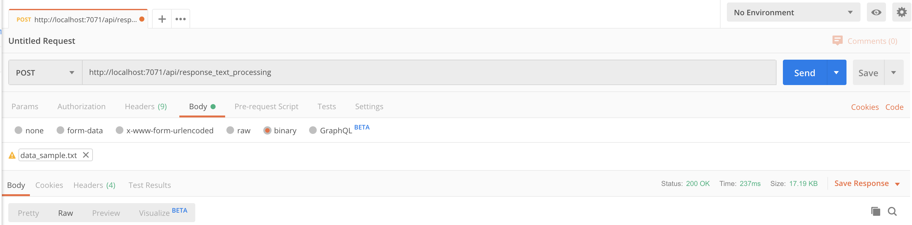

# HTTP Trigger Homework: create a NLP Application

## Goal 🎯

The goal of this homework assignment is for you to use the knowledge gained in the [HTTP Trigger lesson](README.md) and get hands-on.

## Assignment

For this assignment we will create a Serverless Function which removes the English list of [stopwords](https://gist.github.com/sebleier/554280) from a given text.
The code for the stop words remove function will be provided for you [here](../../../src/python/AzureFunctions.Http/homework/homework_resources/shared_code/nlp_text_processing.py). We also uploaded a [test data sample file](../../../src/python/AzureFunctions.Http/homework/homework_resources/data/data_sample.txt) that you can use to test your Serverless Function.

Let's begin!

1. For the sake of this tutorial, we’re going to install the Natural Language Processing library [nltk](https://www.nltk.org/install.html). Create new Function project and run:

    ```bash
    pip install nltk
    pip install numpy
    ```

2. Move `nlp_text_processing.py` to your new function directory.
3. Import `nlp_text_processing.py` in your Serverless Function. You can call the relevant functions using:

    ```python
    processed_text = remove_stop_words(text)
    tokens = tokenize_text(processed_text)
    entities = get_entities(tokens)
    ```

4. Adjust the Serverless Function so it returns `processed_text`, `tokens` and entities as a `response`.

5. Start the function, go to Postman and make the following POST request using the data_sample file as input:



Test if your function works as expected.

## Resources

- Solution can be found [here](../../../src/python/AzureFunctions.Http/homework/homework_solution/), try to accomplish it on your own first.

- [How to Deploy to Azure with Visual Studio Code](https://docs.microsoft.com/azure/azure-functions/functions-develop-vs-code?tabs=python)
- [How to Deploy to Azure with the command like](http-lesson-deploy.md)

## Share

Please share you solutions on LinkedIn and Twitter using the #AzFuncUni hashtag and mention us. We would love to see it!

---
[🔼 Lessons Index](../../README.md) | [Deployment (Optional) ▶](http-lesson-deploy.md)