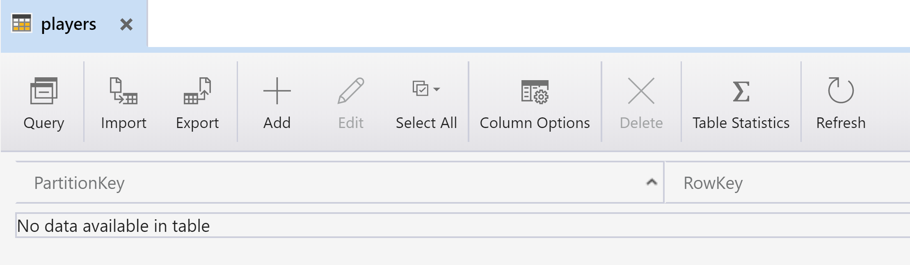
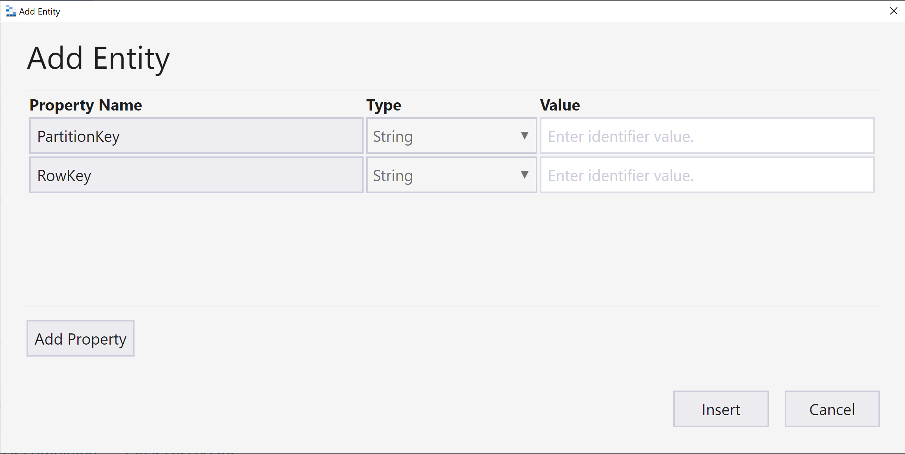

# Table Bindings

## Goal 🎯

The goal of this lesson is to learn how to table input and output bindings work.

This lessons consists of the following exercises:

|Nr|Exercise
|-|-
|0|[Prerequisites](#0-prerequisites)
|1|[Using the Microsoft Azure Storage Explorer for Tables](#1-using-the-microsoft-azure-storage-explorer-for-tables)
|2|[Using `TableEntity` output bindings](#2-using-tableentity-output-bindings)
|3|[Using `IAsyncCollector<T>` Table output bindings](#3-using-iasynccollectort-table-output-bindings)
|4|[Using `TableEntity` input bindings](#4-using-`tableentity`-input-bindings)
|5|[Using `CloudTable` input bindings](#5-using-cloudtable-input-bindings)
|6|[Homework](#6-homework)
|7|[More info](#7-more-info)

> 📝 **Tip** - If you're stuck at any point you can have a look at the [source code](../src/AzureFunctions.Table) in this repository.

---

### 0. Prerequisites

| Prerequisite | Exercise
| - | -
| Azure Storage Emulator or Storage account in Azure | 1-5
| Azure Storage Explorer | 1-5
| VSCode | 2-5
| VSCode AzureFunctions extension | 2-5
| Azure Functions Core Tools | 2-5
| RESTClient for VSCode | 2-5

See the [prerequisites](prerequisites.md) page for more details.

## 1. Using the Microsoft Azure Storage Explorer for Tables

In this exercise we'll look into storage emulation and the Azure Storage Explorer to see how you can interact with tables and entities.

### Steps

1. Make sure that the storage emulator is running and open the Azure Storage Explorer.
2. Navigate to `Storage Accounts` -> `(Emulator - Default Ports)(Key)` -> `Tables`.

    
3. Right-click `Tables` and select `Create Table`.
4. Type a name for the table: `players`
5. Select the new table.

   

   > 🔎 **Observation** - Now you see the contents of the table (which is still empty). In the top menu you see actions you can perform on the table or its records (entities).

6. Try adding a record to the table, you can use the following data:
    - PartitionKey: *United Kingdom* (string)
    - RowKey: *52a3be19-dc1d-4f29-84a6-1013fcfddfa3* (string)
    - Id: *52a3be19-dc1d-4f29-84a6-1013fcfddfa3* (string)
    - NickName: *Ada* (string)
    - Email: *ada@lovelace.org* (string)
    - Region: *United Kingdom* (string)


        > 🔎 **Observation** You'll see that the `PartitionKey` and `RowKey` values are also available in the `Region` and `Id` fields respectively. This type of 'entity modelling' is not required for Table entities. This is just they way we prefer to structure our data. We identify the fields in the business domain we want to use as keys and keep the original fields and their values as is. An alternative would be to only keep the `PartitionKey` and `RowKey` values and not include the `Id` and `Region` fields. But then you need a bit more mapping in your domain classes to map to the `Id` and `Region` fields again.

        > 📝 **Tip** - use the `Add Property` button to add new fields to the entity.

    

## 2. Using `TableEntity` output bindings

In this exercise, we'll be creating an HttpTrigger function and use the Table output binding with a type based on `TableEntity` in order to put player data in the `players` table.

### Steps

1. In VSCode, create a new HTTP Trigger Function App with the following settings:
   1. Location: *AzureFunctions.Table*
   2. Language: *C#*
   3. Template: *HttpTrigger*
   4. Function name: *StorePlayerReturnAttributeTableOutput*
   5. Namespace: *AzureFunctionsUniversity.Demo*  
   6. AccessRights: *Function*
2. Once the Function App is generated, add a reference to these NuGet packages:
    1. `Microsoft.Azure.WebJobs.Extensions.Storage`. This allows us to use bindings for Blobs, Tables and Queues.
    2. `Microsoft.Azure.Cosmos.Table`. This allows us to use the `TableEntity` type as a basis for our custom `PlayerEntity` type.

   > 📝 **Tip** - One way to install packages is to use the _NuGet Package Manager_ VSCode extension:
   > 1. Run `NuGet Package Manager: Add new Package` in the Command Palette (CTRL+SHIFT+P).
   > 2. Type the name of the package (e.g. `Microsoft.Azure.WebJobs.Extensions.Storage`).
   > 3. Select the most recent (non-preview) version of the package.

3. We'll be working with a `PlayerEntity` type, similar to `Player` type used in the Blob and Queue lessons. However that exact same class can't be used here since we need to use the PartitionKey and RowKey properties the table requires.
    1. Create a new file to the project, called `PlayerEntity.cs`.
    2. Copy/paste [this content](../src/AzureFunctions.Table/Models/PlayerEntity.cs) into it.

        > 🔎 **Observation** - Look at the `PlayerEntity` class. Notice that it inherits from `TableEntity`. This is a built-in type.

4. Now update the function method HttpTrigger argument so it looks like this:

    ```csharp
    [HttpTrigger(
            AuthorizationLevel.Function,
            nameof(HttpMethods.Post),
            Route = null)] PlayerEntity playerEntity)
    ```

     > 🔎 **Observation** - We expect that a `PlayerEntity` type will be posted to this HTTP endpoint. Assume that the `PartitionKey` and `RowKey` properties are not provided as part of the JSON object in the request. We'll deal with those later.

5. We haven't specified the table name yet. Lets add a new file, called `TableConfig.cs` and copy the following into the file:

    ```csharp
    namespace AzureFunctionsUniversity.Table
    {
        public static class TableConfig
        {
            public const string Table = "players";
        }
    }
    ```

    > 🔎 **Observation** - Now we can refer to the table name by using `TableConfig.Table`.

6. Back in the function class, add the following return attribute just below the `FunctionName` attribute:

    ```csharp
    [return: Table(TableConfig.Table)]
    ```

    > 🔎 **Observation** - We've now defined that we return the output from the function to a table which name is configured in the `TableConfig` class.

    > 🔎 **Observation** - Notice that we're not specifying the Connection property for the `Table` binding. This means the storage connection of the Function App itself is used for the Table storage. It now uses the `"AzureWebJobsStorage"` setting in the `local.settings.json` file. The value of this setting should be: `"UseDevelopmentStorage=true"` when emulated storage is used. When an Azure Storage Account is used this value should contain the connection string to that Storage Account.

7. Remove the entire content of the function method and replace it with these two lines:

    ```csharp
    playerEntity.SetKeys()  

    return playerEntity;
    ```

    > ❔ **Question** - We're calling the `SetKeys()` method on the `PlayerEntity` class. Why are we doing this before we return the entity to the table?

8. Verify that the entire function method looks as follows:

    ``` csharp
    [FunctionName(nameof(StorePlayerReturnAttributeTableOutput))]
    [return: Table(TableConfig.Table)]
    public static PlayerEntity Run(
        [HttpTrigger(
            AuthorizationLevel.Function,
            nameof(HttpMethods.Post),
            Route = null)] PlayerEntity playerEntity)
    {
        playerEntity.SetKeys()  

        return playerEntity;
    }
   ```

9. Ensure that the storage emulator is started. Then build & run the `AzureFunctions.Table` Function App.

    > 📝 **Tip** - When you see an error like this: `Microsoft.Azure.Storage.Common: No connection could be made because the target machine actively refused it.` that means that the Storage Emulator has not been started successfully and no connection can be made to it. Check the app settings in the local.settings.json and (re)start the emulated storage.

10. Do a POST request to the function endpoint:

      ```http
      POST http://localhost:7071/api/StorePlayerReturnAttributeTableOutput
      Content-Type: application/json

      {
         "id": "{{$guid}}",
         "nickName" : "Frances",
         "email" : "frances@northcutt.org",
         "region" : "United States of America"
      }
      ```

11. > ❔ **Question** - Look at the Azure Functions console output. Is the function executed without errors?

12. > ❔ **Question** - Using the Azure Storage Explorer, check if there's a new entity in the `players` table. If so, click on the entity and inspect its properties.

## 3. Using `IAsyncCollector<T>` Table output bindings

In this exercise, we'll be adding an HttpTrigger function and use the Table output binding with the `IAsyncCollector<PlayerEntity>` output type in order to store multiple player entities in the `players` table when the HTTP request contains an array of `Player` objects.

### Steps

1. Create a copy of the `StorePlayerReturnAttributeTableOutput.cs` file and rename the file, the class and the function to `StorePlayersWithAsyncCollectorTableOutput.cs`.
2. We won't be using the return attribute in this function so remove the line with `[return: Table(TableConfig.Table)]`.
3. Change the `Run` method signature from:

    ```csharp
    public static PlayerEntity Run
    ```

    to

    ```csharp
    public static async Task<IActionResult> Run
    ```

4. Since the method needs to work with an array of `PlayerEntity` elements, change the input type from:

    ```csharp
    PlayerEntity playerEntity
    ```

    to

    ```csharp
    PlayerEntity[] playerEntities
    ```

5. Add the following `Table` binding to the method:

    ```csharp
    [Table(TableConfig.Table)] IAsyncCollector<PlayerEntity> collector
    ```

    > 📝 **Tip** - The `IAsyncCollector<T>` and `ICollector<T>` interfaces are supported by several output bindings such as Queue, Table, ServiceBus, and EventHubs. When this interface is used, items are added to the (in-memory) collector and not directly to the target service behind the output binding. Once the collector is flushed, either using a direct method call or automatically when the function completes, the items in the collector are transferred.

6. Replace the content of the Run method with this code:

    ```csharp
     foreach (var playerEntity in playerEntities)
    {
        playerEntity.SetKeys();
        await collector.AddAsync(playerEntity);
    }

    return new AcceptedResult();
    ```

7. Verify that the entire function looks like this now:

    ```csharp
    public static class StorePlayersWithAsyncCollectorTableOutput
    {
        [FunctionName(nameof(StorePlayersWithAsyncCollectorTableOutput))] 
        public static async Task<IActionResult> Run(
            [HttpTrigger(
                AuthorizationLevel.Function,
                nameof(HttpMethods.Post),
                Route = null)] PlayerEntity[] playerEntities,
            [Table(TableConfig.Table)] IAsyncCollector<PlayerEntity> collector)
        {
            foreach (var playerEntity in playerEntities)
            {
                playerEntity.SetKeys();
                await collector.AddAsync(playerEntity);
            }

            return new AcceptedResult();
        }
    }
    ```

8. Ensure that the storage emulator is started. Then build & run the `AzureFunctions.Table` Function App.

    > 📝 **Tip** - When you see an error like this: `Microsoft.Azure.Storage.Common: No connection could be made because the target machine actively refused it.` that means that the Storage Emulator has not been started successfully and no connection can be made to it. Check the app settings in the local.settings.json and (re)start the emulated storage.

9. Do a POST request with an array of players to the function endpoint:

      ```http
      POST http://localhost:7071/api/StorePlayersWithAsyncCollectorTableOutput
    Content-Type: application/json

    [
        {
            "id": "{{$guid}}",
            "nickName" : "Grace",
            "email" : "grace@hopper.org",
            "region" : "United States of America"
        },
        {
            "id": "{{$guid}}",
            "nickName" : "Margaret",
            "email" : "margaret@hamilton.org",
            "region" : "United States of America"
        },
        {
            "id": "{{$guid}}",
            "nickName" : "Mary",
            "email" : "mary@jackson.org",
            "region" : "United States of America"
        }
    ]
    ```

10. > ❔ **Question** - Look at the Azure Functions console output. Is the function executed without errors?

11. > ❔ **Question** - Using the Azure Storage Explorer, are there several new entities in the `players` table?

## 4. Using `TableEntity` input bindings

In this exercise, we'll be adding an HttpTrigger function and use the Table input binding with the `PlayerEntity` type in order to retrieve one player entity from the `players` table. We'll be doing a point query, which means we use both the PartitionKey and RowKey in order ot retrieve a single entity from the table. In this case we'll provide the player region (PartitionKey) and the player ID (RowKey), both will be part of the route.

### Steps

1. Create a copy of the `StorePlayerReturnAttributeTableOutput.cs` file and rename the file, the class and the function to `GetPlayerByRegionAndIdCloudTableInput.cs`.
2. We won't be using the return attribute in this function so remove the line with `[return: Table(TableConfig.Table)]`.
3. Update the HttpTrigger attribute as follows:

    ```csharp
    [HttpTrigger(
        AuthorizationLevel.Function,
        nameof(HttpMethods.Get),
        Route = "GetPlayerByRegionAndIdTableInput/{region}/{id}")] HttpRequest request,
    ```

    > 🔎 **Observation** - Note that Route parameter contains {region} and {id} expressions.

4. Add `region` and `id` parameters to the method signature, below the HttpTrigger:

    ```csharp
    string region,
    string id,
    ```

5. Add the following Table input binding as the final parameter of the method:

    ```csharp
    [Table(
        TableConfig.Table,
        "{region}",
        "{id}")] PlayerEntity playerEntity)
    ```

6. Update the body of the function with:

    ```csharp
    return new OkObjectResult(playerEntity);
    ```

7. Verify that the entire function looks like this:

    ```csharp
    [FunctionName(nameof(GetPlayerByRegionAndIdTableInput))]
    public static IActionResult Run(
        [HttpTrigger(
            AuthorizationLevel.Function,
            nameof(HttpMethods.Get),
            Route = "GetPlayerByRegionAndIdTableInput/{region}/{id}")] HttpRequest request,
        string region,
        string id,
        [Table(
            TableConfig.Table,
            "{region}",
            "{id}")] PlayerEntity playerEntity)
    {
        return new OkObjectResult(playerEntity);
    }
    ```

8. Ensure that the storage emulator is started. Then build & run the `AzureFunctions.Table` Function App.

9. Ensure that there's at least one entity present in the `players` Table. Copy the PartitionKey and RowKey for that entity.

10. Do a GET request to the endpoint and update the PARTITION_KEY and ROW_KEY fields with the values from the previous step:

    ```http
    GET http://localhost:7071/api/GetPlayerByRegionAndIdTableInput/PARTITION_KEY/ROW_KEY
    ```

    *Example*

    ```http
    GET http://localhost:7071/api/GetPlayerByRegionAndIdTableInput/United%20States%20of%20America/6449f9a2-56be-4f7c-a8ee-02603bb7625c
    ```

    > ❔ **Question** - Does the function run without errors? Do you get the expected `PlayerEntity` back?

## 5. Using `CloudTable` input bindings

In this exercise we'll create an HttpTrigger function which returns multiple `PlayerEntity` objects from the `players` table using a Table input binding based on the `CloudTable` type. The body of the function will use a `TableQuery` that uses information based on parameters from the HTTP query string (region and nickname).

### Steps

1. Create a copy of the `GetPlayerByRegionAndIdTableInput.cs` file and rename the file, the class and the function to `GetPlayersByRegionAndNickNameCloudTableInput.cs`.
2. Update the HttpTrigger so the Route is `null`:

    ```csharp
    [HttpTrigger(
            AuthorizationLevel.Function,
            nameof(HttpMethods.Get),
            Route = null)] HttpRequest request
    ```

3. Remove the `region` and `id` parameters from the method. We'll be using the query string parameters this time.
4. Update the Table input binding to this:

    ```csharp
    [Table(TableConfig.Table)] CloudTable cloudTable
    ```

     > 🔎 **Observation** - The Table binding only uses the table name now. The type the binding is using is `CloudTable` and comes from the `Microsoft.Azure.Cosmos.Table` NuGet package. The CloudTable exposes a lot methods to interact with a Table in either TableStorage or CosmosDB Tables.

5. Replace the body of the function method with:

    ```csharp
    string region = request.Query["region"];
    string nickName = request.Query["nickName"];

    var regionAndNickNameFilter = new TableQuery<PlayerEntity>()
        .Where(
            TableQuery.CombineFilters(
                TableQuery.GenerateFilterCondition(
                    nameof(PlayerEntity.PartitionKey), 
                    QueryComparisons.Equal,
                    region),
                TableOperators.And,
                TableQuery.GenerateFilterCondition(
                    nameof(PlayerEntity.NickName),
                    QueryComparisons.Equal,
                    nickName)));
    var playerEntities = cloudTable.ExecuteQuery<PlayerEntity>(regionAndNickNameFilter);

    return new OkObjectResult(playerEntities);
    ```

    > 🔎 **Observation** - Note that the region and nickName are retrieved from the query string of the HTTP request.

    > 🔎 **Observation** - Note that a `TableQuery<PlayerEntity>` is created with filter conditions based on the `PartitionKey` and the `NickName` properties of a `PlayerEntity`. The query is executed on the `CloudTable` type that belongs to the Table input binding.

    > ❔ **Question** - Look into the `TableQuery` class. What other methods does it support?

    > ❔ **Question** - Look into the `QueryComparisons` class. What other constants does it have?

    > ❔ **Question** - Look into the `TableOperators` class. What other constants does it have?

6. Ensure that the storage emulator is started. Then build & run the `AzureFunctions.Table` Function App.

7. Ensure that there are several entities present in the `players` Table. Copy the PartitionKey and NickName of an entity you want to return from the function.

8. Do a GET request to the endpoint and update the PARTITION_KEY and NICK_NAME fields with the values from the previous step:

    ```http
    GET http://localhost:7071/api/GetPlayersByRegionAndNickNameCloudTableInput
        ?region=PARTITION_KEY
        &nickName=NICK_NAME
    ```

    *Example*

    ```http
    GET http://localhost:7071/api/GetPlayersByRegionAndNickNameCloudTableInput
        ?region=United States of America
        &nickName=Mary
    ```

    > ❔ **Question** - Did the function run without errors? Are the correct entities returned?

## 6 Homework

## 7 More info

---
[◀ Previous lesson](deployment.md) | [🔼 Index](_index.md) | [Next lesson ▶](cosmosdb.md)
