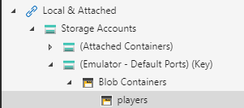
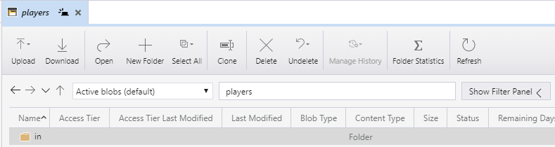
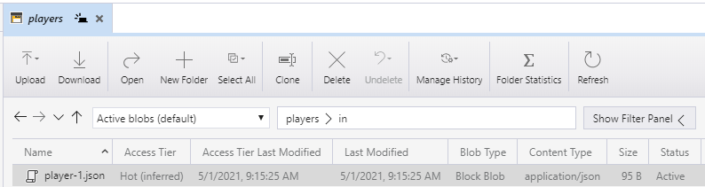
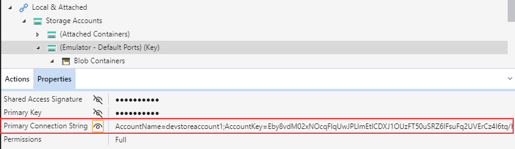
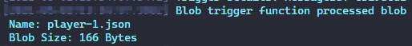

# Blob Bindings (TypeScript)

Watch the recording of this lesson [on YouTube 🎥](https://youtu.be/SC4-_ZwjlR4).

## Goal 🎯

The goal of this lesson is to use _Blob storage_ input and output bindings which lets you read and write Blob data in your Functions. In addition you will create a _Blob triggered_ Function that reacts to changes in Blob storage data.

This lessons consists of the following exercises:

|Nr|Exercise
|-|-
|0| [Prerequisites](#0-prerequisites)
|1| [Using the Microsoft Azure Storage Explorer and Azurite](#1-using-the-microsoft-azure-storage-explorer-and-azurite)
|2| [Using plain Blob output bindings](#2-using-plain-blob-output-bindings)
|3| [Using binding expressions for Blob output bindings](#3-using-binding-expressions-for-blob-output-bindings)
|4| [Using payload data of trigger for Blob output bindings](#4-using-payload-data-of-trigger-for-blob-output-bindings)
|5| [Using plain Blob input bindings](#5-using-plain-blob-input-bindings)
|6| [Using Blob storage SDK for reading](#6-using-blob-storage-sdk-for-reading)
|7| [Creating a Blob triggered Function](#7-creating-a-blob-triggered-function)
|8| [Homework](#8-homework)
|9| [More info](#9-more-info)

> 📝 **Tip** - If you're stuck at any point you can have a look at the [source code](../../../src/typescript/AzureFunctions.Blob) in this repository.

---

## 0. Prerequisites

| Prerequisite | Exercise
| - | -
| Azurite (Storage Emulator) | 1-6
| Azure Storage Explorer | 1-7
| An empty local folder / git repo | 2-7
| Azure Functions Core Tools | 2-7
| VS Code with Azure Functions extension| 2-7
| Rest Client for VS Code or Postman | 2-6

See [TypeScript prerequisites](../prerequisites/README.md) for more details.

## 1. Using the Microsoft Azure Storage Explorer and Azurite

What is the _Azure Blob storage_? Azure Blob storage is a service for storing large amounts of unstructured data that can be accessed from anywhere in the world via REST API i.e. HTTP or HTTPS calls. A single blob can be hundreds of gigabytes in size. Azure Blob storage offers three types of resources:

- The _storage account_
- _Container(s)_ in the storage account. A storage account can contain multiple containers.
- A _blob_ in a container. A container can contain multiple blobs. You can also use _folders_ to structure the blobs in a container.

We will mostly use a _local storage emulator_ instead of creating a storage account in Azure to deal with blobs. This is great for local development. In this section we will setup a sample container containing a folder and a blob.

### Steps

1. Install [Azurite](https://github.com/Azure/Azurite) as cross-platform emulator for the storage.
2. Install [Azure Storage Explorer](https://azure.microsoft.com/features/storage-explorer/).
3. Create a directory for the data storage of Azurite e.g. `C:\Users\<Your_Name>\azurite-storage`
4. Start the Azurite with the command:

   ```powershell
   azurite -s -l C:\Users\<Your_Name>\azurite-storage -d C:\Users\<Your_Name>\azurite-storage\debug.log
   ```

   > 📝 **Tip** This command starts all Azurite services and tells Azurite where to store the data including logs. You can also start the services exclusively e. g. via `azurite-blob`

5. Open the Azure Storage Explorer, expand Local & Attached > Storage Accounts > (Emulator - Default Ports) (Keys) > Right click on Blob containers and create a new container named `players`.

   

6. Create a folder called `in` in the `players` container.
  
   

7. Drag the [player-1.json](../../../src/typescript/AzureFunctions.Blob/player-1.json) file that we have provided there. You can create more `player-x.json` files and add them if you like.

     

8. You are now all set to work with local storage.

   > 📝 **Tip** - Read about [Azurite](https://docs.microsoft.com/azure/storage/common/storage-use-azurite) and [Azure Storage Explorer](https://azure.microsoft.com/features/storage-explorer/).

## 2. Using plain Blob output bindings

In this exercise, we will create a HTTP-triggered Function and extend it with a Blob _output binding_ in order to write a `Player` JSON object to a `players/out` path in the Blob storage.

### Steps

1. Create a new directory `AzureFunctions.Blob`, switch into the directory and start VSCode.
2. In VSCode create a new HTTP Trigger Function App via the Azure Functions extension with the following settings:
   1. Location: *AzureFunctions.Blob*
   2. Language: *TypeScript*
   3. Template: *HTTP trigger*
   4. Function name: *StorePlayerWithBlobOutput*
   5. AccessRights: *Function*
3. After the Function App is created, execute `npm install` to install the required dependencies.
4. Open the `function.json` file in the `StorePlayerWithBlobOutput` directory and make the following changes:
   1. We want to support POST requests only, so we remove the `"get"` from the array of support HTTP methods.
   2. We add a new output binding by adding the following lines of JSON after the input binding section:

      ```JSON
      {
         "name": "playerBlob",
         "type": "blob",
         "path": "players/out/stored-input.json",
         "direction": "out"
       }
       ```

      > 🔎 **Observation** - The attribute `"name"` defines the name that we use to address the bound object in your `index.ts` file. The attribute `"type"` specifies the binding type, in our case the Blob binding. The attribute `"path"` tells the binding which path to use to store the blob. It consists of  the  name of the container (`player`), the directory (`out`) and the file name (`players/out/stored-input.json`). The attribute `"direction"` defines the   binding direction, in this case an output binding.
      
      > 🔎 **Observation** - Notice that we left out the `connection` attribute for the `Blob` binding. This means the storage connection of the Function App   itself is used which is the `"AzureWebJobsStorage"` setting in the `local.settings.json` file. The value of this setting should be:   `"UseDevelopmentStorage=true"` when emulated storage is used. When an Azure Storage Account is used this value should contain the connection string to  that  Storage Account.

5. Go back to Function code in `index.ts` file and remove the existing content of the function's body, since we write a new implementation.
6. Add some variables for the HTTP response object:

   ```typescript
   let responseStatusCode: number
   let responseMessage: string
   ```

7. We must distinguish the cases if we receive a body in our POST request or not. So add some basic `if-else` logic:

   ```typescript
   if (req.body){
    
    }
    else{

    }
   ```

   > 🔎 **Observation** - For the sake of this lesson, we leave out any further checks on the JSON object in the body of the request. In real life scenarios you certainly must place further validations in place to make sure that you store valid data.

8. Let us deal with the unhappy case first when the request does not contain a body. We return the corresponding information to the caller:

   ```typescript
    else {
        responseStatusCode = 400
        responseMessage = "Provide player data in the request."
    }
   ```

9. In case we receive a body we store the JSON body in the Blob storage. As we put in place the output binding, this is straightforward, as we just need to transfer the JSON object in the body to the binding available via the Function context:  

   ```typescript
   if (req.body){

        context.bindings.playerBlob = req.body

   }
   ```

10. Complete the `if`-case by adding the corresponding response information:

    ```typescript
    if (req.body){
 
    ...
 
         responseStatusCode = 201
         responseMessage = "Player data created in Blob storage."
 
    }
    ```

11. Finalize the code by returning the information via the response object after the `if-else` clause:

    ```typescript
    context.res = {
            status: responseStatusCode,
            body: responseMessage
        }
    ```

12. Start the Azure Function via `npm run start` or by pressing F5 and make a POST call to the `StorePlayerWithBlobOutput` endpoint. Provide a valid JSON body with a `Player` object:

    ```http
    POST http://localhost:7071/api/StorePlayerWithBlobOutput
    Content-Type: application/json
    
    {
       "id": "{{$guid}}",
       "nickName": "Scarlet Witch",
       "email":"wanda.maximoff@avengers.com",
       "location": {
           "region": "novi grad",
           "country": "sokovia"
       }
    }
    ```

   > 📝 **Tip** - The `{{$guid}}` part in the body creates a new random GUID when the request is made. This functionality is part of the VSCode REST Client extension.
  
   > ❔ **Question** - Is there a blob created in the blob storage? What is the exact path of the blob? What is the content type?
  
   > ❔ **Question** - What do you think would happen if you run the Function again with the exact same input?

## 3. Using binding expressions for Blob output bindings

In this exercise, we will make use of _binding expressions_ to add a unique ID to the stored data and avoid the overwriting of entries.

### Steps

1. Commit your changes in the Function App directory, create a new branch called `binding-expression` and switch to the new branch.
2. Adjust the `path` attribute in the `function.json` file:

   ```json
   ...
   "path": "players/out/stored-input-{rand-guid}.json",
   ...
   ```

    > 🔎 **Observation** - The {rand-guid} expression in path is a so-called _binding expression_. The expression creates a random GUID when the output binding is executed by the Azure Functions runtime. There are more expressions available as described in the [documentation](https://docs.microsoft.com/azure/azure-functions/functions-bindings-expressions-patterns).

3. Start the Azure Function via `npm run start` or by pressing F5 and make a POST call to the `StorePlayerToBlobOutput` endpoint. Provide a valid JSON body with a `Player` object:

   ```http
   POST http://localhost:7071/api/StorePlayerWithBlobOutput
   Content-Type: application/json
   
   {
      "id": "{{$guid}}",
      "nickName": "Scarlet Witch",
      "email":"wanda.maximoff@avengers.com",
      "location": {
          "region": "novi grad",
          "country": "sokovia"
      }
   }
   ```

   > ❔ **Question** - What happens when you run the Function with the exact same input?

## 4. Using payload data of trigger for Blob output bindings

In this exercise, we making use of the data from the JSON body of the HTTP request to derive the file name we want to store.

The binding expression syntax enables us to use the attributes in the JSON file of our input, so we want to apply the following naming convention to our output file:

```powershell
players/out/stored-input-<GUID from the input>-<Nickname>-<Country in Location>.json
```

### Steps

1. Commit your changes in the Function App directory, create a new branch called `binding-expression-payload` and switch to the new branch.
2. Adjust the `path` attribute in the `function.json` file:

   ```json
   ...
   "path": "players/out/stored-input-{id}-{nickName}-{location.country}.json",
   ...
   ```

    > 🔎 **Observation** - We can access nested structures of the JSON body via _dot notation_.

3. Adjust the return message for the success case in the `index.ts` in order to be able to check if the GUID of the request object was used:

   ```typescript
   if (req.body) {
      ...
      responseMessage = `Player data with id ${req.body.id} was created in Blob storage.`
      ...
    }

   ```

4. Start the Azure Function via `npm run start` or by pressing F5 and make a POST call to the `StorePlayerToBlobOutput` endpoint. Provide a valid JSON body with a `Player` object:

   ```http
   POST http://localhost:7071/api/StorePlayerWithBlobOutput
   Content-Type: application/json
   
   {
     "id": "{{$guid}}",
     "nickName": "Hulk",
     "email":"bruce.banner@avengers.com",
     "location": {
         "region": "massachusetts",
         "country": "usa"
     }
   }      
   ```

   > ❔ **Question** - Is the blob created as specified?
 
   > 📝 **Tip** - In the previous sections we used a _declarative_ binding specified in the `function.json` file. The naming of the output file is defined at design time. Although there is some flexibility via binding expressions to influence this you will face scenarios where the functionality is not enough to cover your requirements. Unfortunately, _imperative_ binding patterns (also known as _dynamic binding_) is not supported for non-.NET languages. In case you run into limitations with the declarative binding, do not hesitate to use the [Blob storage SDK](https://www.npmjs.com/package/@azure/storage-blob) to directly interact with the storage from withing your Function code.

## 5. Using plain Blob input bindings

In this exercise we want to explore how we can use the _input binding_ to read data from a Blob storage. We will create an HTTP trigger Function that expects a player ID as URL parameter. Using this ID we will return the content from the Blob that matches it.

### Steps

1. Create a new HTTP triggered Function and name it `GetPlayerFromBlob`.
2. We make some changes to the `function.json` file with respect to the HTTP trigger :
   1. Remove the `"post"` value from the methods array, as we only support GET requests.
   2. Add a `route` attribute to the `HTTPTrigger` configuration and set it to:

      ```json
      "route": "GetPlayerFromBlob/{id}"
      ```

      > 📝 **Tip** - The optional route parameter allows you to define custom HTTP endpoints for the HTTP triggered Function. In addition, the route parameters, like `{id}` in our setup, are available as input for the other bindings of the Function.

   3. Add the Blob input binding:

      ```json
      {
         "name": "playerBlobIn",
         "type": "blob",
         "path": "players/in/player-{id}.json",
         "direction": "in"
      }
      ```

      > 🔎 **Observation** - The conventions for the binding attributes are the same as for the output binding we used before.
      
      > 🔎 **Observation** - We left out the optional attribute `dataType`. This attribute allows to specify the data type for dynamically typed languages. However, the possible values are restricted to `string`, `binary` and `stream`.

3. We adjust the code of the `index.ts` file to make use of the input binding and return the result fetched from the Blob storage to the caller:
   1. Remove all the code from the function's body.
   2. Add some variables for the HTTP response object:

      ```typescript
      let responseStatusCode: number
      let responseMessage: string
      let responseHeaders: object
      ```

   3. We must distinguish the cases if we receive a result from our binding or not. So we add a basic `if-else` logic and check the bound data:
  
      ```typescript
      if (context.bindings.playerBlobIn){
      }
      else{
      }
      ```

   4. Fill the response parameters in accordance to the branch of the `if`-clause:

         ```typescript
         if (context.bindings.playerBlobIn) {
             
             responseStatusCode = 200
             responseHeaders = { "Content-Type": "application/json" }
             responseMessage = context.bindings.playerBlobIn
         
         }
        else {
             
             responseStatusCode = 404
             responseHeaders = { "Content-Type": "text/plain" }
             responseMessage = `No result found`
         
         }
         ```

         > 🔎 **Observation** - As we will return a JSON object we adjust the response header i. e. the `Content-Type` attribute accordingly.
         > 🔎 **Observation** - We cheated a bit concerning the type of the `responseMessage`. The Blob is a JSON, but the binding in the `context` parameter is typed as `any`. Due to the untyped nature of the transpiled JavaScript code, this works. In a real-life scenario you should distinguish the types to have a better safety at design time.

   5. Finally add the response object to the Function code:

      ```typescript
      context.res = {
        status: responseStatusCode,
        headers: responseHeaders,
        body: responseMessage
      }
      ```

4. Start the Azure Function via `npm run start` or by pressing F5 and make a GET call to the GetPlayerFromBlob endpoint. Provide a valid ID:
     1. URL:

         ```http
         GET http://localhost:7071/api/GetPlayerFromBlob/1
         ```

     2. Output: (this is the contents of [player-1.json](../../../src/typescript/AzureFunctions.Blob/files/player-1.json) make sure it is in your local storage blob container, as described in the first section of this lesson.)

         ```json
         {
           "id": "1",
           "nickName": "Starlord",
           "email":"peter.quill@avengers.com",
           "location": {
               "region": "missouri",
               "country": "usa"
            }
         }
         ```

         > ❔ **Question** - What happens if you leave the id out of the HTTP request?

## 6. Using Blob storage SDK for reading

As already discussed when dealing with the output binding, the bindings have some short comings when we want make things more dynamically or want to use typed bindings. This makes it sometimes necessary to use the _Blob Storage SDK_.

To show you how to use it, we make a short detour to cover the following use case: we want to enable the caller to either get a dedicated entry in our Blob storage or to get a list of all stored file. We will now cover the later part by using the Blob Storage SDK.

### Steps

1. Commit your changes in the Function App directory, create a new branch called `blob-sdk` and switch to the new branch.
2. Adjust the `route` attribute in the `function.json` file to make the `{id}` parameter optional:

   ```json
   {
      ...
      "route": "GetPlayerFromBlob/{id?}"
      ...
   }
   ```

3. Add the dependency to the Blob Storage SDK in the `package.json` file and run `npm install`

   ```json
    "dependencies": {
      "@azure/storage-blob": "12.5.0"
     }
   ```

   > 📝 **Tip** - Usually you would use `^12.0.0` as dependency. Unfortunately, there is a bug in the current version 12.6.0 which will cause an error when executing the call.

4. Adjust the `index.ts` file.

   1. Import the `BlobServiceClient` from the SDK:

      ```typescript
      import { BlobServiceClient } from "@azure/storage-blob"
      ```

   2. Create an `if-else` branch to check if a parameter is received and move the existing logic into the `if` branch:

      ```typescript
      if (req.params.id) {

        if (context.bindings.playerBlobIn) {

            responseStatusCode = 200
            responseHeaders = { "Content-Type": "application/json" }
            responseMessage = context.bindings.playerBlobIn

        }
      else {

      }
      ```

   3. Implement the logic to read the file names from the storage in the `else`-branch. Take into account the directory which is treated as a prefix in the file path:

       ```typescript
       else {
           const connectionString = "<YOUR CONNECTION STRING>"
           const containerName = "players"
   
           let blobData: string[] = new Array()
   
           const blobServiceClient = BlobServiceClient.fromConnectionString(connectionString);
           const containerClient = blobServiceClient.getContainerClient(containerName);
   
           let i = 0
           for await (const blob of containerClient.listBlobsFlat({ prefix: "in/" })) {
   
               let entry = `Blob ${i++}: ${blob.name}`
               blobData.push(entry)
   
            }
   
           responseStatusCode = 200
           responseHeaders = { "Content-Type": "application/json" }
           responseMessage = <any>{ "dataFromBlob": blobData }
      
        }
      ```

      > 📝 **Tip** - You find your connection string in the storage explorer in the properties of your storage account:

      

      > 📝 **Tip** - Do not place connection strings or passwords in your code. Instead use the app settings in combination with [Azure Key Vault](https://docs.microsoft.com/azure/key-vault/general/) or if possible make use of [managed identities](https://docs.microsoft.com/azure/active-directory/managed-identities-azure-resources/overview) when accessing resources in Azure.

4. Start the Azure Function via `npm run start` or by pressing F5 and make a GET call to the GetPlayerFromBlob endpoint. 
     1. Fetch a single player via:

        ```http
           GET http://localhost:7071/api/GetPlayerFromBlob/1
        ```

     2. Fetch the list of Blobs via:  

        ```http
           GET http://localhost:7071/api/GetPlayerFromBlob
        ```

## 7. Creating a Blob triggered Function

In this section we will take a look at the Blob Trigger binding for Azure Functions, so this time our Function will react on newly created and updated blobs.

### Steps

1. Create a storage account (e.g. `azurefuncuniblobts`) with a container (e. g. `samples-workitems`) in Microsoft Azure. You can do that via the Azure Portal or the Azure CLI. You find a short how-to [here](https://docs.microsoft.com/azure/storage/common/storage-account-create?toc=%2Fazure%2Fstorage%2Fblobs%2Ftoc.json&tabs=azure-portal)
   > 📝 **Tip** - You can also do so from the Azure Function extension, but sometimes this does not work.

1. Create a new directory `AzureFunctions.BlobTrigger`, switch into the directory and start VSCode.
2. Create a new Blob trigger Function App with the following settings:
   1. Location: *AzureFunctions.BlobTrigger*
   2. Language: *TypeScript*
   3. Template: *Azure Blob Storage Trigger*
   4. Function name: *HelloWorldBlobTrigger*
   5. Select `Create a new local app setting`.
   6. Select the Azure subscription you will be using.
   7. Select the storage account you have created before.
   8. Select the path your trigger should react to based on the name of the container you created before.
   9. When asked about storage required for debugging choose _Use local emulator_.

      

3. After the Function App is created, execute `npm install` to install the relevant dependencies.

> 📝 **Tip** - Check the attribute `"AzureWebJobsStorage"` in your `local.settings.json` file. In case it contains no value, either add `"UseDevelopmentStorage=true"` (make sure that Azurite is still running) or copy the connection string to your Azure Storage.

## 8.1 Examining the Function App

Examine the generated code. First take a look at the `function.json` file:

```json
{
  "bindings": [
    {
      "name": "myBlob",
      "type": "blobTrigger",
      "direction": "in",
      "path": "samples-workitems/{name}",
      "connection": "azurefuncuniblobts_STORAGE"
    }
  ],
  "scriptFile": "../dist/HelloWorldBlobTrigger/index.js"
}
```

We recognize the well known structure with the `type` `blobTrigger`. As for the in- and output binding the `path` attribute contains the information about the Blob container and comprises a binding expression for the name of the file. This is the path the Function will listen to and react on the create and update events.

The code generator also added the `connection` attribute that specifies the location of the storage. As best practice the connection string is not directly stored in the `function.json` file but references the value. We find the value in the local app settings file (`local.settings.json`) that is used to store environment variables as well as other configurations.

Let us switch to the code and take a look at the `index.ts` file i.e. the body of the TypeScript function:

```typescript
const blobTrigger: AzureFunction = async function (context: Context, myBlob: any): Promise<void> {
    context.log("Blob trigger function processed blob \n Name:", context.bindingData.name, "\n Blob Size:", myBlob.length, "Bytes");
};
```

The generated code logs some information about the Blob that triggered the function namely:

- The name of the Blob that is accessed via the `bindingData` attribute of the Azure Function context.
- The size of the Blob that is available to the function via the binding parameter `myBlob` that is received as input parameter of the function.

## 8.2 Run the Function

Let us run the Function and then add a file to the Blob container that the Function is monitoring. You should see an output in the console similar to this:



> 🔎 **Observation** - Great! That's how the Blob trigger works, can you start to see how useful this trigger could be in your work?

## 8. Homework

[Here](blob-homework-ts.md) is the assignment for this lesson.

## 9. More info

For more info about the Blob Trigger and bindings have a look at the official [Azure Functions Blob Bindings](https://docs.microsoft.com/azure/azure-functions/functions-bindings-storage-blob) documentation.

---
[🔼 Lesson Index](../../README.md)
