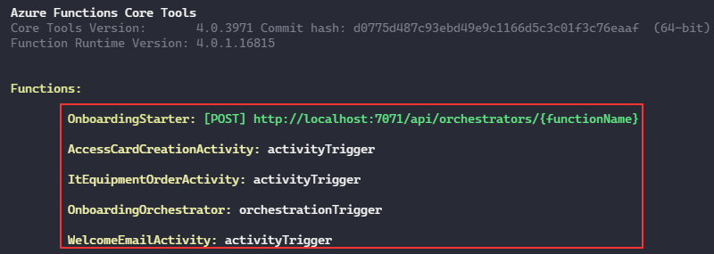
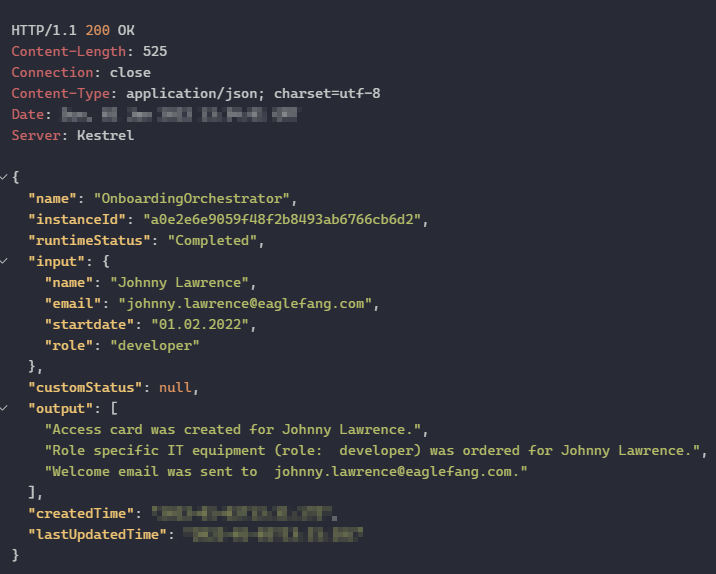

# Azure Durable Functions - Advanced Patterns (TypeScript)

Watch the recording of this lesson [on YouTube 🎥]().

## Goal 🎯

The goal of this lesson is to dive deeper into the area of Azure Durable Functions. In this lesson we discuss some more advanced patterns for the modeling of workflows with Durable Functions.

This lessons consists of the following exercises:

|Nr|Exercise
|-|-
|0|[Prerequisites](#0-prerequisites)
|1|[Scenario](#1-scenario)
|2|[Fan-Out/Fan-In Scenario](#2-fan-outfan-in-scenario)
|3|[Sub-Orchestration](#3-sub-orchestration)
|4|[External Events - Human Interaction](#4-external-event---human-interaction)
|5|[Homework](#5-homework)
|6|[More info](#6-more-info)

> 📝 **Tip** - If you're stuck at any point you can have a look at the [source code](../../src/typescript/durable-functions/advanced-patterns) in this repository.

---

## 0. Prerequisites

| Prerequisite                          | Exercise
| -                                     | -
| Azurite (Storage Emulator)            | 2-4
| Azure Storage Explorer                | 2-4
| An empty local folder / git repo      | 2-4
| Azure Functions Core Tools            | 2-4
| VS Code with Azure Functions extension| 2-4
| Rest Client for VS Code or Postman    | 2-4

See [TypeScript prerequisites](../prerequisites/prerequisites-ts.md) for more details.

We assume that you have already made your way through the [first lesson](../chaining/chaining-lesson-ts.md) on Azure Durable Functions to have an understanding of the basics. If not we highly recommend to do so before starting with this lesson. 

## 1. Scenario

We will focus on one _scenario_ throughout this lesson namely employee onboarding. The storyline is to automate the workflow that lies behind the onboarding of a new employee at a company. Let us assume that whenever a new employee is onboarded the following steps need to be executed in different backend systems of the company:

- trigger the creation of an access card to the company building
- start the purchasing process for the IT equipment of the employee  
- send out an email with a welcoming text to the new employee and some guidance how the start day will look like.

As we already know we can model a sequence of these steps making use of Azure Durable Functions, so it would be possible to execute one step after the other. But these steps to not have any dependency on each other, so there is no need to wait for the outcome of the access card creation to start the purchasing process. From a business process perspective we could kick off all activities in parallel and then wait until all activities have finished to successfully close this part of the onboarding process. 

Let's find out how to do this with Azure Durable Functions.

> 🔎 **Observation** - The goal of this lesson is to learn about patterns that can be applied using Azure Durable Functions. We will therefore "simulate" the onboarding steps and not call any other external systems as we would in reality. We have shown this including patterns for resilience of the calls to external systems in the  [first lesson](../chaining/chaining-lesson-ts.md) on Azure Durable Functions.

## 2. Fan-Out/Fan-In Scenario

In this section we want to explore how to execute the onboarding activities in parallel using Azure Durable Functions. This pattern is called _Fan-Out/Fan-In_ as we first fan-out the execution of several activities and then wait until all activities have finished to fan-in again and continue with the process.

We design the solution as follows:

- as an entry point for the process we make use a `Durable Functions HTTP Starter` function that receives a `POST` request containing the data of the new employee (name, email, start date, role).
- the orchestration of the onboarding activities is done via a  `Durable Functions orchestrator`.
- the single steps of the onboarding are defined in `Durable Functions activities`.

We achieve the parallel execution of the tasks via the `Tasks.all` method available on the Durable Functions context object. This method expects an array of activity calls as input.

### Basic Setup

#### Steps

1. Create a directory for our function app and navigate into the directory.

   ```powershell
   mkdir OnbordingByDurableFunction
   cd OnbordingByDurableFunction
   ```

2. Start Visual Studio Code.

   ```powershell
   code .
   ```

3. Create a new project via the Azure Functions Extension.
   1. Name the project `OnbordingByDurableFunction`.
   2. Choose `TypeScript` as language.
   3. Select `Durable Functions HTTP Starter` as a template as we want to trigger the execution of the Durable Function via an HTTP call.
   4. Name the function `OnboardingStarter`.
   5. Set the authorization level of the function to `Anonymous`.

4. Install the `durable-functions` via npm `npm install durable-functions`.

   > 📝 **Tip** - Install the the `@types/node` npm package as a dev-dependency because this is needed for the build process.

5. Adjust the `function.json` file of the HTTP starter to expose only an `POST` endpoint.

   ```json
    "methods": [
      "post"
    ]
   ```

6. Create a new Orchestrator Function via the Azure Functions Extension in VSCode.
   1. Select `Durable Functions orchestrator` as a template.
   2. Name the function `OnboardingOrchestrator`.

   > 📝 **Tip** - We will adjust the code of the orchestrator after we have created the Activity Functions that we want to execute.

7. Create three new Activity Functions via the Azure Functions Extension in VSCode.
   1. Select `Durable Functions activity` as a template.
   2. Name the functions `AccessCardCreationActivity`, `ItEquipmentOrderActivity`, `WelcomeEmailActivity`.

8. Set the `AzureWebJobsStorage` parameter in the `local.settings.json` to `UseDevelopmentStorage=true`

   ```json
   {
    "IsEncrypted": false,
    "Values": {
       "AzureWebJobsStorage": "UseDevelopmentStorage=true",
       "FUNCTIONS_WORKER_RUNTIME": "node"
     }
   }
   ```

### Implementation of the Orchestrator Function

As the basic setup is in place we will now implement the fan-out/fan-in logic in the Orchestrator Function.  

#### Steps

1. Open the `index.ts` file of the Orchestrator Function and remove the comments.
2. Remove the content of the function, the function should now look like this:

   ```typescript
   import * as df from "durable-functions"

   const orchestrator = df.orchestrator(function* (context) {

   })

   export default orchestrator
   ```

3. Define an empty array called `onboardingTasks` that will be filled with the activity functions that should be executed in parallel
  
   ```typescript
   const onboardingTasks = [] 
   ```

4. Push the onboarding Activity Functions that we defined before into the array. Hand over the input data available via the `context` object to the Activity Functions.

   ```typescript
   onboardingTasks.push(context.df.callActivity("AccessCardCreationActivity", context.bindingData.input))
   onboardingTasks.push(context.df.callActivity("ItEquipmentOrderActivity", context.bindingData.input))
   onboardingTasks.push(context.df.callActivity("WelcomeEmailActivity", context.bindingData.input))  
   ```

   > 🔎 **Observation** - Comparing this call of activities with the one of the chaining we see that the call itself remains the same, but we omit the key word `yield` and therefore do not trigger the generator functionality used in the chaining scenario. This enables the parallel execution.

   > 📝 **Tip** - You can also make use of the retry functionality available on the `context.df` object to call the Activity Function.

5. Start the parallel execution via `Task.all` of the activities, fetch the result data and return it.

   ```typescript

    const result = yield context.df.Task.all(onboardingTasks)

    return result
   ```

   > 🔎 **Observation** - In contrast to the single activity calls that we did not `yield`, we yielded the task execution. We get back a task that won't complete until all activities have completed. This is the same concept as `Promise.all` in JavaScript. The difference is that the tasks could be running on multiple virtual machines concurrently, and the Durable Functions extension ensures that the end-to-end execution is resilient to process recycling.

### Implementation of the Activity Functions

Next we implement the three activities we triggered via the orchestrator. as described above we will only mimic the different process steps.

#### Steps

1. Go to the directory that contains the Activity Function `AccessCardCreationActivity`.

   a. Open the `function.json` file and change the name of the input binding to `input`

      ```json
      "bindings": [
       {
         "name": "input",
         "type": "activityTrigger",
         "direction": "in"
       }
      ```

   b. Open the `index.ts` file and remove all comments and the content of the Functions's body. The result should look like this:

      ```typescript
      import { AzureFunction, Context } from "@azure/functions"
      
      const activityFunction: AzureFunction = async function (context: Context): Promise<string> {
      
      }
      
      export default activityFunction
      
      ```

   c. Insert a log message that the access card was created and return a corresponding message to the orchestrator. Use the information that is available via the input binding to personalize the messages. A result could look like this:

      ```typescript
      const activityFunction: AzureFunction = async function (context: Context): Promise<string> {
      
          context.log(`Access card created for  ${context.bindings.input.name} starting on ${context.bindings.input.startdate}`)
      
          return `Access card was created for ${context.bindings.input.name}.`
      
      }
      ```

2. Go to the directory that contains the Activity Function `ItEquipmentOrderActivity`.

   a. Open the `function.json` file and change the name of the input binding to `input`

      ```json
      "bindings": [
       {
         "name": "input",
         "type": "activityTrigger",
         "direction": "in"
       }
      ```

   b. Open the `index.ts` file and remove all comments and the content of the Functions's body. The result should look like this:
  
      ```typescript
      import { AzureFunction, Context } from "@azure/functions"
      
      const activityFunction: AzureFunction = async function (context: Context): Promise<string> {
      
      }
      
      export default activityFunction
      ```
  
   c. Insert a log message that the role-specific IT equipment was ordered and return a corresponding message to the orchestrator. Use the information that is available via the input binding to personalize the messages. A result could look like this:
  
      ```typescript
      const activityFunction: AzureFunction = async function (context: Context): Promise<string> {
      
          context.log(`Role specific IT equipment (role:  ${context.bindings.input.role}) was ordered for  ${context.bindings.input.name} starting on ${context.bindings.input.startdate}`)
          
          return `Role specific IT equipment (role: ${context.bindings.input.role}) was ordered for ${context.bindings.input.name}.`      

      }
      ```

3. Go to the directory that contains the Activity Function `WelcomeEmailActivity`.

   a. Open the `function.json` file and change the name of the input binding to `input`
  
      ```json
      "bindings": [
       {
         "name": "input",
         "type": "activityTrigger",
         "direction": "in"
       }
      ```
  
   b. Open the `index.ts` file and remove all comments and the content of the Functions's body. The result should look like this:

      ```typescript
      import { AzureFunction, Context } from "@azure/functions"
      
      const activityFunction: AzureFunction = async function (context: Context): Promise<string> {
      
      }
      
      export default activityFunction
      ```
  
   c. Insert a log message that a welcome email was sent and return a corresponding message to the orchestrator. Use the information that is available via the input binding to personalize the messages. A result could look like this:
  
      ```typescript
      const activityFunction: AzureFunction = async function (context: Context): Promise<string> {

          context.log(`Welcome ${context.bindings.input.name}! Happy to have you on board and see you on ${context.bindings.input.startdate}!`)
          
          return `Welcome email was sent to ${context.bindings.input.email}.`
      
      }
      ```

4. Install the dependencies defined in the `package.json` via `npm install` in a shell of your choice.
5. Build the project by making use of the predefined script in the `package.json` file via `npm run build` in a shell of your choice.
6. Start the Azure Storage Emulator.
7. Start the Azure Functions via `npm run start`.

   

   >🔎 **Observation** - You can see that the runtime is serving the different types of Azure Functions.

8. Call the Client Function via the tool of your choice e.g. VSCode REST Client.

   ```rest
   POST http://localhost:7071/api/orchestrators/OnboardingOrchestrator
   content-type: application/json
   
   {
       "name": "Johnny Lawrence",
       "email": "johnny.lawrence@eaglefang.com",
       "startdate": "01.02.2022",
       "role": "developer"
   }   
   ```

9. The Durable Functions do not directly return the result of the orchestration. So we need to call the `statusQueryGetUri` endpoint to receive the results:

   

10. Check the resulting entries in your Azure Storage Emulator

   > ❔ **Question** - What is different with regards to the execution sequence when comparing the parallel and the sequential one?

## 3. Sub-Orchestration

In this section we introduce the concept of *sub-orchestration*. Sub-Orchestration uses the capability of Orchestrator Functions to call other Orchestrator Function. This enables us to create larger orchestrations by combining Orchestrator Functions as building blocks or to run multiple instances of Orchestrator Functions in parallel.

Transferring this to our onboarding scenario, we will now onboard several new employees in parallel by making use of this functionality. We will create one new Orchestrator Function that will call the existing orchestrator based on an array of new employees.
### Steps

1. Create a new Orchestrator Function called `ParallelOnboardingOrchestrator` using the VSCode extension.
2. Open the `index.ts` file of the new Orchestrator Functions and remove the content of the Functions's body:

   ```typescript
   import * as df from "durable-functions"
   
   const orchestrator = df.orchestrator(function* (context) {
   
   })
   
   export default orchestrator
   ```

3. We assume that we get a JSON array as input via the `context` parameter. The input we will provide has the following structure:

   ```json
   {
       "employees2onboard": [
           {
               "name": "Johnny Lawrence",
               "email": "johnny.lawrence@eaglefang.com",
               "startdate": "01.02.2022",
               "role": "developer"
           },
           {
               "name": "Daniel LaRusso",
               "email": "daniel.larusso@miyagido.com",
               "startdate": "15.02.2022",
               "role": "sales"
           },
           {
               "name": "Terry Silver",
               "email": "terry.silver@cobrakai.com",
               "startdate": "01.03.2022",
               "role": "manager"
           }
       ]
   }   
   ```

4. The first building block of the Orchestrator Function is to iterate over the array that we received as input. In case the input is empty we will log a corresponding message:

   ```typescript
   const orchestrator = df.orchestrator(function* (context) {
   
       const employees2onboard = context.bindingData.input.employees2onboard
   
       if (employees2onboard) {
         
           for (const employeeEntry of employees2onboard) {
   
           }
           
   
       }
       else {
           context.log.warn("No employees to onboard")
       }
   
   })   
   ```

5. The mechanics is the same as in the prior case: we need an array where we push our `callSubOrchestrator` executions to. In addition we need an identifier for each sub-orchestration which we create manually by combining the Durable Functions Instance ID with the employee name from the list. After that we trigger the execution via `yield context.df.Task.all` on the array

   ```typescript
   const orchestrator = df.orchestrator(function* (context) {
   
       const employees2onboard = context.bindingData.input.employees2onboard
   
       if (employees2onboard) {
   
           const onboardingList = []
   
           let id = 0
   
           for (const employeeEntry of employees2onboard) {
   
               const child_id = context.df.instanceId + `:${employeeEntry.name}`
               const onboardingListEntry = context.df.callSubOrchestrator("OnboardingOrchestrator", employeeEntry, child_id)
   
               onboardingList.push(onboardingListEntry)
   
               id++
           }
      
           yield context.df.Task.all(onboardingList)
       }
       else {
           context.log.warn("No employees to onboard")
       }
   
   })   
   ```

   > 📝 **Tip** - Be aware that the sub-orchestrations must be defined in the same function app as the parent orchestration

6. We also add a short log message telling us how many sub-orchestrations will be started. The Orchestrator Function finally looks like this:

   ```typescript
   import * as df from "durable-functions"
   
   const orchestrator = df.orchestrator(function* (context) {
   
       const employees2onboard = context.bindingData.input.employees2onboard
   
       if (employees2onboard) {
   
           const onboardingList = []
   
           let id = 0
   
           for (const employeeEntry of employees2onboard) {
   
               const child_id = context.df.instanceId + `:${employeeEntry.name}`
               const onboardingListEntry = context.df.callSubOrchestrator("OnboardingOrchestrator", employeeEntry, child_id)
   
               onboardingList.push(onboardingListEntry)
   
               id++
           }
   
           if (context.df.isReplaying === false) {
               context.log.info(`Starting ${onboardingList.length} sub-orchestrations for update`)
           }
   
           yield context.df.Task.all(onboardingList)
       }
       else {
           context.log.warn("No employees to onboard")
       }
   
   })
   
   export default orchestrator
   ```

   > 🔎 **Observation** - we use the `isReplaying` attribute of the Durable Functions context to avoid multiple log entries

7. Build the project by making use of the predefined script in the `package.json` file via `npm run build` in a shell of your choice.
8. If not already running, start the Azure Storage Emulator.
9. Start the Azure Functions via `npm run start`.

   >🔎 **Observation** - You can see that the runtime is serving the new Orchestrator Function.

10. Call the Client Function via the tool of your choice e.g. VSCode REST Client. Make sure to call the new Orchestrator Function:

   ```rest
   POST http://localhost:7071/api/orchestrators/ParallelOnboardingOrchestrator
   content-type: application/json
   
   {
       "employees2onboard": [
           {
               "name": "Johnny Lawrence",
               "email": "johnny.lawrence@eaglefang.com",
               "startdate": "01.02.2022",
               "role": "developer"
           },
           {
               "name": "Daniel LaRusso",
               "email": "daniel.larusso@miyagido.com",
               "startdate": "15.02.2022",
               "role": "sales"
           },
           {
               "name": "Terry Silver",
               "email": "terry.silver@cobrakai.com",
               "startdate": "01.03.2022",
               "role": "manager"
           }
       ]
   }
   ```

11. Checking the `statusQueryGetUri` endpoint will this time only tell us, if the execution was completed or not. to see what happened you must take a look at the Azure Storage Emulator.

   > ❔ **Question** - How many orchestration instances have been created?

   > ❔ **Question** - Can you distinguish between the main orchestration and the sub-orchestrations?

   > ❔ **Question** - What is the difference between the triggering of a sub-orchestration and an activity?

## 4. External Event - Human Interaction

In many workflow scenarios the process will probably not be fully automated but manual interaction is needed. Looking at our onboarding example one could think of that depending on the role a manual release is needed for the IT equipment order if the value exceeds a certain value and the role is e.g. "sales".

These escalation flows can be modeled via Durable Functions and *external events*. As in the case of sub-orchestrations the Durable Functions context provides a methods called `waitForExternalEvent`. This method allows us to react to external events including data transferred by the event.

In the following section we will use this functionality to model the following process flow:

- We check if the role of a new employee is sales and mimic that the IT equipment exceeds a certain spending limit via a dedicated Activity Function.
- Depending on the outcome of the check we will wait for an external event that releases the order. We set a timer to limit the waiting time
- If the manual interaction is executed, we will trigger the order of the equipment
### Steps

1. Create a new Activity Functions called `CheckItEquipmentValueByRoleActivity` using the VSCode extension.
2. Open the `function.json` file and change the name of the input binding to `input`
3. The Activity Function checks the role of the new employee. If the role is "sales" it returns `approval needed`, otherwise it returns `approved`:

  ```typescript
   import { AzureFunction, Context } from "@azure/functions"
   
   const activityFunction: AzureFunction = async function (context: Context): Promise<string> {
   
       if (context.bindings.input.role === "sales"){
   
           return `approval needed`
   
       }
       else{
   
           return `approved`
   
       }
   
   }
   
   export default activityFunction
  ```

4. Create a new Orchestrator Function `OnboardingOrchestratorExternalEvent`, switch to the `index.ts` file  and remove the content of the function:

   ```typescript
   import * as df from "durable-functions"
   
   const orchestrator = df.orchestrator(function* (context) {
   
   })
   
   export default orchestrator
   ```

5. First we implement the call of the new Activity Function to execute the check we just implemented:

   ```typescript
   const orchestrator = df.orchestrator(function* (context) {
   
       const checkResult = yield context.df.callActivity("CheckItEquipmentValueByRoleActivity", context.bindingData.input)
   
   })
   ```

6. Next we implement the case where a manual approval is needed. For that we instruct the Azure Functions runtime to wait for an external event via the corresponding method `waitForExternalEvent`. We specify the event as `ApprovalRequest` and react depending on the result provided via the event:

   ```typescript
   const orchestrator = df.orchestrator(function* (context) {

       const checkResult = yield context.df.callActivity("CheckItEquipmentValueByRoleActivity", context.bindingData.input)
   
       let orderApproved = false
   
       if (checkResult !== "approved") {
   
           const approvalTask = yield context.df.waitForExternalEvent("ApprovalRequest")
      
   
           if (approvalTask.result === 'approved') {
               orderApproved = true
           }
           else {
               orderApproved = false
           }

   
   })
   ```

   > 🔎 **Observation** - The object returned as external event has a parameter called `result` that contains the information provided by the caller of the event.

   > ❔ **Question** - What would happen if no event was raised by a caller?

7. We want to limit the time that we want to wait for the external event. FOr that we rewrite the logic, using the `Timer` functionality of Durable Functions that we used in the introduction lesson on Durable Functions as a circuit breaker. We want to wait for 90 seconds for the manual interaction. The adjusted logic of the Orchestrator FUnction looks like this:

   ```typescript
   import * as df from "durable-functions"   
   import { DateTime } from "luxon"
   
   const orchestrator = df.orchestrator(function* (context) {
   
       const checkResult = yield context.df.callActivity("CheckItEquipmentValueByRoleActivity", context.bindingData.input)
   
       let orderApproved = false
   
       if (checkResult !== "approved") {
   
           const expiration = DateTime.fromJSDate(context.df.currentUtcDateTime, { zone: 'utc' }).plus({ seconds: 90 });
           const timeoutTask = context.df.createTimer(expiration.toJSDate())
   
           const approvalTask = context.df.waitForExternalEvent("ApprovalRequest")
   
           const winner = yield context.df.Task.any([approvalTask, timeoutTask])
   
           if (winner === approvalTask) {
   
               if (approvalTask.result === 'approved') {
                   orderApproved = true
               }
               else {
                   orderApproved = false
               }
   
           } else {
   
               context.log.warn("Timeout expired");
           }
   
           if (!timeoutTask.isCompleted) {
   
               timeoutTask.cancel()
   
           }
       }
   
   })
   ```

8. Last thing we need to add is the logic that reacts on the result of the check or the external event, namely to execute the order process or to inform about the decline of the order that we add after the existing code of the function: 

   ```typescript
       if (checkResult === "approved" || orderApproved === true) {
           const orderResult = yield context.df.callActivity("ItEquipmentOrderActivity", context.bindingData.input)
   
           return orderResult
       }
       else {
           const message = "Order was declined"
   
           context.log.error(message)
   
           return message
   
       }
   ```

9. The code of the Orchestrator Function finally looks like this:

   ```typescript
   import * as df from "durable-functions"
   import { DateTime } from "luxon"
   
   const orchestrator = df.orchestrator(function* (context) {
   
       const checkResult = yield context.df.callActivity("CheckItEquipmentValueByRoleActivity", context.bindingData.input)
   
       let orderApproved = false
   
       if (checkResult !== "approved") {
   
           const expiration = DateTime.fromJSDate(context.df.currentUtcDateTime, { zone: 'utc' }).plus({ seconds: 90 });
           const timeoutTask = context.df.createTimer(expiration.toJSDate())
   
           const approvalTask = context.df.waitForExternalEvent("ApprovalRequest")
   
           const winner = yield context.df.Task.any([approvalTask, timeoutTask])
   
           if (winner === approvalTask) {
   
               if (approvalTask.result === 'approved') {
                   orderApproved = true
               }
               else {
                   orderApproved = false
               }
   
           } else {
   
               context.log.warn("Timeout expired");
           }
   
           if (!timeoutTask.isCompleted) {
   
               timeoutTask.cancel()
   
           }
       }
   
       if (checkResult === "approved" || orderApproved === true) {
           const orderResult = yield context.df.callActivity("ItEquipmentOrderActivity", context.bindingData.input)
   
           return orderResult
       }
       else {
           const message = "Order was declined"
   
           context.log.error(message)
   
           return message
   
       }
   
   })
   
   export default orchestrator
   ```

10. Build the project by making use of the predefined script in the `package.json` file via `npm run build` in a shell of your choice.
11. If not already running, start the Azure Storage Emulator.
12. Start the Azure Functions via `npm run start`.
13. Make the call to trigger the manual interaction:

   ```rest
   POST http://localhost:7071/api/orchestrators/OnboardingOrchestratorExternalEvent
   content-type: application/json
   
   {
       "name": "Daniel LaRusso",
       "email": "daniel.larusso@miyagido.com",
       "startdate": "15.02.2022",
       "role": "sales"
   }   
   ```

14. Trigger the event manually via a POST request. The correct URI is given by the `"sendEventPostUri"` of the response message of the previous `POST` request. Replace the placeholder `{eventName}` in the URI with `ApprovalRequest`. A sample request looks like this.

   ```rest
   POST http://localhost:7071/runtime/webhooks/durabletask/instances/d0f9580077c54397a53b336ea8a2799d/raiseEvent/ApprovalRequest?taskHub=TestHubName&connection=Storage&code=GKNGoT5Gp3ztIkQ05Lo3GY8gJry4jpiX8D8dhJiBA6GDuxyvnfziSA==
   content-type: application/json
   
    "approved"
   ```

   > ❔ **Question** - What do you see as processing sequence in the Azure Storage Explorer?

   > 📝 **Tip** - Also try out the timeout functionality that we implemented, maybe setting the duration to 30 seconds

## 5. Homework

Ready to get hands-on? Checkout the [homework assignment](./advanced-patterns-homework.md) for this lesson.

## 6. More info

You find more information about advanced pattern of Azure Durable Functions in the official documentation:

- Concepts
  - [Sub-orchestrations in Durable Functions (Azure Functions)](https://docs.microsoft.com/azure/azure-functions/durable/durable-functions-sub-orchestrations?tabs=javascript)
  - [Handling external events in Durable Functions (Azure Functions)](https://docs.microsoft.com/azure/azure-functions/durable/durable-functions-external-events?tabs=javascript)
  - [Timers in Durable Functions (Azure Functions)](https://docs.microsoft.com/azure/azure-functions/durable/durable-functions-timers?tabs=javascript)
- Tutorials
  - [Fan-out/fan-in scenario in Durable Functions - Cloud backup example](https://docs.microsoft.com/azure/azure-functions/durable/durable-functions-cloud-backup?tabs=javascript)
  - [Human interaction in Durable Functions - Phone verification sample](https://docs.microsoft.com/azure/azure-functions/durable/durable-functions-phone-verification?tabs=javascript)

---
[🔼 Lessons Index](../../README.md)
