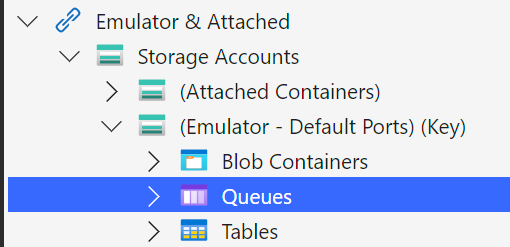
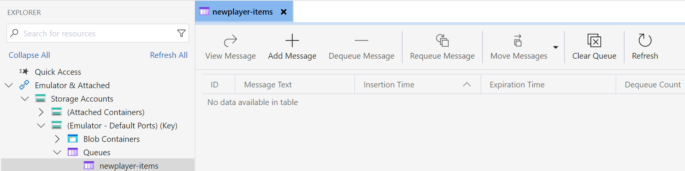

# Queue Trigger & Bindings (TypeScript)

The recording of this lesson on YouTube 🎥 will be available soon.

## Goal 🎯

The goal of this lesson is to learn how to trigger a Function by putting a message on a queue, and how you can bind an output message to a queue.

This lessons consists of the following exercises:

|Nr|Exercise
|-|-
|0|[Prerequisites](#0-prerequisites)
|1|[Using the Microsoft Azure Storage Explorer for Queues](#1-using-the-microsoft-azure-storage-explorer-for-queues)
|2|[Using Queue Output Bindings](#2-using-queue-output-bindings)
|2.1|[Use Plain String as Message](#21-use-plain-string-as-message)
|2.2|[Use JSON as Message](#22-use-json-as-message)
|3|[Using Queue Trigger Bindings](#3-using-queue-trigger-bindings)
|3.1|[Creating a Queue triggered Function](#31-creating-a-queue-triggered-function)
|3.2|[Examine & Run the Queue triggered Function](#32-examine--run-the-queue-triggered-function)
|3.3|[Break the Queue triggered Function](#33-break-the-queue-triggered-function)
|3.4|[Change the Queue triggered Function](#34-change-the-queue-triggered-function)
|4|[Homework](#4-homework)
|5|[More info](#5-more-info)
|6|[Feedback](#6-feedback)

> 📝 **Tip** - If you're stuck at any point you can have a look at the [source code](../../../src/typescript/AzureFunctions.Queue) in this repository.

> 📝 **Tip** - If you have questions or suggestions about this lesson, feel free to [create a Lesson Q&A discussion](https://github.com/marcduiker/azure-functions-university/discussions/categories/lesson-q-a) here on GitHub.

---

## 0. Prerequisites

| Prerequisite | Exercise
| - | -
| Azurite (Storage Emulator) | 1-4
| Azure Storage Explorer | 1-4
| An empty local folder / git repo | 1-4
| Azure Functions Core Tools | 1-4
| VS Code with Azure Functions extension|1-4

See [TypeScript prerequisites](../prerequisites/README.md) for more details.

## 1. Using the Microsoft Azure Storage Explorer for Queues

In this exercise we'll look into storage emulation and the Azure Storage Explorer to see how you can interact with queues and messages.

### Steps

1. Make sure that the storage emulator is running and open the Azure Storage Explorer.
2. Navigate to `Storage Accounts` -> `(Emulator - Default Ports)(Key)` -> `Queues`
   
3. Right-click on `Queues` and select `Create Queue`
4. Type a name for the queue: `newplayer-items`
5. Select the new queue.
   
   > 🔎 **Observation** - Now you see the contents of the queue which is empty after creation. In the top menu you see actions you can perform on the queue or its items.
6. Try adding three messages to the queue, each with different content.
7. Now try dequeue-ing the messages.

   > ❔ **Question** - What do you notice about the order of the messages being dequeued?

## 2. Using Queue Output Bindings

In this exercise, we'll be creating an Http trigger Function and use the Queue output binding in order to put player messages on the `newplayer-items` queue.

> 🔎 **Observation** - In contrast to .NET in-process Azure Functions TypeScript only supports strings or JSON-serializable objects as message payload.

### 2.1 Use Plain String as Message

We start with the simplest way to store a message in a queue i.e., storing a plain string.

#### Steps

1. In VSCode, create a new HTTP Trigger Function App with the following settings:
   1. Location: *AzureFunctions.Queue*
   2. Language: *TypeScript*
   3. Template: *Http trigger*
   4. Function name: *NewPlayerWithQueueOutput*
   5. AccessRights: *Function*
2. After the Function App is created, execute `npm install` to install the required dependencies.
3. Open the `local.settings.json` file and set the value of the key `"AzureWebJobsStorage":`  to `"UseDevelopmentStorage=true"`. This points the Azure Function to use the local storage emulator i.e. `Azurite`.
4. Open the `function.json` file in the `NewPlayerWithQueueOutput` directory. We want to support POST requests only, so we remove the `"get"` from the array of support HTTP methods.
5. Add the configuration for the queue output binding to the `function.json`:

   ```json
   {
      "type": "queue",
      "name": "newPlayerItems",
      "direction": "out",
      "queueName": "newplayer-items",
      "connection": "AzureWebJobsStorage"
    }
   ```

   > 🔎 **Observation** The specific parameters of this binding are the *queueName* specifying the name of the queue we want to post the data to as well as the *connection* that specifies the configuration that should be used to connect to the queue.  

6. Switch to the Azure Function code in the `index.ts` and remove code from the function body:

   ```typescript
   import { AzureFunction, Context, HttpRequest } from '@azure/functions'

   const httpTrigger: AzureFunction = async function (context: Context, req: HttpRequest): Promise<void> {
   
   }

   export default httpTrigger
   ```

7. We want to transfer some hard coded value to the queue. To do so we create this value and add it to the binding parameter, defined in the `function.json`

   ```typescript
   import { AzureFunction, Context, HttpRequest } from '@azure/functions'

   const httpTrigger: AzureFunction = async function (context: Context, req: HttpRequest): Promise<void> {
      const player1AsString = "Player 1"

      context.bindings.newPlayerItems = player1AsString
   }

   export default httpTrigger
   ```

8. Add a response message to the Function as well as a log message. The Function should finally look like this:

   ```typescript
   import { AzureFunction, Context, HttpRequest } from '@azure/functions'

   const httpTrigger: AzureFunction = async function (context: Context, req: HttpRequest): Promise<void> {
      const player1AsString = "Player 1"

      context.bindings.newPlayerItems = player1AsString

      context.log('HTTP trigger function processed a queue output binding.')

      context.res = {
        body: `Queued the player ${player1AsString}`
    }

   }

   export default httpTrigger
   ```

9. Ensure that the storage emulator is started. Then build and run the Azure Function App via `npm run start`.

    > 📝 **Tip** - When you see an error like this: `Microsoft.Azure.Storage.Common: No connection could be made because the target machine actively refused it.` that means that the Storage Emulator has not been started successfully and no connection can be made to it. Check the app settings in the local.settings.json and (re)start the emulated storage.

10. Do a POST request to the Function endpoint:

      ```http
      POST http://localhost:7071/api/NewPlayerWithStringQueueOutput
      ```

      > ❔ **Question** - Look at the Azure Functions console output. Is the message processed without errors?

      > ❔ **Question** - Using the Azure Storage Explorer, check if there's a new message in the `newplayer-items` queue. What is the content of the message?

#### Variant - Array as Message

You can also send multiple items to the queue using an array. To achieve this adjust the code as follows:

```typescript
import { AzureFunction, Context, HttpRequest } from '@azure/functions'

const httpTrigger: AzureFunction = async function (context: Context, req: HttpRequest): Promise<void> {

    const player1AsString = "Player 1"
    const player2AsString = "Player 2"

    context.bindings.newPlayerItems = [player1AsString, player2AsString]

    context.log('HTTP trigger function processed a queue output binding.')

    context.res = {
        body: `Queued the player ${player1AsString} and ${player2AsString}`
    }
}

export default httpTrigger
```

Re-build and run the Azure Function App via `npm run start`. When the Function is up and running, redo the POST request:

```http
POST http://localhost:7071/api/NewPlayerWithStringQueueOutput
```

> ❔ **Question** - Look at the Azure Functions console output. Is the message processed without errors?

> ❔ **Question** - Using the Azure Storage Explorer, check how many new messages are in the `newplayer-items` queue now. What is the content of the messages?

### 2.2 Use JSON as Message

Let us change the setup. We now get the data for our player data for the via the HTTP request in the JSON body. The request body has the following structure:

```json
"id": "SOME-GUID",
"nickName" : "Ada",
"email" : "ada@lovelace.org",
"region" : "United Kingdom"
```

We now use this data and pass it to the queue as message.

#### Steps

1. Clean up the Function body from the previous section to start the implementation from scratch:

   ```typescript
   import { AzureFunction, Context, HttpRequest } from '@azure/functions'

   const httpTrigger: AzureFunction = async function (context: Context, req: HttpRequest): Promise<void> {
   }

   export default httpTrigger
   ```

2. Define an interface called `Player` that reflects the structure of the reuqest body:

  ```typescript
   import { AzureFunction, Context, HttpRequest } from '@azure/functions'

   const httpTrigger: AzureFunction = async function (context: Context, req: HttpRequest): Promise<void> {
   }


   export default httpTrigger

   interface Player {
      id: string,
      nickName: string,
      email: string,
      region: string
   }
   ```

   > 🔎 **Observation** - The interface enables us to have a typed access to the request body. However, be aware that there is no type checking implemented. For a production grade setup this is not sufficient and you will probably need additional libraries to be harden the setup. For the sake of this lesson, we accept this flaw.

3. Use the new interface to receive the request body and pass it to the queue:

  ```typescript
   import { AzureFunction, Context, HttpRequest } from '@azure/functions'

   const httpTrigger: AzureFunction = async function (context: Context, req: HttpRequest): Promise<void> {

      const player:Player = JSON.parse(request.body)

      //Probably some business logic would happen here, like validations

      context.bindings.newPlayerItems = player
   }

   export default httpTrigger

   interface Player {
      id: string,
      nickName: string,
      email: string,
      region: string
   }
   ```

4. Add a response message to the Function as well as a log message. The Function should finally look like this:

  ```typescript
   import { AzureFunction, Context, HttpRequest } from '@azure/functions'

   const httpTrigger: AzureFunction = async function (context: Context, req: HttpRequest): Promise<void> {

      const player:Player = request.body

      //Probably some business logic would happen here, like validations

      context.bindings.newPlayerItems = player

      context.log('HTTP trigger function processed a request.')

      context.res = {
         // status: 200, /* Defaults to 200 */
         body: `Queued the player with the nickname ${player.nickName}`
      }
    }

   export default httpTrigger

   interface Player {
      id: string,
      nickName: string,
      email: string,
      region: string
   }
   ```

5. Ensure that the storage emulator is started. Then build and run the Azure Function App via `npm run start`.

6. Do a POST request to the Function endpoint including a body with the player data:

      ```http
      POST http://localhost:7071/api/NewPlayerWithStringQueueOutput
      Content-Type: application/json

      {
         "id": "{{$guid}}",
         "nickName" : "Ada",
         "email" : "ada@lovelace.org",
         "region" : "United Kingdom"
      }
      ```

      > ❔ **Question** - Look at the Azure Functions console output. Is the message processed without errors?

      > ❔ **Question** - Using the Azure Storage Explorer, check if there's a new message in the `newplayer-items` queue. What is the content of the message?

## 3. Using Queue Trigger Bindings

Besides the output binding a message in a queue can also be used as a trigger for a Function. In this section we will create Queue Triggered Functions.

## 3.1 Creating a Queue triggered Function

Let us start with setting up a plain Azure Function that is triggered by a Queue.

### Steps

1. Create a new Function App by running `AzureFunctions: Create New Project` in the VSCode Command Palette (CTRL+SHIFT+P).

   > 📝 **Tip** - Create a folder with a descriptive name since that will be used as the name for the project, e.g. `AzureFunctionsUniversity.Queue`.

2. Select the language you'll be using to code the Function, in this lesson we'll be using `TypeScript`.
3. Select `Azure Queue Storage trigger` as the template.
4. Give the Function a name (e.g. `HelloWorldQueueTrigger`).
5. Select `AzureWebJobsStorage`
6. Enter the value `newplayer-items` as name of the queue that should be used as trigger.

Now the Function App with a Queue Trigger Function will be created.

## 3.2 Examine & Run the Queue triggered Function

Let us examine what has been generated for us. First we take a look at the `function.json` file:

```json
{
  "bindings": [
    {
      "name": "myQueueItem",
      "type": "queueTrigger",
      "direction": "in",
      "queueName": "newplayer-items",
      "connection": "AzureWebJobsStorage"
    }
  ],
  "scriptFile": "../dist/HelloWorldQueueTrigger/index.js"
}
```

> 🔎 **Observation** - The `"type": "queueTrigger"` indicates this Function will be triggered based on queue messages. As specified in the setup the `""queueName""` point to our queue `"newplayer-items"`. As we are using the local storage emulator, the `"connection"` value is set as `"AzureWebJobsStorage"`. We can access the message of the queue via the name `"myQueueItem"` in the Function code.

Next let us check the Function code in the `index.ts`:

```typescript
import { AzureFunction, Context } from '@azure/functions'

const queueTrigger: AzureFunction = async function (context: Context, myQueueItem: string): Promise<void> {
  context.log('Queue trigger function processed work item', myQueueItem)
}

export default queueTrigger
```

> 🔎 **Observation** - The queue message itself, named `myQueueItem`, is read as a string and outputted to the log inside the method.

Let us see thing in action:

1. Build and run the Function App via `npm run start`.

2. The Function will only be triggered when a message is put on the `myqueue-items` queue. Use the Azure Storage Explorer to add a message to this queue.

   > ❔ **Question** - Is the Function triggered once you've put a message on the queue? How can you determine this?

   > 📝 **Tip** -  You can configure the behavior of the queue binding via the `host.json` file. Configurable settings include the frequency of polling the queue for new messages, timeout duration when processing fails, and how many messages the Function will process in parallel. See the [official docs](https://learn.microsoft.com/azure/azure-functions/functions-bindings-storage-queue?tabs=in-process%2Cextensionv5%2Cextensionv3&pivots=programming-language-javascript#host-json) for the details.

## 3.3. Break the Queue triggered Function

Now that the queue trigger is working, let us break it! When a queue triggered Function can't process the message successfully, the message will be retried a couple of time (5 times by default). When it still fails after the final retry the message will be placed on a so-called **poison queue**. This is a new queue dedicated for messages that can't be processed. The name of this queue is the same as the regular queue but ends with `-poison`.

### Steps

1. Replace the contents of the queue triggered Function with this exception:

   ```typescript
       throw new Error(`Let's throw an exception to test the retry logic`)
   ```

   > 🔎 **Observation** - Throwing an exception will force the Function to fail processing the message. The Function will retry to process the message a couple of times.

2. Build the Function via `npm run build`. Put a breakpoint on the `throw new Error()` line and press `F5` to start debugging.
3. Add a message to the `myqueue-items` queue.

   > ❔ **Question** - How many times is the breakpoint hit?

   > ❔ **Question** - Once the Function has stopped retrying, is there a `myqueue-items-poison` queue? Does it contain the message you created?

## 3.4. Change the Queue triggered Function

Now you understand how queue triggers work, let us do something useful with the message. Let's add a Blob output binding which saves the contents of the message to a Blob container.

### Steps

1. Add a Blob output binding to `function.json` of the queue triggered Function:

   ```json
   {
      "name": "players",
      "type": "blob",
      "direction": "out",
      "path": "players/stored-queue-message-{id}-{nickName}.json"
    }
   ```

   > 📝 **Tip** - We make use of path expressions for the output path to specify the file name store in the Blob storage

4. Open the `index.ts` file of the queue triggered Function and remove th body of the Function:

   ```typescript
   import { AzureFunction, Context } from '@azure/functions'

   const queueTrigger: AzureFunction = async function (context: Context, myQueueItem: string): Promise<void> {

   }

   export default queueTrigger
   ```

5. Add the `Player` interface we created before to the file:

   ```typescript
   import { AzureFunction, Context } from '@azure/functions'

   const queueTrigger: AzureFunction = async function (context: Context, myQueueItem: string): Promise<void> {

   }

   export default queueTrigger

   interface Player {
      id: string
      nickName: string
      email: string
      region: string
   }
   ```

6. Now add the implementation to cast the `myQueueItem` to the `Player` interface and transfer it to the Blob output binding and provide some basic log output:

   ```typescript
   import { AzureFunction, Context } from '@azure/functions'

   const queueTrigger: AzureFunction = async function (context: Context, myQueueItem: string): Promise<void> {
      context.log('Queue trigger function processed work item', myQueueItem)

      const player: Player = <any>myQueueItem

      context.bindings.players = player

      context.log(`Player added to blob storage as stored-queue-message-${player.id}-${player.nickName}.json`)    
   }

   export default queueTrigger

   interface Player {
      id: string
      nickName: string
      email: string
      region: string
   }
   ```

   > 🔎 **Observation** - Although the `myQueueItem` is declared as string, triggering the Function with a message of type JSON will result in a `myQueueItem` of type `object`. Therefore we need to cheat in order to be able to do the cast and work in a typed manner. As mentioned before more validation would be needed here in a productive setup. If we would leave the typing aside we could also directly transfer the `myQueueItem` to the output binding.

7. The current code would fail in case the `myQueueItem` is indeed (as typed) a `string`. So enhance the code to safeguard this scenario via:

   ```typescript
   import { AzureFunction, Context } from '@azure/functions'

   const queueTrigger: AzureFunction = async function (context: Context, myQueueItem: string): Promise<void> {

      context.log('Queue trigger function processed work item', myQueueItem)

      if (typeof (myQueueItem) === 'object') {
         const player: Player = <any>myQueueItem

         context.bindings.players = player

         context.log(`Player added to blob storage as stored-queue-message-${player.id}-${player.nickName}.json`)
      }
      else {
         context.log.error(`Invalid type of queue item. Provided ${typeof (myQueueItem)}`)
      }
   }

   export default queueTrigger

   interface Player {
      id: string
      nickName: string
      email: string
      region: string
   }
   ```

8. Build and run the Function App via `npm run start`.
9. Add a message with the following JSON content to the `myqueue-items` queue:

   ```json
   {
      "id":"2673d898-a6b4-4cef-92b0-8fc46bcf972f",
      "nickName":"Margaret",
      "email":"margaret@hamilton.org",
      "region":"United States of America"
   }
   ```

   > ❔ **Question** - Is the Function triggered by the message? Is a new blob available in the "players" Blob container?

## 4. Homework

[Here](queue-homework-resume-api-typescript.md) is the assignment for this lesson.

## 5. More info

For more info about the Queue Trigger and binding have a look at the official [Azure Functions Queue Storage and Bindings](https://learn.microsoft.com/azure/azure-functions/functions-bindings-storage-queue?&pivots=programming-language-javascript) documentation.

## 6. Feedback

We love to hear from you! Was this lesson useful to you? Is anything missing? Let us know in a [Feedback discussion post](https://github.com/marcduiker/azure-functions-university/discussions/new?category=feedback&title=.NET%20Core%20Queue%20Lesson) here on GitHub.

---
[🔼 Lessons Index](../../README.md)
